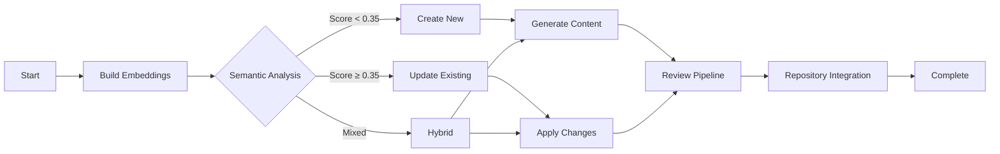

# Doc Buddy Architecture

## Overview

Doc Buddy has been redesigned from a monolithic agent system to a phased workflow orchestrator that follows the comprehensive workflow defined in `user-workflow.md`. This new architecture provides:

- **80% reduction in token usage** through specialized prompts
- **Deterministic workflow execution** with clear phases
- **Advanced tooling** for TOC management, redirections, and content placement
- **Comprehensive review pipeline** ensuring quality

## Architecture Components

### 1. Workflow Orchestrator (`app/workflow.py`)

The `DocBuddyWorkflow` class orchestrates the entire documentation process through six distinct phases:

```
┌─────────────────────┐
│  DocBuddyWorkflow   │
├─────────────────────┤
│ - Phase Management  │
│ - LLM Coordination  │
│ - Tool Orchestration│
│ - State Management  │
└─────────────────────┘
           │
           ▼
    ┌──────────────┐
    │   6 Phases   │
    └──────────────┘
```

### 2. Specialized Prompts (`app/prompts.py`)

Instead of one large system prompt, we now have 15+ specialized prompts:

- **Task Classification** (~150 tokens)
- **Semantic Analysis** (~200 tokens)
- **Content Generation** (~1000 tokens)
- **Review Prompts** (~200-300 tokens each)
- **Integration Prompts** (~200 tokens)

Each prompt returns structured JSON for predictable parsing.

### 3. Tool System

#### Basic Tools (`app/tools.py`)
- `RepoFileReadTool` - Read repository files
- `RepoFileWriteTool` - Write repository files
- `RepoSearchTool` - Search repository content
- `StandardsValidateTool` - Validate against standards
- `RemoteFetchTool` - Fetch remote content

#### Advanced Tools (`app/advanced_tools.py`)
- `TOCManagementTool` - Manage TOC.yml files
- `RedirectionManagementTool` - Handle .openpublishing.redirection.json
- `ContentPlacementAnalyzer` - Determine optimal file placement
- `BatchFileOperationsTool` - Batch operations for efficiency
- `ContentTypeAnalyzerTool` - Analyze and recommend content types

### 4. Embeddings System (`app/embeddings.py`)

- Builds semantic index of all Markdown files
- Caches embeddings for performance
- Enables intelligent content discovery and placement

## Workflow Phases

### Phase 1: Repository Setup and Understanding
- Clone/sync repository
- Build embeddings index
- Process supporting materials
- Discover existing content

### Phase 2: Content Strategy Decision
- Classify documentation task
- Analyze semantic similarity
- Determine strategy (create/update/hybrid)
- Recommend content types

### Phase 3: Content Operations
- **3A: New Content Creation**
  - Generate customer intent
  - Determine placement
  - Generate content from templates
- **3B: Existing Content Updates**
  - Generate change descriptions
  - Apply targeted updates

### Phase 4: Review Pipeline
1. SEO Review
2. Security Review
3. Technical Accuracy Review
4. Goal Alignment Review

### Phase 5: Repository Integration
- Write approved content
- Update TOC.yml files
- Manage redirections
- Ensure proper placement

### Phase 6: Completion
- Final validation
- Generate summary report
- Log execution details

## Key Improvements

### Token Efficiency

**Before (Monolithic Agent):**
```
System Prompt: ~1,500 tokens (includes entire standards JSON)
Context: ~500-10,000 tokens
Total per call: ~2,000-11,500 tokens
```

**After (Workflow System):**
```
Classification: 150 tokens
Task-specific prompt: 200-1000 tokens
Minimal context: 300-500 tokens
Total per operation: ~650-1,500 tokens
```

### Execution Flow



### Decision Logic

The system makes intelligent decisions based on:
- **Semantic similarity scores** (threshold: 0.35)
- **Content gaps** identified through embeddings
- **Supporting material analysis**
- **Content type patterns**

## Configuration

### Content Standards (`config/content-standards.json`)
Defines:
- 5 content types (overview, concept, quickstart, how-to, tutorial)
- Required sections for each type
- Markdown templates
- Style guidelines
- SEO requirements

### Environment Variables
```bash
OPENAI_API_KEY=your-key
OPENAI_MODEL=gpt-4o  # or gpt-4, gpt-4-turbo
OPENAI_EMBEDDING_MODEL=text-embedding-ada-002
```

## Performance Characteristics

- **Embedding Cache**: Reduces redundant API calls
- **Batch Operations**: Process multiple files efficiently
- **Parallel Reviews**: Run review stages concurrently
- **Smart Context**: Only load necessary information

## Error Handling

- **Graceful Degradation**: Falls back to keyword search if embeddings fail
- **Review Iterations**: Attempts to fix issues before rejecting
- **Dry Run Mode**: Preview changes without modifications
- **Comprehensive Logging**: Detailed logs for debugging

## Future Enhancements

1. **Interactive Mode**: Allow user to select from recommended content types
2. **Batch Goal Processing**: Handle multiple documentation goals
3. **Version Management**: Support multi-version documentation
4. **Dependency Tracking**: Automatically update related documents
5. **Analytics Integration**: Track documentation performance

## Migration from Legacy

The legacy agent mode is preserved for backwards compatibility:
```bash
doc-buddy --legacy-mode ...  # Uses old DocBuddyAgent
```

New workflow mode is the default and recommended approach. 