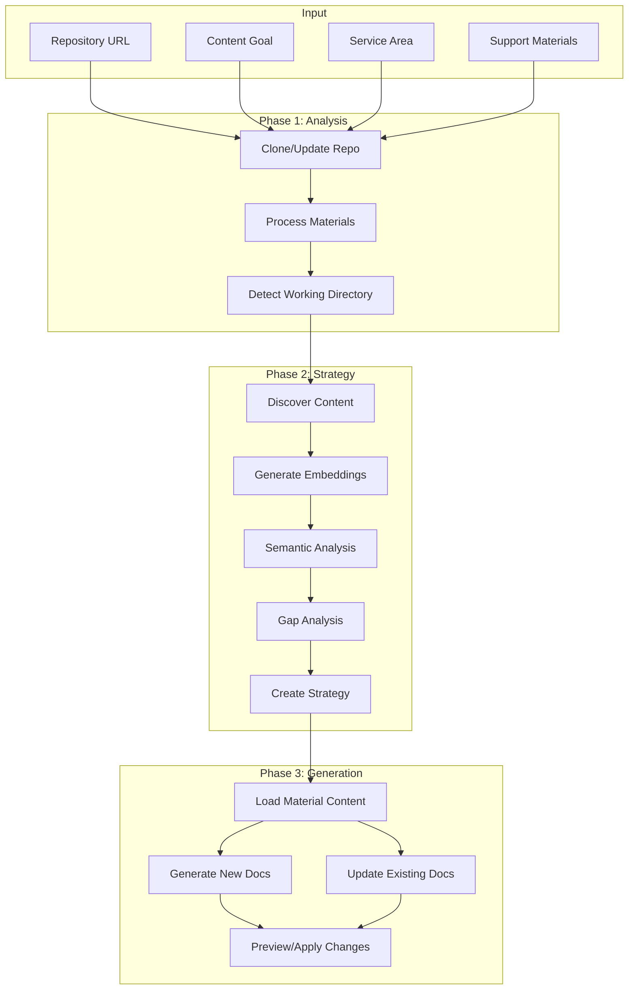
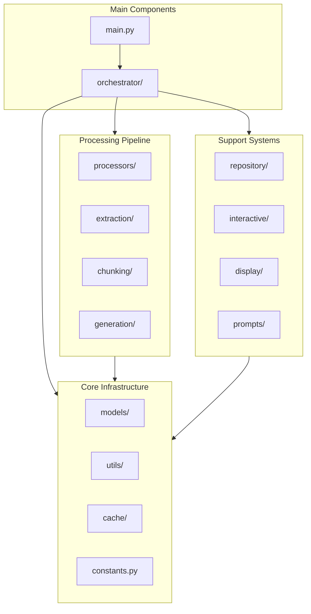
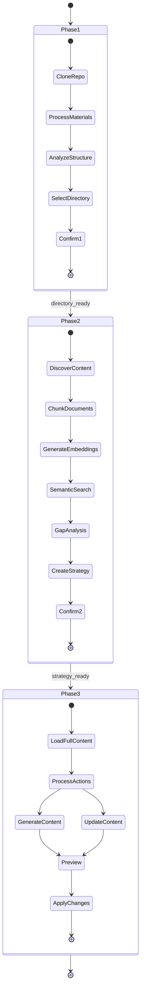

# AI Content Developer

An intelligent documentation generation tool that analyzes repositories and creates or updates documentation based on support materials using OpenAI's GPT models.

## Overview

AI Content Developer automates the process of creating and updating technical documentation by:
- Analyzing your repository structure
- Processing support materials (PDFs, Word docs, markdown files, URLs)
- Identifying content gaps through semantic analysis
- Generating new documentation or updating existing files
- Maintaining consistency with existing documentation style

## Architecture

### High-Level Flow



### Module Structure



### Phase Details



## Installation

### Prerequisites

- Python 3.8+
- Git
- OpenAI API key

### Setup

1. Clone the repository:
```bash
git clone https://github.com/yourusername/ai-content-developer.git
cd ai-content-developer
```

2. Install dependencies:
```bash
pip install -r requirements.txt
```

3. Set your OpenAI API key:
```bash
export OPENAI_API_KEY="your-api-key-here"
```

## Usage

### Basic Usage

```bash
python main.py <repo_url> "<content_goal>" "<service_area>" [materials...]
```

### Examples

#### Full Pipeline (All Phases)
```bash
python main.py https://github.com/Azure/azure-docs \
    "Create Cilium networking documentation" \
    "Azure Kubernetes Service" \
    support-materials/cilium-overview.pdf \
    support-materials/azure-cni-guide.docx
```

#### Phase 1 Only (Analysis)
```bash
python main.py https://github.com/Azure/azure-docs \
    "Analyze repository structure" \
    "AKS" \
    --phases 1
```

#### Phases 1 & 2 (Analysis + Strategy)
```bash
python main.py https://github.com/Azure/azure-docs \
    "Plan networking documentation updates" \
    "AKS" \
    --phases 12 \
    networking-guide.md
```

#### Auto-Confirm Mode
```bash
python main.py https://github.com/Azure/azure-docs \
    "Update CNI documentation" \
    "AKS" \
    --auto-confirm \
    cni-updates.pdf
```

#### Apply Changes Directly
```bash
python main.py https://github.com/Azure/azure-docs \
    "Create new tutorials" \
    "AKS" \
    --apply-changes \
    tutorial-content.md
```

### Command Line Options

| Option | Description | Default |
|--------|-------------|---------|
| `repo_url` | Repository URL to analyze | Required |
| `content_goal` | Goal for content creation/update | Required |
| `service_area` | Service area (e.g., 'Azure Kubernetes Service') | Required |
| `materials` | Support material files/URLs | Optional |
| `--auto-confirm`, `-y` | Auto-confirm all prompts | False |
| `--work-dir` | Working directory for repos | `./work/tmp` |
| `--max-depth` | Max repository depth to analyze | 3 |
| `--content-limit` | Content extraction limit (chars) | 15000 |
| `--phases` | Phases to run (1, 2, 3, 12, 13, 23, 123) | "3" |
| `--debug-similarity` | Show similarity scoring details | False |
| `--apply-changes` | Apply generated content to repository | False |

## Features

### Phase 1: Repository Analysis

- **Material Processing**: Extracts and summarizes content from various formats:
  - PDF documents (.pdf)
  - Word documents (.docx, .doc)
  - Markdown files (.md)
  - Web URLs (http://, https://)
  - Any other text files

- **Intelligent Directory Detection**: Uses LLM to analyze repository structure and select the most appropriate working directory based on:
  - Content goal alignment
  - Service area relevance
  - Material context
  - Existing directory purposes

### Phase 2: Content Strategy

- **Smart Document Chunking**: Preserves document structure while creating semantic chunks
- **Embedding Generation**: Creates vector embeddings for semantic search
- **Gap Analysis**: Identifies missing content by comparing materials against existing docs
- **Strategic Planning**: Determines whether to CREATE new files or UPDATE existing ones

### Phase 3: Content Generation

- **Context-Aware Generation**: Uses full material content and relevant chunks
- **Content Type Selection**: Automatically selects appropriate documentation type:
  - How-To Guides
  - Concepts
  - Overviews
  - Quickstarts
  - Tutorials

- **Intelligent Updates**: Preserves existing content while adding new sections
- **RAG-Based Generation**: Uses Retrieval-Augmented Generation to prevent hallucination

## Output Structure

```
./llm_outputs/
├── materials_summary/          # Processed material summaries
├── decisions/
│   └── working_directory/      # Directory selection decisions
├── content_strategy/           # Strategy analysis results
├── embeddings/                 # Cached embeddings by repo/directory
│   └── [repo]/[directory]/     # Organized by repository and working directory
├── content_generation/
│   └── create/                 # New content generation logs
├── generation/                 # Content update logs
└── preview/
    └── [repo]/[directory]/
        ├── create/             # Preview of new files
        └── updates/            # Preview of updated files
```

## Module Structure

```
content_developer/
├── models/                     # Data models
│   ├── config.py              # Configuration
│   ├── content.py             # Content models
│   └── result.py              # Result model
├── processors/                 # Core processors
│   ├── smart_processor.py     # Base processor class
│   ├── material.py            # Material processing
│   ├── directory.py           # Directory detection
│   ├── discovery.py           # Content discovery
│   ├── strategy.py            # Strategy generation
│   ├── strategy_debug.py      # Debug visualization
│   └── strategy_helpers.py    # Helper methods
├── generation/                 # Content generation
│   ├── base_content_processor.py  # Base class for processors
│   ├── material_loader.py     # Load full content
│   ├── create_processor.py    # Create new files
│   ├── update_processor.py    # Update existing
│   └── content_generator.py   # Orchestrator
├── extraction/                 # Content extraction
│   └── content_extractor.py   # Multi-format extractor
├── chunking/                   # Document chunking
│   └── smart_chunker.py       # Structure-aware chunking
├── cache/                      # Caching system
│   └── unified_cache.py       # Embeddings & manifests
├── repository/                 # Git operations
│   └── manager.py             # Clone, update, structure
├── interactive/                # User interactions
│   ├── generic_interactive.py # Base interaction class
│   ├── directory.py           # Directory confirmation
│   ├── strategy.py            # Strategy confirmation
│   └── selector.py            # Interactive selection
├── display/                    # Results display
│   └── results.py             # Formatted output
├── prompts/                    # LLM prompts
│   ├── material.py            # Material analysis
│   ├── directory.py           # Directory selection
│   ├── strategy.py            # Strategy generation  
│   ├── generation.py          # Content generation
│   └── helpers.py             # Formatting helpers
├── utils/                      # Utilities
│   ├── core_utils.py          # Core utilities
│   ├── file_ops.py            # File operations
│   ├── imports.py             # Dynamic imports
│   └── logging.py             # Logging setup
└── orchestrator/               # Main orchestrator
    └── orchestrator.py        # 3-phase workflow
```

## Advanced Usage

### Custom Content Standards

Create a `content_standards.json` file to define custom content types:

```json
{
  "contentTypes": [
    {
      "name": "API Reference",
      "frontMatter": {
        "ms.topic": "reference",
        "ms.service": "api"
      },
      "purpose": "Technical API documentation",
      "description": "Detailed API endpoint documentation",
      "structure": [
        "Overview",
        "Authentication",
        "Endpoints",
        "Examples",
        "Error Codes"
      ]
    }
  ]
}
```

### Debugging Similarity Scores

Use `--debug-similarity` to see detailed scoring information:

```bash
python main.py https://github.com/repo "goal" "service" \
    --debug-similarity \
    --phases 2
```

This shows:
- Base similarity scores
- File-level relevance analysis
- Boost calculations
- Score transformations
- Strategy insights
- Chunk-level matching details

## Best Practices

1. **Start with Phase 1**: Run phase 1 first to understand repository structure
2. **Review Strategy**: Always review the content strategy before generation
3. **Use Support Materials**: Provide comprehensive materials for better results
4. **Review Before Applying**: Always review generated content in preview before using `--apply-changes`
5. **Backup Important Files**: Always maintain your own backups before running content updates
6. **Incremental Updates**: Work on one section at a time for large documentation sets

## Troubleshooting

### Common Issues

1. **"No materials provided"**
   - Ensure you provide at least one support material file or URL
   - Check that file paths are correct

2. **"No markdown files found"**
   - Ensure the selected directory contains `.md` files
   - Check if you need a different working directory

3. **"Strategy generation failed"**
   - Verify your OpenAI API key is set correctly
   - Check API rate limits
   - Ensure materials are readable

4. **"Import error"**
   - Run `pip install -r requirements.txt`
   - Ensure Python 3.8+ is installed

### Debug Mode

Enable detailed logging:

```bash
export PYTHONPATH=$PYTHONPATH:$(pwd)
python -m logging.basicConfig level=DEBUG main.py ...
```

Or in code:
```python
import logging
logging.basicConfig(level=logging.DEBUG)
```

## Validation & Testing Tools

### Health Check Script

Run a comprehensive health check to ensure your environment is properly configured:

```bash
./scripts/health_check.sh
```

This checks:
- Python installation and version
- OpenAI API key configuration
- Required dependencies
- Directory structure
- Network connectivity
- File permissions

### Test Run Script

Validate the application is working correctly with a minimal test:

```bash
./scripts/test_run.sh
```

This script:
- Tests all three phases independently
- Uses minimal inputs for quick validation
- Verifies output creation
- Reports pass/fail status for each phase

### Reset Tool

Clean up outputs or perform various reset operations:

```bash
# Show help
./scripts/reset.sh help

# Clear corrupted cache
./scripts/reset.sh cache

# Clear outputs but keep cache
./scripts/reset.sh outputs

# Clear preview files only
./scripts/reset.sh preview

# Full reset (removes all outputs)
./scripts/reset.sh full

# Reinstall dependencies
./scripts/reset.sh deps
```

### Quick Validation

After installation or when experiencing issues:

1. **Check environment**:
   ```bash
   ./scripts/health_check.sh
   ```

2. **Run test**:
   ```bash
   ./scripts/test_run.sh
   ```

3. **If issues persist, reset and retry**:
   ```bash
   ./scripts/reset.sh full
   ./scripts/test_run.sh
   ```

For detailed troubleshooting steps and error resolution, see the comprehensive [Validation & Troubleshooting Guide](./docs/validation-troubleshooting.md) in the documentation.

## Contributing

1. Fork the repository
2. Create a feature branch
3. Make your changes
4. Run tests
5. Submit a pull request

## License

MIT License - see LICENSE file for details

## Acknowledgments

- OpenAI for GPT models
- Azure documentation team for inspiration
- Contributors and testers

---

For more information, issues, or contributions, visit the [GitHub repository](https://github.com/yourusername/ai-content-developer).