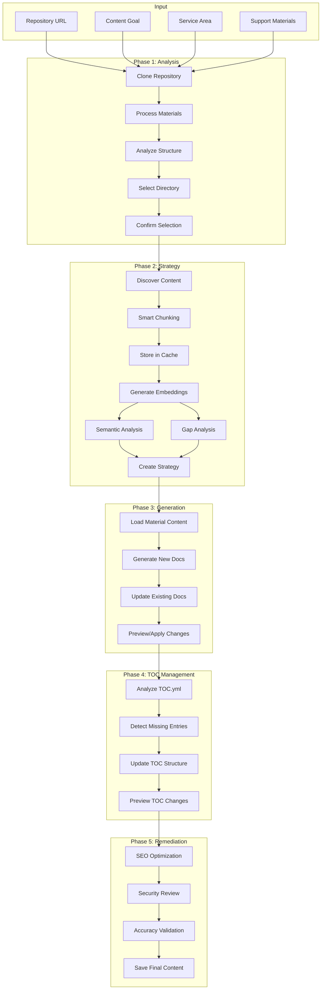
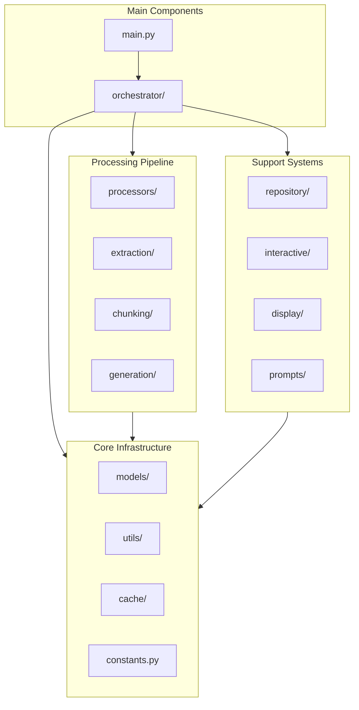

# AI Content Developer

An intelligent documentation generation tool that analyzes repositories and creates or updates documentation based on support materials using Azure OpenAI models.

> **📢 Important**: This tool uses **Azure OpenAI** with Microsoft Entra ID authentication instead of OpenAI API keys.

## Overview

AI Content Developer automates the process of creating and updating technical documentation by:
- Analyzing your repository structure
- Processing support materials (PDFs, Word docs, markdown files, URLs)
- Identifying content gaps through semantic analysis
- Generating new documentation or updating existing files
- Maintaining consistency with existing documentation style

## Architecture

### High-Level Flow



### Module Structure



### Phase Details

```mermaid
stateDiagram-v2
    [*] --> Phase1
    
    state Phase1 {
        [*] --> CloneRepo
        CloneRepo --> ProcessMaterials
        ProcessMaterials --> AnalyzeStructure
        AnalyzeStructure --> SelectDirectory
        SelectDirectory --> Confirm1
        Confirm1 --> [*]
    }
    
    Phase1 --> Phase2: directory_ready
    
    state Phase2 {
        [*] --> DiscoverContent
        DiscoverContent --> ChunkDocuments
        ChunkDocuments --> GenerateEmbeddings
        GenerateEmbeddings --> SemanticSearch
        SemanticSearch --> GapAnalysis
        GapAnalysis --> CreateStrategy
        CreateStrategy --> Confirm2
        Confirm2 --> [*]
    }
    
    Phase2 --> Phase3: strategy_ready
    
    state Phase3 {
        [*] --> LoadFullContent
        LoadFullContent --> ProcessActions
        ProcessActions --> GenerateContent
        ProcessActions --> UpdateContent
        GenerateContent --> Preview
        UpdateContent --> Preview
        Preview --> ApplyChanges
        ApplyChanges --> [*]
    }
    
    Phase3 --> Phase4: generation_ready
    
    state Phase4 {
        [*] --> LoadTOC
        LoadTOC --> ExtractEntries
        ExtractEntries --> IdentifyMissing
        IdentifyMissing --> GenerateTOCUpdate
        GenerateTOCUpdate --> PreviewTOC
        PreviewTOC --> [*]
    }
    
    Phase4 --> Phase5: remediation_ready
    
    state Phase5 {
        [*] --> SEOOptimization
        SEOOptimization --> SecurityReview
        SecurityReview --> AccuracyValidation
        AccuracyValidation --> SaveFinalContent
        SaveFinalContent --> [*]
    }
    
    Phase5 --> [*]
```



## Large Repository Handling

The tool automatically detects and optimizes for large repositories (>5,000 files):

### Directory-Only View
For all repositories (automatically applied to large repos), the tool uses a directory-only tree view that:
- Shows the complete directory tree structure
- Excludes individual files to reduce prompt size
- Displays markdown file counts per directory  
- Indicates directories with TOC.yml files
- Filters out common non-documentation directories

Example output:
```
[Repository Root] (5 .md)
├── articles [TOC] (0 .md)
│   ├── aks (45 .md)
│   │   ├── concepts (12 .md)
│   │   ├── how-to (20 .md)
│   │   └── troubleshooting (13 .md)
│   ├── storage (32 .md)
│   │   ├── blobs (15 .md)
│   │   ├── files (10 .md)
│   │   └── queues (7 .md)
│   └── app-service (28 .md)
├── includes (0 .md)
└── bread (0 .md)
```

This approach provides full visibility into the repository structure while preventing rate limiting issues when processing massive repositories like azure-docs.

## Prerequisites

### System Requirements

- **Python 3.12 or earlier** (Python 3.13 has compatibility issues with some dependencies)
- **Git** (for cloning repositories)
- **Azure Subscription** with access to create Azure OpenAI resources
- **Azure CLI** installed and configured

### Required Azure Resources

1. **Azure OpenAI Service Resource** with:
   - A completion model deployment (e.g., `gpt-4`, `gpt-4o`, or `gpt-4.1`)
   - An embedding model deployment (e.g., `text-embedding-3-small`)

2. **Required Permissions**:
   - `Cognitive Services OpenAI User` role on the Azure OpenAI resource
   - Or `Cognitive Services OpenAI Contributor` for full access

## Installation & Setup

### Step 1: Clone the Repository

```bash
git clone https://github.com/chasedmicrosoft/AI-CONTENT-DEVELOPER.git
cd AI-CONTENT-DEVELOPER
```

### Step 2: Set Up Python Virtual Environment

Using a Python virtual environment is **strongly recommended** to avoid dependency conflicts.

<details>
<summary><b>macOS/Linux Instructions</b></summary>

```bash
# Create virtual environment (use python3.12 if available)
python3 -m venv venv
# or specifically with Python 3.12
python3.12 -m venv venv

# Activate virtual environment
source venv/bin/activate

# Upgrade pip
pip install --upgrade pip

# Install dependencies
pip install -r requirements.txt
```

</details>

<details>
<summary><b>Windows Instructions</b></summary>

```cmd
# Create virtual environment
python -m venv venv
# or specifically with Python 3.12
py -3.12 -m venv venv

# Activate virtual environment
# For Command Prompt:
venv\Scripts\activate.bat
# For PowerShell:
venv\Scripts\Activate.ps1

# If you get an execution policy error in PowerShell:
Set-ExecutionPolicy -ExecutionPolicy RemoteSigned -Scope CurrentUser

# Upgrade pip
python -m pip install --upgrade pip

# Install dependencies
pip install -r requirements.txt
```

</details>

### Step 3: Install and Configure Azure CLI

The Azure CLI is required for authentication with Azure OpenAI.

<details>
<summary><b>Installation Instructions</b></summary>

**macOS:**
```bash
brew update && brew install azure-cli
```

**Linux (Ubuntu/Debian):**
```bash
curl -sL https://aka.ms/InstallAzureCLIDeb | sudo bash
```

**Windows:**
Download and run the [MSI installer](https://aka.ms/installazurecliwindows)

For other platforms, see the [Azure CLI installation guide](https://learn.microsoft.com/en-us/cli/azure/install-azure-cli).

</details>

**Configure Azure CLI:**
```bash
# Login to Azure
az login

# If you have multiple subscriptions, set the one to use
az account list --output table
az account set --subscription "Your Subscription Name or ID"

# Verify you're logged in
az account show
```

### Step 4: Create Azure OpenAI Resource

Follow the [official Azure OpenAI resource creation guide](https://learn.microsoft.com/en-us/azure/ai-services/openai/how-to/create-resource) or use these quick steps:

<details>
<summary><b>Azure Portal Method</b></summary>

1. Go to [Azure Portal](https://portal.azure.com)
2. Click **Create a resource**
3. Search for **Azure OpenAI** and select it
4. Click **Create**
5. Fill in the required fields:
   - **Subscription**: Your Azure subscription
   - **Resource group**: Create new or use existing
   - **Region**: Choose based on [model availability](https://learn.microsoft.com/en-us/azure/ai-services/openai/concepts/models#model-summary-table-and-region-availability)
   - **Name**: Unique name for your resource
   - **Pricing tier**: Standard S0
6. Review and create the resource

</details>

<details>
<summary><b>Azure CLI Method</b></summary>

```bash
# Create a resource group (if needed)
az group create --name YourResourceGroup --location eastus

# Create Azure OpenAI resource
az cognitiveservices account create \
    --name YourOpenAIResource \
    --resource-group YourResourceGroup \
    --location eastus \
    --kind OpenAI \
    --sku S0 \
    --yes

# Get the endpoint
az cognitiveservices account show \
    --name YourOpenAIResource \
    --resource-group YourResourceGroup \
    --query properties.endpoint \
    --output tsv
```

</details>

### Step 5: Deploy Required Models

You need to deploy two models: one for completion and one for embeddings.

<details>
<summary><b>Azure Portal Method</b></summary>

1. Go to your Azure OpenAI resource in the Azure Portal
2. Navigate to **Model deployments** → **Manage Deployments**
3. Click **Create new deployment**
4. Deploy a completion model:
   - **Model**: `gpt-4`, `gpt-4o`, or `gpt-4.1`
   - **Deployment name**: `gpt-4.1` (or your preferred name)
   - **Deployment type**: Standard
5. Create another deployment for embeddings:
   - **Model**: `text-embedding-3-small`
   - **Deployment name**: `text-embedding-3-small`
   - **Deployment type**: Standard

</details>

<details>
<summary><b>Azure CLI Method</b></summary>

```bash
# Deploy GPT-4.1 model
az cognitiveservices account deployment create \
    --name YourOpenAIResource \
    --resource-group YourResourceGroup \
    --deployment-name gpt-4.1 \
    --model-name gpt-4.1 \
    --model-version "2024-05-13" \
    --model-format OpenAI \
    --sku-capacity 10 \
    --sku-name Standard

# Deploy embedding model
az cognitiveservices account deployment create \
    --name YourOpenAIResource \
    --resource-group YourResourceGroup \
    --deployment-name text-embedding-3-small \
    --model-name text-embedding-3-small \
    --model-version "1" \
    --model-format OpenAI \
    --sku-capacity 10 \
    --sku-name Standard
```

</details>

### Step 6: Configure Permissions

Ensure your Azure account has the necessary permissions. See the [Azure OpenAI RBAC guide](https://learn.microsoft.com/en-us/azure/ai-services/openai/how-to/role-based-access-control) for details.

**Grant yourself access (if needed):**
```bash
# Get your user object ID
az ad signed-in-user show --query id -o tsv

# Assign Cognitive Services OpenAI User role
az role assignment create \
    --role "Cognitive Services OpenAI User" \
    --assignee YOUR_USER_OBJECT_ID \
    --scope /subscriptions/YOUR_SUBSCRIPTION_ID/resourceGroups/YOUR_RESOURCE_GROUP/providers/Microsoft.CognitiveServices/accounts/YOUR_OPENAI_RESOURCE
```

### Step 7: Configure Environment Variables

```bash
# Copy the example environment file
cp env.example .env

# Edit .env with your configuration
# macOS/Linux: nano .env or vim .env
# Windows: notepad .env
```

Update your `.env` file with your Azure OpenAI details:

```bash
# Azure OpenAI Configuration
# Required: Your Azure OpenAI endpoint URL
AZURE_OPENAI_ENDPOINT=https://your-resource-name.openai.azure.com/

# Deployment names (must match your deployed model names)
AZURE_OPENAI_COMPLETION_DEPLOYMENT=gpt-4.1
AZURE_OPENAI_EMBEDDING_DEPLOYMENT=text-embedding-3-small

# Optional: API version (defaults to 2024-08-01-preview)
AZURE_OPENAI_API_VERSION=2024-08-01-preview

# Optional: Temperature settings
AZURE_OPENAI_TEMPERATURE=0.3
AZURE_OPENAI_CREATIVE_TEMPERATURE=0.7
```

If successful, you should see the tool analyzing the repository structure.

## Virtual Environment Best Practices

1. **Always activate the virtual environment** before running the tool:
   - macOS/Linux: `source venv/bin/activate`
   - Windows: `venv\Scripts\activate`

2. **Keep dependencies updated:**
```bash
# Update all packages
pip install --upgrade -r requirements.txt

# Check for outdated packages
pip list --outdated
```

3. **Freeze dependencies** if you install new packages:
```bash
pip freeze > requirements.txt
```

4. **Use the correct Python version:**
   - The tool works best with Python 3.12 or earlier
   - Python 3.13 has compatibility issues with some dependencies

5. **Troubleshooting virtual environment issues:**
```bash
# If venv is corrupted, recreate it
rm -rf venv  # macOS/Linux
rmdir /s venv  # Windows
python -m venv venv

# If packages fail to install, try upgrading pip and setuptools
pip install --upgrade pip setuptools wheel
```

### Quick Start Scripts

For convenience, you can create scripts to automate virtual environment setup:

**macOS/Linux** (`setup_venv.sh`):
```bash
#!/bin/bash
echo "Setting up Python virtual environment..."
python3.12 -m venv venv || python3 -m venv venv
source venv/bin/activate
pip install --upgrade pip
pip install -r requirements.txt
cp env.example .env
echo "Virtual environment ready! Don't forget to:"
echo "1. Edit .env with your Azure OpenAI configuration"
echo "2. Run 'az login' to authenticate"
echo "3. Activate venv with: source venv/bin/activate"
```

**Windows** (`setup_venv.bat`):
```batch
@echo off
echo Setting up Python virtual environment...
py -3.12 -m venv venv 2>nul || python -m venv venv
call venv\Scripts\activate.bat
python -m pip install --upgrade pip
pip install -r requirements.txt
copy env.example .env
echo Virtual environment ready! Don't forget to:
echo 1. Edit .env with your Azure OpenAI configuration
echo 2. Run 'az login' to authenticate
echo 3. Activate venv with: venv\Scripts\activate
```

Make the script executable (macOS/Linux):
```bash
chmod +x setup_venv.sh
./setup_venv.sh
```

## Usage

### Basic Usage

```bash
python main.py --repo <repo_url> --goal "<content_goal>" --service "<service_area>" -m [materials...]
```

### Examples

#### Example 1: Create New Azure Kubernetes Service Documentation
```bash
# Create comprehensive AKS networking documentation from technical specifications
python main.py \
    --repo https://github.com/MicrosoftDocs/azure-aks-docs \
    --goal "Create comprehensive documentation for Azure CNI powered by Cilium, including architecture, deployment steps, and troubleshooting" \
    --service "Azure Kubernetes Service" \
    -m azure-cni-cilium-spec.pdf cilium-architecture.docx \
    --audience "cloud architects and DevOps engineers" \
    --audience-level intermediate
```

#### Example 2: Update Existing Storage Documentation
```bash
# Update Azure Storage docs with new blob lifecycle management features
python main.py \
    --repo https://github.com/MicrosoftDocs/azure-storage-docs \
    --goal "Update blob storage documentation to include new lifecycle management policies and cost optimization strategies" \
    --service "Azure Storage" \
    -m blob-lifecycle-features.md cost-optimization-guide.pdf \
    --auto-confirm \
    --apply-changes
```

#### Example 3: Create API Reference Documentation
```bash
# Generate API reference docs from OpenAPI specification
python main.py \
    --repo https://github.com/Azure/azure-rest-api-specs \
    --goal "Create detailed API reference documentation for the new Azure Container Apps management REST APIs" \
    --service "Azure Container Apps" \
    -m container-apps-openapi.yaml api-examples.json \
    --audience "API developers" \
    --audience-level advanced
```

#### Example 4: Add Troubleshooting Guides
```bash
# Add troubleshooting section to existing documentation
python main.py \
    --repo https://github.com/MicrosoftDocs/azure-app-service-docs \
    --goal "Add comprehensive troubleshooting guide for common App Service deployment failures and performance issues" \
    --service "Azure App Service" \
    -m support-tickets-analysis.xlsx common-errors.md \
    --phases 234 \
    --auto-confirm
```

#### Example 5: Create Migration Documentation
```bash
# Create migration guide from on-premises to Azure
python main.py \
    --repo https://github.com/MicrosoftDocs/azure-migration-docs \
    --goal "Create step-by-step migration guide for moving SQL Server workloads from on-premises to Azure SQL Database" \
    --service "Azure SQL Database" \
    -m sql-migration-assessment.pdf best-practices.docx prerequisites.md \
    --audience "database administrators" \
    --audience-level intermediate \
    --apply-changes
```

### Phase-Specific Examples

#### Phase 1 Only: Repository Analysis
```bash
# Analyze repository structure to understand documentation organization
python main.py \
    --repo https://github.com/MicrosoftDocs/azure-cognitive-services-docs \
    --goal "Analyze how AI/ML documentation is organized" \
    --service "Azure Cognitive Services" \
    --phases 1 \
    -m sample-content.md
```

#### Phases 1-2: Analysis and Strategy Planning
```bash
# Plan documentation updates without generating content
python main.py \
    --repo https://github.com/MicrosoftDocs/azure-cosmos-db-docs \
    --goal "Plan comprehensive update for Cosmos DB consistency levels documentation" \
    --service "Azure Cosmos DB" \
    --phases 12 \
    -m consistency-levels-deep-dive.pdf \
    --debug-similarity
```

#### Phases 3-4: Content Generation and TOC Update
```bash
# Generate content and update TOC for existing repository
python main.py \
    --repo https://github.com/MicrosoftDocs/azure-virtual-machines-docs \
    --goal "Add new section on VM performance optimization and monitoring best practices" \
    --service "Azure Virtual Machines" \
    --phases 34 \
    -m vm-performance-guide.pdf monitoring-tools.md \
    --apply-changes
```

#### Phase 5: Content Remediation Only
```bash
# Run remediation on previously generated content (requires prior phase 3 completion)
python main.py \
    --repo https://github.com/MicrosoftDocs/azure-aks-docs \
    --goal "Optimize Kubernetes networking documentation for SEO and security" \
    --service "Azure Kubernetes Service" \
    --phases 5 \
    -m networking-guide.pdf
```

#### All Phases: Complete Workflow with Remediation
```bash
# Run complete workflow including remediation for highest quality output
python main.py \
    --repo https://github.com/MicrosoftDocs/azure-monitor-docs \
    --goal "Create comprehensive monitoring and alerting guide with best practices" \
    --service "Azure Monitor" \
    --phases all \
    -m monitoring-patterns.pdf alerting-rules.md sla-requirements.docx \
    --auto-confirm \
    --apply-changes
```

#### Phases 3-5: Generation with Remediation
```bash
# Generate content and run full remediation workflow
python main.py \
    --repo https://github.com/MicrosoftDocs/azure-security-docs \
    --goal "Document Zero Trust security implementation for Azure workloads" \
    --service "Azure Security" \
    --phases 345 \
    -m zero-trust-principles.pdf security-baseline.docx \
    --audience "security engineers" \
    --audience-level advanced
```

### Advanced Usage Examples

#### Working with Multiple Materials and URLs
```bash
# Combine PDFs, Word docs, markdown files, and web resources
python main.py \
    --repo https://github.com/MicrosoftDocs/azure-security-docs \
    --goal "Create comprehensive security baseline documentation for Azure Landing Zones" \
    --service "Azure Security" \
    -m security-baseline.pdf \
       compliance-requirements.docx \
       https://docs.microsoft.com/azure/security/benchmarks/overview \
       landing-zone-architecture.md \
    --audience "security architects and compliance officers" \
    --audience-level advanced
```

#### Working with Large Materials (No Truncation)
```bash
# Process large PDFs or documents without truncation
python main.py \
    --repo https://github.com/MicrosoftDocs/azure-aks-docs \
    --goal "Update documentation based on comprehensive PRD" \
    --service "Azure Kubernetes Service" \
    -m large-prd-document.pdf detailed-specs.docx \
    --content-limit 10000000 \
    --phases 2
```

#### Clean Run with Full Automation
```bash
# Fresh start with automatic confirmation and direct application
python main.py \
    --repo https://github.com/MicrosoftDocs/azure-monitor-docs \
    --goal "Create complete observability guide including metrics, logs, and distributed tracing" \
    --service "Azure Monitor" \
    -m observability-patterns.pdf logs-best-practices.md metrics-guide.docx \
    --clean \
    --auto-confirm \
    --apply-changes
```

#### Custom Working Directory
```bash
# Specify custom working directory for cloned repositories
python main.py \
    --repo https://github.com/Azure-Samples/azure-functions-samples \
    --goal "Document serverless patterns and best practices for Azure Functions" \
    --service "Azure Functions" \
    -m serverless-patterns.pdf function-triggers.md \
    --work-dir ./projects/azure-functions \
    --max-depth 4
```

#### Skip TOC Update for Repositories with Complex TOC Structure
```bash
# Generate content but skip TOC.yml updates
python main.py \
    --repo https://github.com/MicrosoftDocs/azure-iot-docs \
    --goal "Add Edge computing scenarios and deployment patterns documentation" \
    --service "Azure IoT Edge" \
    -m iot-edge-patterns.pdf deployment-scenarios.docx \
    --skip-toc \
    --auto-confirm
```

### Real-World Scenarios

#### Scenario 1: Documentation Sprint
```bash
# Quick documentation update during a sprint
python main.py \
    --repo https://github.com/MicrosoftDocs/azure-container-instances-docs \
    --goal "Document new GPU support features and pricing updates" \
    --service "Azure Container Instances" \
    -m gpu-support-announcement.md pricing-calculator.xlsx \
    --phases 34 \
    --auto-confirm \
    --apply-changes
```

#### Scenario 2: Compliance Documentation
```bash
# Generate compliance and regulatory documentation
python main.py \
    --repo https://github.com/MicrosoftDocs/azure-compliance-docs \
    --goal "Create GDPR compliance guide for Azure data services including retention policies and data residency" \
    --service "Azure Compliance" \
    -m gdpr-requirements.pdf data-residency-matrix.xlsx \
    --audience "compliance officers and data protection officers" \
    --audience-level intermediate
```

#### Scenario 3: Architecture Documentation
```bash
# Create architecture decision records and design patterns
python main.py \
    --repo https://github.com/Azure/azure-architecture-center \
    --goal "Document microservices design patterns and anti-patterns for Azure-based solutions" \
    --service "Azure Architecture" \
    -m microservices-patterns.pdf anti-patterns.md case-studies.docx \
    --content-limit 1000000 \
    --audience "solution architects" \
    --audience-level advanced
```

## Command Line Options

| Option | Description | Default |
|--------|-------------|---------|
| `--repo` | Repository URL to analyze | Required |
| `--goal` | Goal for content creation/update | Required |
| `--service` | Service area (e.g., 'Azure Kubernetes Service') | Required |
| `-m`, `--materials` | Support material files/URLs | Required |
| `--audience` | Target audience for the content | "technical professionals" |
| `--audience-level` | Technical level (beginner, intermediate, advanced) | "intermediate" |
| `--auto-confirm`, `-y` | Auto-confirm all prompts | False |
| `--clean` | Clear llm_outputs and work directory before starting | False |
| `--work-dir` | Working directory for repos | `./work/tmp` |
| `--max-depth` | Max repository depth to analyze | 3 |
| `--content-limit` | Material extraction limit (chars). Use high values (e.g., 10000000) to avoid truncation | 15000 |
| `--phases` | Phases to run (1, 2, 3, 4, 5, 12, 13, 14, 15, 23, 24, 25, 34, 35, 45, 123, 124, 125, 134, 135, 145, 234, 235, 245, 345, 1234, 1235, 1245, 1345, 2345, 12345, or 'all') | "all" |
| `--debug-similarity` | Show similarity scoring details | False |
| `--apply-changes` | Apply generated content to repository | False |
| `--skip-toc` | Skip TOC management (Phase 4) if TOC.yml is invalid | False |

## Authentication

The AI Content Developer uses **DefaultAzureCredential** from the Azure Identity library, which supports multiple authentication methods:

### Authentication Methods (in order of precedence)

1. **Azure CLI** (Recommended for local development)
   ```bash
   az login
   ```

2. **Managed Identity** (For Azure-hosted environments)
   - Automatically uses the managed identity assigned to your Azure resource

3. **Environment Variables** (For service principals)
   ```bash
   export AZURE_CLIENT_ID="your-service-principal-id"
   export AZURE_CLIENT_SECRET="your-service-principal-secret"
   export AZURE_TENANT_ID="your-tenant-id"
   ```

4. **Visual Studio Code**
   - Uses credentials from the Azure Account extension

5. **Azure PowerShell**
   ```powershell
   Connect-AzAccount
   ```

6. **Interactive Browser** (Fallback)
   - Opens a browser for authentication if no other method works

For more details, see the [DefaultAzureCredential documentation](https://learn.microsoft.com/en-us/python/api/azure-identity/azure.identity.defaultazurecredential).

## Features

### Phase 1: Repository Analysis

- **Material Processing**: Extracts and analyzes content from various formats:
  - PDF documents (.pdf)
  - Word documents (.docx, .doc)
  - Markdown files (.md)
  - Web URLs (http://, https://)
  - Plain text files (.txt)

- **Intelligent Directory Detection**: Uses LLM to analyze repository structure and select the most appropriate working directory based on:
  - Content goal alignment
  - Service area relevance
  - Material context
  - Repository organization patterns
  - **NEW**: Validates selection is a directory, not a file

### Phase 2: Content Strategy

- **Smart Document Chunking**: Preserves document structure while creating semantic chunks
- **Embedding Generation**: Creates vector embeddings for semantic search using Azure OpenAI
- **Enhanced Gap Analysis**: 
  - **NEW**: Uses full material content (not just summaries) for accurate comparison
  - **NEW**: Analyzes only top 3 most relevant files for focused strategy
  - Identifies specific missing sections by comparing materials against existing docs
- **Strategic Planning**: Determines whether to CREATE, UPDATE, or SKIP files
- **Coverage Assessment**: Evaluates how well existing content covers the material topics
- **File-Based Analysis**: Aggregates chunk scores by file for better relevance assessment

### Phase 3: Content Generation

- **Context-Aware Generation**: Uses full material content and relevant chunks
- **Content Type Selection**: Automatically selects appropriate documentation type:
  - How-To Guides
  - Concepts
  - Overviews
  - Quickstarts
  - Tutorials
  - Reference

- **Intelligent Updates**: Preserves existing content while adding new sections
- **Material Validation**: Ensures sufficient information before generating
- **RAG-Based Generation**: Uses Retrieval-Augmented Generation to prevent hallucination
- **Gap Reporting**: Reports missing information if materials are insufficient

### Phase 4: TOC Management

- **Automatic TOC Analysis**: Reads and parses existing TOC.yml structure
- **Smart Entry Detection**: Identifies which generated files are missing from TOC
- **Intelligent Placement**: Determines optimal placement for new entries based on:
  - Content type (How-To, Tutorial, Concept, etc.)
  - Topic relationships
  - Existing TOC organization patterns
- **Large TOC Handling**: Automatically condenses very large TOC files (>20KB)
- **Hierarchical Structure Preservation**: Maintains proper nesting and organization
- **Entry Naming**: Generates meaningful display names from document titles
- **Preview Mode**: Shows proposed TOC changes before applying
- **Validation**: Ensures YAML syntax correctness and structural integrity

**Note**: Phase 4 requires a valid TOC.yml file in the working directory. If the TOC has YAML syntax errors, use `--skip-toc` to skip this phase.

### Phase 5: Content Remediation

Phase 5 performs three sequential remediation steps on all generated content to ensure quality, security, and accuracy:

#### Step 1: SEO Optimization
- **Title Tag Optimization**: Ensures H1 titles are descriptive with primary keywords
- **Meta Description**: Creates compelling 150-160 character descriptions
- **Heading Structure**: Optimizes H2/H3 hierarchy for scannability
- **Keyword Integration**: Naturally includes primary and semantic keywords
- **Content Enhancements**: 
  - Adds alt text suggestions for images
  - Optimizes introduction paragraphs
  - Suggests internal links
  - Structures content for featured snippets
- **Technical SEO**: Optimizes code blocks and suggests schema markup

#### Step 2: Security Remediation
- **Sensitive Information Removal**:
  - Removes hardcoded credentials, keys, and tokens
  - Replaces real IP addresses with RFC 1918 ranges
  - Uses safe domain names (example.com, contoso.com)
  - Removes employee names and personal information
- **Resource Identifier Safety**:
  - Replaces real Azure subscription IDs
  - Uses generic resource names
  - Ensures no production resources are exposed
- **Security Best Practices**:
  - Validates examples follow least privilege
  - Adds security warnings where appropriate
  - Ensures secure coding practices in examples
- **Compliance Considerations**: Adds notes for data residency and compliance

#### Step 3: Technical Accuracy Validation
- **Material Cross-Reference**: Validates all claims against source materials
- **Code Validation**: 
  - Checks syntax correctness
  - Identifies deprecated methods
  - Validates API calls and parameters
- **Factual Accuracy**:
  - Verifies service limits and quotas
  - Validates version compatibility
  - Confirms regional availability
- **Completeness Check**: Ensures all required steps and prerequisites are included
- **Currency Review**: Flags outdated information and suggests updates

#### Phase 5 Output Structure
```
./llm_outputs/preview/phase5/
├── seo/
│   ├── create/         # SEO-optimized new files
│   └── update/         # SEO-optimized updated files
├── security/
│   ├── create/         # Security-remediated new files
│   └── update/         # Security-remediated updated files
└── final/
    ├── create/         # Final validated new files
    └── update/         # Final validated updated files
```

Each step displays:
- AI thinking process and reasoning
- Metrics and improvements made
- Issues found and corrected
- Confidence scores

The final validated content in `phase5/final/` represents the highest quality output, having passed through all three remediation steps.

### Large Repository Optimization

- **Automatic Detection**: Detects repositories with >5,000 files and optimizes structure display
- **Directory-Only Tree View**: 
  - Shows complete directory tree structure (all directories, all depths)
  - Excludes individual files to reduce prompt size
  - Displays markdown file counts per directory
  - Indicates TOC.yml presence with [TOC] tag
  - Filters out common non-documentation directories
- **Smart Directory Filtering**: Automatically excludes:
  - Build directories (node_modules, dist, build, target)
  - Test directories (test, tests, __pycache__)
  - Media directories (images, assets, static)
  - Version control (.git)
- **Performance Optimization**: Directory-only view prevents rate limiting with large repositories while maintaining full structural visibility

### Enhanced Features

- **AI Thinking Display**: Shows step-by-step AI reasoning in the terminal
- **Progress Tracking**: Visual progress bars for each phase
- **Error Recovery**: Graceful handling of insufficient materials or API errors
- **Cache Management**: Efficient embedding caching by repository and directory
- **Preview Mode**: Review all changes before applying to repository
- **Clean Runs**: Option to clear previous outputs for fresh starts

## Output Structure

```
./llm_outputs/
├── materials_summary/          # Processed material summaries
├── decisions/
│   └── working_directory/      # Directory selection decisions
├── content_strategy/           # Strategy analysis results
├── embeddings/                 # Cached embeddings by repo/directory
│   └── [repo]/[directory]/     # Organized by repository and working directory
├── content_generation/
│   └── create/                 # New content generation logs
├── generation/                 # Content update logs
├── toc_management/             # TOC update logs
└── preview/
    ├── [repo]/[directory]/
    │   ├── create/             # Preview of new files
    │   └── updates/            # Preview of updated files
    └── toc/                    # Preview of TOC changes
```

## Module Structure

```
content_developer/
├── models/                     # Data models
│   ├── config.py              # Configuration
│   ├── content.py             # Content models
│   └── result.py              # Result model
├── processors/                 # Core processors
│   ├── smart_processor.py     # Base processor class
│   ├── material.py            # Material processing
│   ├── directory.py           # Directory detection
│   ├── discovery.py           # Content discovery
│   ├── strategy.py            # Strategy generation
│   ├── strategy_debug.py      # Debug visualization
│   ├── strategy_helpers.py    # Helper methods
│   └── toc_processor.py       # TOC management
├── generation/                 # Content generation
│   ├── base_content_processor.py  # Base class for processors
│   ├── material_loader.py     # Load full content
│   ├── create_processor.py    # Create new files
│   ├── update_processor.py    # Update existing
│   └── content_generator.py   # Orchestrator
├── extraction/                 # Content extraction
│   └── content_extractor.py   # Multi-format extractor
├── chunking/                   # Document chunking
│   └── smart_chunker.py       # Structure-aware chunking
├── cache/                      # Caching system
│   └── unified_cache.py       # Embeddings & manifests
├── repository/                 # Git operations
│   └── manager.py             # Clone, update, structure
├── interactive/                # User interactions
│   ├── generic_interactive.py # Base interaction class
│   ├── directory.py           # Directory confirmation
│   ├── strategy.py            # Strategy confirmation
│   └── selector.py            # Interactive selection
├── display/                    # Results display
│   ├── console_display.py     # Rich terminal output
│   └── results.py             # Formatted output
├── prompts/                    # LLM prompts
│   ├── material.py            # Material analysis
│   ├── directory.py           # Directory selection
│   ├── strategy.py            # Strategy generation  
│   ├── generation.py          # Content generation
│   ├── toc.py                 # TOC management
│   ├── llm_native.py          # LLM-native operations
│   ├── helpers.py             # Formatting helpers
│   └── schemas.py             # JSON response schemas
├── utils/                      # Utilities
│   ├── core_utils.py          # Core utilities
│   ├── file_ops.py            # File operations
│   ├── imports.py             # Dynamic imports
│   └── logging.py             # Logging setup
└── orchestrator/               # Main orchestrator
    └── orchestrator.py        # 4-phase workflow
```

## Troubleshooting

### Common Issues

1. **Authentication Errors**
   ```
   "DefaultAzureCredential failed to retrieve a token"
   ```
   - Ensure you're logged in: `az login`
   - Check your subscription: `az account show`
   - Verify you have access to the Azure OpenAI resource

2. **Model Deployment Errors**
   ```
   "The API deployment for this resource does not exist"
   ```
   - Verify deployment names in `.env` match your actual deployments
   - Check deployments: `az cognitiveservices account deployment list --name YourResource --resource-group YourRG`

3. **Insufficient Materials Error**
   ```
   "Missing: Detailed explanation and configuration steps..."
   ```
   - The provided materials don't contain enough information
   - Add more comprehensive documentation or technical guides
   - Check that materials are being read correctly

4. **Directory Selection Issues**
   ```
   "Markdown Files: 0"
   ```
   - The system selected a file instead of a directory
   - This has been fixed in the latest version
   - Ensure you're using the updated code

5. **"No materials provided"**
   - Ensure you provide at least one support material file or URL
   - Check that file paths are correct
   - Verify URLs are accessible

6. **Failed to parse TOC.yml**
   - The repository's TOC.yml may have invalid YAML syntax
   - Use `--skip-toc` flag to skip Phase 4
   - Common YAML issues:
     - Missing colons after keys
     - Incorrect indentation (use 2 spaces, not tabs)
     - Duplicate keys at the same level

7. **Rate Limiting**
   ```
   "Rate limit reached"
   ```
   - Azure OpenAI has rate limits per deployment
   - Wait a moment and retry
   - Consider increasing TPM (Tokens Per Minute) in Azure Portal

### Debug Mode

Enable detailed logging:

```bash
# Set environment variable
export AI_CONTENT_DEBUG=true

# Or use debug flag
python main.py --debug-similarity ...
```

### Validation & Testing Tools

#### Health Check Script

Run a comprehensive health check:

```bash
./scripts/health_check.sh
```

This checks:
- Python installation and version
- Azure CLI configuration
- Required dependencies
- Directory structure
- Azure connectivity
- Model deployments

#### Test Run Script

Validate the application is working:

```bash
./scripts/test_run.sh
```

#### Reset Tool

Clean up outputs or perform reset operations:

```bash
# Show help
./scripts/reset.sh help

# Clear corrupted cache
./scripts/reset.sh cache

# Clear outputs but keep cache
./scripts/reset.sh outputs

# Full reset (removes all outputs)
./scripts/reset.sh full
```

### Getting Help

1. **Check the logs**: Look in `./llm_outputs/` for detailed operation logs
2. **Enable debug mode**: Use `--debug-similarity` for detailed scoring info
3. **Review prerequisites**: Ensure all Azure resources are properly configured
4. **Check permissions**: Verify you have the correct RBAC roles
5. **File an issue**: Report bugs on the GitHub repository

## Best Practices

1. **Start with Phase 1**: Run phase 1 first to understand repository structure
2. **Review Strategy**: Always review the content strategy before generation
3. **Use Comprehensive Materials**: Provide detailed technical documentation
4. **Preview Before Applying**: Always review generated content before using `--apply-changes`
5. **Backup Important Files**: Maintain backups before running content updates
6. **Monitor Costs**: Azure OpenAI usage incurs costs - monitor your usage

## Contributing

1. Fork the repository
2. Create a feature branch
3. Make your changes
4. Run tests
5. Submit a pull request

## License

MIT License - see LICENSE file for details

## Acknowledgments

- OpenAI for GPT models
- Azure documentation team for inspiration
- Contributors and testers

---

For more information, issues, or contributions, visit the [GitHub repository](https://github.com/chasedmicrosoft/ai-content-developer).