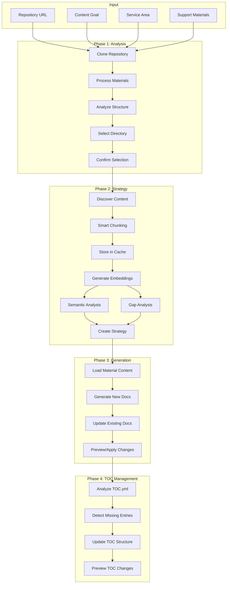
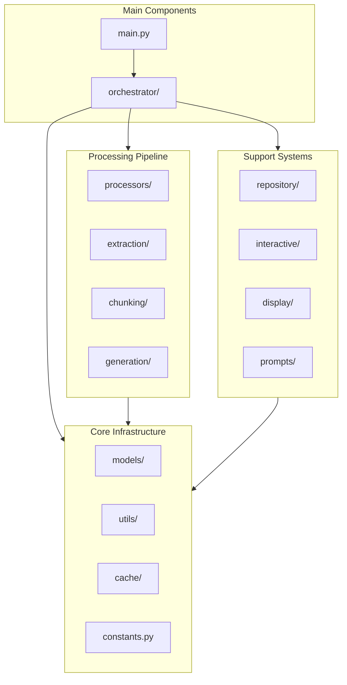

# AI Content Developer

An intelligent documentation generation tool that analyzes repositories and creates or updates documentation based on support materials using Azure OpenAI models.

> **📢 Important Update**: This tool now uses **Azure OpenAI** with Microsoft Entra ID authentication instead of OpenAI API keys. If you're migrating from a previous version, please see the [Azure Migration Guide](docs/azure-migration-guide.md).

## Overview

AI Content Developer automates the process of creating and updating technical documentation by:
- Analyzing your repository structure
- Processing support materials (PDFs, Word docs, markdown files, URLs)
- Identifying content gaps through semantic analysis
- Generating new documentation or updating existing files
- Maintaining consistency with existing documentation style

## Architecture

### High-Level Flow



### Module Structure



### Phase Details

```mermaid
stateDiagram-v2
    [*] --> Phase1
    
    state Phase1 {
        [*] --> CloneRepo
        CloneRepo --> ProcessMaterials
        ProcessMaterials --> AnalyzeStructure
        AnalyzeStructure --> SelectDirectory
        SelectDirectory --> Confirm1
        Confirm1 --> [*]
    }
    
    Phase1 --> Phase2: directory_ready
    
    state Phase2 {
        [*] --> DiscoverContent
        DiscoverContent --> ChunkDocuments
        ChunkDocuments --> GenerateEmbeddings
        GenerateEmbeddings --> SemanticSearch
        SemanticSearch --> GapAnalysis
        GapAnalysis --> CreateStrategy
        CreateStrategy --> Confirm2
        Confirm2 --> [*]
    }
    
    Phase2 --> Phase3: strategy_ready
    
    state Phase3 {
        [*] --> LoadFullContent
        LoadFullContent --> ProcessActions
        ProcessActions --> GenerateContent
        ProcessActions --> UpdateContent
        GenerateContent --> Preview
        UpdateContent --> Preview
        Preview --> ApplyChanges
        ApplyChanges --> [*]
    }
    
    Phase3 --> Phase4: generation_ready
    
    state Phase4 {
        [*] --> LoadTOC
        LoadTOC --> ExtractEntries
        ExtractEntries --> IdentifyMissing
        IdentifyMissing --> GenerateTOCUpdate
        GenerateTOCUpdate --> PreviewTOC
        PreviewTOC --> [*]
    }
    
    Phase4 --> [*]
```



## Installation

### Prerequisites

- Python 3.12 or earlier (Python 3.13 has compatibility issues with some dependencies)
- Azure OpenAI resource with deployed models
- Azure CLI installed and authenticated (`az login`)
- Git (for cloning repositories)

### Setup

1. Clone the repository:
```bash
git clone https://github.com/yourusername/ai-content-developer.git
cd ai-content-developer
```

2. Install dependencies:
```bash
pip install -r requirements.txt
```

3. Configure Azure OpenAI:
```bash
# Copy the example environment file
cp env.example .env

# Edit .env and add your Azure OpenAI configuration
nano .env
```

4. Authenticate with Azure:
```bash
# Login with Azure CLI (used by DefaultAzureCredential)
az login

# Set your subscription if you have multiple
az account set --subscription "Your Subscription Name"
```

### Azure OpenAI Configuration

The application uses Azure OpenAI with Microsoft Entra ID authentication (via DefaultAzureCredential). Configure the following environment variables in your `.env` file:

```bash
# Required
AZURE_OPENAI_ENDPOINT=https://your-resource.openai.azure.com/

# Deployment names (required)
AZURE_OPENAI_COMPLETION_DEPLOYMENT=gpt-4  # Used for all LLM operations
AZURE_OPENAI_EMBEDDING_DEPLOYMENT=text-embedding-3-small

# Optional
AZURE_OPENAI_API_VERSION=2024-08-01-preview
AZURE_OPENAI_TEMPERATURE=0.3
AZURE_OPENAI_CREATIVE_TEMPERATURE=0.7
```

**Authentication Methods:**
- Azure CLI (recommended): `az login`
- Managed Identity (when running in Azure)
- Environment variables (service principal)
- VS Code Azure extension
- Azure PowerShell

See [DefaultAzureCredential documentation](https://docs.microsoft.com/en-us/python/api/azure-identity/azure.identity.defaultazurecredential) for all supported authentication methods.

### Model Configuration

The application uses configurable Azure OpenAI deployments for different operations. See [Azure Model Configuration Guide](docs/azure-model-configuration.md) for details.

Default deployments:
- **Completion**: `gpt-4` (for all LLM operations)
- **Embeddings**: `text-embedding-3-small` (for similarity search)

You can customize these in your `.env` file.

## Usage

### Basic Usage

```bash
python main.py --repo <repo_url> --goal "<content_goal>" --service "<service_area>" -m [materials...]
```

### Examples

#### Full Pipeline (All Phases)
```bash
# By default, all phases run automatically
python main.py --repo https://github.com/MicrosoftDocs/azure-aks-docs \
    --goal "Create Cilium networking documentation" \
    --service "Azure Kubernetes Service" \
    -m support-materials/cilium-overview.pdf \
       support-materials/azure-cni-guide.docx
```

#### Phase 1 Only (Analysis)
```bash
python main.py --repo https://github.com/MicrosoftDocs/azure-aks-docs \
    --goal "Analyze repository structure" \
    --service "AKS" \
    --phases 1 \
    -m overview.md
```

#### Phases 1 & 2 (Analysis + Strategy)
```bash
python main.py --repo https://github.com/MicrosoftDocs/azure-aks-docs \
    --goal "Plan networking documentation updates" \
    --service "AKS" \
    --phases 12 \
    -m networking-guide.md
```

#### Auto-Confirm Mode
```bash
python main.py --repo https://github.com/MicrosoftDocs/azure-aks-docs \
    --goal "Update CNI documentation" \
    --service "AKS" \
    --auto-confirm \
    -m cni-updates.pdf
```

#### Apply Changes Directly
```bash
python main.py --repo https://github.com/MicrosoftDocs/azure-aks-docs \
    --goal "Create new tutorials" \
    --service "AKS" \
    --apply-changes \
    -m tutorial-content.md
```

#### Clean Run (Fresh Start)
```bash
# Clear previous outputs and start fresh
python main.py --repo https://github.com/MicrosoftDocs/azure-aks-docs \
    --goal "Create documentation" \
    --service "AKS" \
    --clean \
    -m guide.pdf

# Combine with auto-confirm for fully automated fresh run
python main.py --repo https://github.com/MicrosoftDocs/azure-aks-docs \
    --goal "Update guides" \
    --service "AKS" \
    --clean --auto-confirm --apply-changes \
    -m updates.docx
```

#### Phase 4: TOC Management
```bash
# Run generation and TOC update together
python main.py --repo https://github.com/MicrosoftDocs/azure-aks-docs \
    --goal "Create Cilium documentation" \
    --service "AKS" \
    --phases 34 \
    --apply-changes \
    -m cilium-guide.pdf

# Run all phases including TOC management  
python main.py --repo https://github.com/MicrosoftDocs/azure-aks-docs \
    --goal "Update networking guides" \
    --service "AKS" \
    --phases 1234 \
    --auto-confirm \
    -m networking-updates.docx

# Run all phases with multiple materials
python main.py --repo https://github.com/MicrosoftDocs/azure-aks-docs \
    --goal "Update TOC for new content" \
    --service "AKS" \
    --auto-confirm \
    -m guide1.pdf guide2.md reference.docx

# Skip TOC update if TOC.yml has issues
python main.py --repo https://github.com/MicrosoftDocs/azure-aks-docs \
    --goal "Create documentation" \
    --service "AKS" \
    --skip-toc \
    -m materials.pdf
```

### Command Line Options

| Option | Description | Default |
|--------|-------------|---------|
| `--repo` | Repository URL to analyze | Required |
| `--goal` | Goal for content creation/update | Required |
| `--service` | Service area (e.g., 'Azure Kubernetes Service') | Required |
| `-m`, `--materials` | Support material files/URLs | Required |
| `--audience` | Target audience for the content | "technical professionals" |
| `--audience-level` | Technical level (beginner, intermediate, advanced) | "intermediate" |
| `--auto-confirm`, `-y` | Auto-confirm all prompts | False |
| `--clean` | Clear llm_outputs and work directory before starting | False |
| `--work-dir` | Working directory for repos | `./work/tmp` |
| `--max-depth` | Max repository depth to analyze | 3 |
| `--content-limit` | Content extraction limit (chars) | 15000 |
| `--phases` | Phases to run (1, 2, 3, 4, 12, 13, 14, 23, 24, 34, 123, 124, 134, 234, 1234, or 'all') | "all" |
| `--debug-similarity` | Show similarity scoring details | False |
| `--apply-changes` | Apply generated content to repository | False |
| `--skip-toc` | Skip TOC management (Phase 4) if TOC.yml is invalid | False |

## Streamlit Web Interface

AI Content Developer includes a modern web interface built with Streamlit that provides an intuitive alternative to the command line.

### Running the Web Interface

```bash
# Using the provided script
./run_frontend.sh

# Or manually
export PYTHONPATH=$PYTHONPATH:$(pwd)
streamlit run frontend/app.py
```

The interface will open in your browser at http://localhost:8501

### Web Interface Features

#### 1. **Interactive Input Collection**
- Visual form for entering repository URL, content goal, and service area
- Drag-and-drop file upload for support materials
- URL input for online documentation references
- Advanced settings in an expandable panel

#### 2. **Execution Modes**
- **Interactive Mode**: Review results after each phase before continuing
- **Auto-Confirm Mode**: Run all phases automatically without interruptions

#### 3. **Real-Time Progress Display**
- Phase indicator showing current progress
- Live "thinking" messages from the AI as it processes
- Status updates and progress bars
- Detailed results after each phase

#### 4. **Content Preview**
- Tabbed interface for viewing generated content
- Syntax-highlighted markdown preview
- Separate tabs for created files, updated files, and TOC changes
- File paths for accessing generated content

#### 5. **Key Differences from CLI**
- No direct file application (preview only for safety)
- Materials are optional with visual feedback
- Real-time display of AI reasoning process
- Persistent session state during generation
- Modern, responsive UI design

### Example Workflow

1. **Start the Interface**: Run `./run_frontend.sh`
2. **Enter Details**: Fill in repository URL, goal, and service area
3. **Add Materials** (Optional): Upload files or paste URLs
4. **Select Mode**: Choose Interactive or Auto-Confirm
5. **Start Generation**: Click "Start Content Generation"
6. **Monitor Progress**: Watch AI thinking and phase completion
7. **Review Results**: Browse generated content in preview tabs
8. **Access Files**: Find generated files in `./llm_outputs/preview/`

The web interface provides the same powerful functionality as the CLI with a more user-friendly experience, making it ideal for users who prefer visual interaction over command-line operations.

## Features

### Phase 1: Repository Analysis

- **Material Processing**: Extracts and summarizes content from various formats:
  - PDF documents (.pdf)
  - Word documents (.docx, .doc)
  - Markdown files (.md)
  - Web URLs (http://, https://)
  - Any other text files

- **Intelligent Directory Detection**: Uses LLM to analyze repository structure and select the most appropriate working directory based on:
  - Content goal alignment
  - Service area relevance
  - Material context
  - Existing directory purposes

### Phase 2: Content Strategy

- **Smart Document Chunking**: Preserves document structure while creating semantic chunks
- **Embedding Generation**: Creates vector embeddings for semantic search
- **Gap Analysis**: Identifies missing content by comparing materials against existing docs
- **Strategic Planning**: Determines whether to CREATE new files or UPDATE existing ones

### Phase 3: Content Generation

- **Context-Aware Generation**: Uses full material content and relevant chunks
- **Content Type Selection**: Automatically selects appropriate documentation type:
  - How-To Guides
  - Concepts
  - Overviews
  - Quickstarts
  - Tutorials

- **Intelligent Updates**: Preserves existing content while adding new sections
- **RAG-Based Generation**: Uses Retrieval-Augmented Generation to prevent hallucination

### Phase 4: TOC Management

- **Automatic TOC Analysis**: Reads and parses existing TOC.yml structure
- **Smart Entry Detection**: Identifies which generated files are missing from TOC
- **Intelligent Placement**: Determines optimal placement for new entries based on:
  - Content type (How-To, Tutorial, Concept, etc.)
  - Topic relationships
  - Existing TOC organization patterns
  - Directory structure hints
- **Large TOC Handling**: Automatically condenses very large TOC files (>20KB) for efficient processing
- **Hierarchical Structure Preservation**: Maintains proper nesting and organization
- **Entry Naming**: Generates meaningful display names from document titles
- **Preview Mode**: Shows proposed TOC changes before applying
- **Validation**: Ensures YAML syntax correctness and structural integrity

**Note**: Phase 4 requires a valid TOC.yml file in the working directory. If the TOC has YAML syntax errors, use `--skip-toc` to skip this phase or fix the TOC using the provided scripts.

## Output Structure

```
./llm_outputs/
├── materials_summary/          # Processed material summaries
├── decisions/
│   └── working_directory/      # Directory selection decisions
├── content_strategy/           # Strategy analysis results
├── embeddings/                 # Cached embeddings by repo/directory
│   └── [repo]/[directory]/     # Organized by repository and working directory
├── content_generation/
│   └── create/                 # New content generation logs
├── generation/                 # Content update logs
├── toc_management/             # TOC update logs
└── preview/
    ├── [repo]/[directory]/
    │   ├── create/             # Preview of new files
    │   └── updates/            # Preview of updated files
    └── toc/                    # Preview of TOC changes
```

## Module Structure

```
content_developer/
├── models/                     # Data models
│   ├── config.py              # Configuration
│   ├── content.py             # Content models
│   └── result.py              # Result model
├── processors/                 # Core processors
│   ├── smart_processor.py     # Base processor class
│   ├── material.py            # Material processing
│   ├── directory.py           # Directory detection
│   ├── discovery.py           # Content discovery
│   ├── strategy.py            # Strategy generation
│   ├── strategy_debug.py      # Debug visualization
│   ├── strategy_helpers.py    # Helper methods
│   └── toc_processor.py       # TOC management
├── generation/                 # Content generation
│   ├── base_content_processor.py  # Base class for processors
│   ├── material_loader.py     # Load full content
│   ├── create_processor.py    # Create new files
│   ├── update_processor.py    # Update existing
│   └── content_generator.py   # Orchestrator
├── extraction/                 # Content extraction
│   └── content_extractor.py   # Multi-format extractor
├── chunking/                   # Document chunking
│   └── smart_chunker.py       # Structure-aware chunking
├── cache/                      # Caching system
│   └── unified_cache.py       # Embeddings & manifests
├── repository/                 # Git operations
│   └── manager.py             # Clone, update, structure
├── interactive/                # User interactions
│   ├── generic_interactive.py # Base interaction class
│   ├── directory.py           # Directory confirmation
│   ├── strategy.py            # Strategy confirmation
│   └── selector.py            # Interactive selection
├── display/                    # Results display
│   └── results.py             # Formatted output
├── prompts/                    # LLM prompts
│   ├── material.py            # Material analysis
│   ├── directory.py           # Directory selection
│   ├── strategy.py            # Strategy generation  
│   ├── generation.py          # Content generation
│   ├── toc.py                 # TOC management
│   └── helpers.py             # Formatting helpers
├── utils/                      # Utilities
│   ├── core_utils.py          # Core utilities
│   ├── file_ops.py            # File operations
│   ├── imports.py             # Dynamic imports
│   └── logging.py             # Logging setup
└── orchestrator/               # Main orchestrator
    └── orchestrator.py        # 4-phase workflow
```

## Advanced Usage

### Custom Content Standards

Create a `content_standards.json` file to define custom content types:

```json
{
  "contentTypes": [
    {
      "name": "API Reference",
      "frontMatter": {
        "ms.topic": "reference",
        "ms.service": "api"
      },
      "purpose": "Technical API documentation",
      "description": "Detailed API endpoint documentation",
      "structure": [
        "Overview",
        "Authentication",
        "Endpoints",
        "Examples",
        "Error Codes"
      ]
    }
  ]
}
```

### Debugging Similarity Scores

Use `--debug-similarity` to see detailed scoring information:

```bash
python main.py https://github.com/repo "goal" "service" \
    --debug-similarity \
    --phases 2
```

This shows:
- Base similarity scores
- File-level relevance analysis
- Boost calculations
- Score transformations
- Strategy insights
- Chunk-level matching details

## Best Practices

1. **Start with Phase 1**: Run phase 1 first to understand repository structure
2. **Review Strategy**: Always review the content strategy before generation
3. **Use Support Materials**: Provide comprehensive materials for better results
4. **Review Before Applying**: Always review generated content in preview before using `--apply-changes`
5. **Backup Important Files**: Always maintain your own backups before running content updates
6. **Incremental Updates**: Work on one section at a time for large documentation sets

## Troubleshooting

### Common Issues

1. **"No materials provided"**
   - Ensure you provide at least one support material file or URL
   - Check that file paths are correct

2. **"No markdown files found"**
   - Ensure the selected directory contains `.md` files
   - Check if you need a different working directory

3. **"Strategy generation failed"**
   - Verify your OpenAI API key is set correctly
   - Check API rate limits
   - Ensure materials are readable

4. **"Import error"**
   - Run `pip install -r requirements.txt`
   - Ensure Python 3.8+ is installed

5. **"Failed to parse TOC.yml"**
   - The repository's TOC.yml may have invalid YAML syntax
   - Use `--skip-toc` flag to skip Phase 4: `python main.py <args> --skip-toc`
   - Validate TOC syntax: `python scripts/validate_toc.py <path-to-TOC.yml>`
   - Try to fix common issues: `python scripts/fix_toc_yaml.py <path-to-TOC.yml>`
   - Check for:
     - Missing colons after keys
     - Incorrect indentation (should use 2 spaces, not tabs)
     - Duplicate keys at the same level
     - Missing required fields (name or href)

6. **"Invalid parameter: 'response_format' not supported with this model"**
   - This occurs when using an OpenAI model that doesn't support JSON response format
   - The tool now uses `gpt-4o` which supports JSON output
   - If you see this error, ensure you have the latest code
   - See `docs/json-response-format-models.md` for model compatibility details

### Debug Mode

Enable detailed logging:

```bash
export PYTHONPATH=$PYTHONPATH:$(pwd)
python -m logging.basicConfig level=DEBUG main.py ...
```

Or in code:
```python
import logging
logging.basicConfig(level=logging.DEBUG)
```

## Validation & Testing Tools

### Health Check Script

Run a comprehensive health check to ensure your environment is properly configured:

```bash
./scripts/health_check.sh
```

This checks:
- Python installation and version
- OpenAI API key configuration
- Required dependencies
- Directory structure
- Network connectivity
- File permissions

### Test Run Script

Validate the application is working correctly with a minimal test:

```bash
./scripts/test_run.sh
```

This script:
- Tests all three phases independently
- Uses minimal inputs for quick validation
- Verifies output creation
- Reports pass/fail status for each phase

### Reset Tool

Clean up outputs or perform various reset operations:

```bash
# Show help
./scripts/reset.sh help

# Clear corrupted cache
./scripts/reset.sh cache

# Clear outputs but keep cache
./scripts/reset.sh outputs

# Clear preview files only
./scripts/reset.sh preview

# Full reset (removes all outputs)
./scripts/reset.sh full

# Reinstall dependencies
./scripts/reset.sh deps
```

### Quick Validation

After installation or when experiencing issues:

1. **Check environment**:
   ```bash
   ./scripts/health_check.sh
   ```

2. **Run test**:
   ```bash
   ./scripts/test_run.sh
   ```

3. **If issues persist, reset and retry**:
   ```bash
   ./scripts/reset.sh full
   ./scripts/test_run.sh
   ```

For detailed troubleshooting steps and error resolution, see the comprehensive [Validation & Troubleshooting Guide](./docs/validation-troubleshooting.md) in the documentation.

## Contributing

1. Fork the repository
2. Create a feature branch
3. Make your changes
4. Run tests
5. Submit a pull request

## License

MIT License - see LICENSE file for details

## Acknowledgments

- OpenAI for GPT models
- Azure documentation team for inspiration
- Contributors and testers

---

For more information, issues, or contributions, visit the [GitHub repository](https://github.com/yourusername/ai-content-developer).