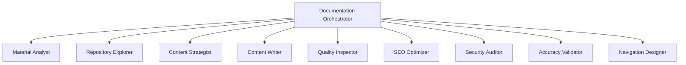

# Multi-Agent Content Developer Setup

This guide explains how to set up and use the multi-agent version of AI Content Developer powered by Azure AI Foundry.

## Overview

The multi-agent system transforms the linear phase-based approach into a flexible, orchestrated system where specialized agents collaborate:



## Prerequisites

1. **Azure AI Foundry Project**
   - Create a project in Azure AI Foundry
   - Deploy a model (GPT-4 recommended)
   - Note your endpoint and deployment name

2. **Python Environment**
   ```bash
   pip install -r requirements-multi-agent.txt
   ```

## Configuration

### Environment Variables

Add these to your `.env` file:

```env
# Azure AI Foundry Configuration
PROJECT_ENDPOINT=https://your-project.azureai.io
MODEL_DEPLOYMENT_NAME=gpt-4-deployment

# Azure Authentication (choose one method)
# Option 1: Service Principal
AZURE_CLIENT_ID=your-client-id
AZURE_CLIENT_SECRET=your-client-secret
AZURE_TENANT_ID=your-tenant-id

# Option 2: Use Azure CLI login
# Just run: az login
```

### Azure CLI Authentication (Recommended)

```bash
# Login to Azure
az login

# Set subscription if needed
az account set --subscription "Your Subscription"
```

## Usage

### Basic Usage

```bash
# Use multi-agent mode with the --multi-agent flag
python main.py https://github.com/user/repo \
  "Create networking documentation" \
  "aks-networking" \
  materials/network.pdf \
  --multi-agent
```

### With All Options

```bash
python main.py https://github.com/Azure/azure-docs \
  "Create comprehensive AKS networking guide" \
  "aks-networking" \
  materials/aks-network-design.pdf \
  materials/network-policies.docx \
  --multi-agent \
  --auto-confirm \
  --apply-changes \
  --audience "Cloud architects" \
  --audience-level advanced
```

## How It Works

### 1. Orchestrator Agent
The main orchestrator manages the entire workflow:
- Receives the documentation request
- Coordinates specialized agents
- Makes decisions based on agent outputs
- Ensures quality standards

### 2. Specialized Agents

**Material Analyst**: Analyzes PDFs, Word docs, and URLs
- Extracts key information
- Identifies technologies and concepts
- Summarizes content

**Repository Explorer**: Understands repository structure
- Finds documentation directories
- Analyzes file patterns
- Selects appropriate locations

**Content Strategist**: Plans documentation approach
- Analyzes existing content
- Identifies gaps
- Decides what to create/update/skip

**Content Writer**: Creates and updates documentation
- Follows Microsoft standards
- Generates markdown content
- Updates existing files

**Quality Inspector**: Validates content quality
- Checks completeness
- Ensures clarity
- Validates structure

**SEO Optimizer**: Improves discoverability
- Optimizes titles and headings
- Enhances meta descriptions
- Improves keyword usage

**Security Auditor**: Ensures security compliance
- Removes sensitive data
- Adds security warnings
- Validates examples

**Accuracy Validator**: Checks technical accuracy
- Cross-references with sources
- Validates code examples
- Verifies claims

**Navigation Designer**: Manages documentation structure
- Updates table of contents
- Optimizes navigation
- Maintains hierarchy

### 3. Workflow Phases

The orchestrator executes these phases:

1. **Analysis Phase**
   - Material analysis
   - Repository exploration

2. **Strategy Phase**
   - Content strategy creation
   - Decision making

3. **Generation Phase**
   - Content creation/updates
   - Parallel processing

4. **Quality Phase**
   - Multiple quality checks
   - Optimizations
   - Validations

5. **Navigation Phase**
   - TOC updates
   - Structure optimization

## Monitoring

The multi-agent system provides detailed progress updates:

```
[INFO] Setting up multi-agent system...
[INFO] Multi-agent system setup complete
[INFO] Sending request to Documentation Orchestrator...
[INFO] Processing documentation request... This may take several minutes.
```

## Troubleshooting

### Authentication Issues

```bash
# Verify Azure CLI login
az account show

# Check environment variables
echo $PROJECT_ENDPOINT
echo $MODEL_DEPLOYMENT_NAME
```

### Agent Errors

If agents fail to create:
1. Verify your Azure AI Foundry project is active
2. Check model deployment status
3. Ensure proper permissions

### Performance

- The multi-agent system may take longer initially due to agent setup
- Subsequent runs reuse the thread for faster processing
- Agents are cleaned up automatically after completion

## Advantages

1. **Parallel Processing**: Multiple agents work simultaneously
2. **Specialized Expertise**: Each agent focuses on its domain
3. **Better Quality**: Multiple quality checks and validations
4. **Flexibility**: Easy to add new agents or modify behavior
5. **Transparency**: Clear progress through each phase

## Limitations

1. Requires Azure AI Foundry subscription
2. Initial setup more complex than standalone mode
3. May have higher token usage due to agent coordination
4. Currently optimized for documentation tasks

## Examples

### Creating New Documentation

```bash
python main.py https://github.com/Azure/azure-docs \
  "Create a comprehensive guide for AKS networking" \
  "aks" \
  materials/aks-design.pdf \
  --multi-agent \
  --auto-confirm
```

### Updating Existing Documentation

```bash
python main.py https://github.com/Azure/azure-docs \
  "Update storage documentation with new features" \
  "storage" \
  materials/storage-updates.docx \
  --multi-agent \
  --apply-changes
```

### Advanced Scenario

```bash
python main.py https://github.com/Azure/azure-docs \
  "Create security best practices for Azure SQL" \
  "sql-database" \
  materials/sql-security.pdf \
  materials/compliance-guide.docx \
  --multi-agent \
  --audience "Security engineers" \
  --audience-level advanced \
  --apply-changes
```

## Next Steps

1. Set up your Azure AI Foundry project
2. Configure environment variables
3. Test with a simple documentation task
4. Monitor agent interactions in logs
5. Customize agent behaviors as needed 