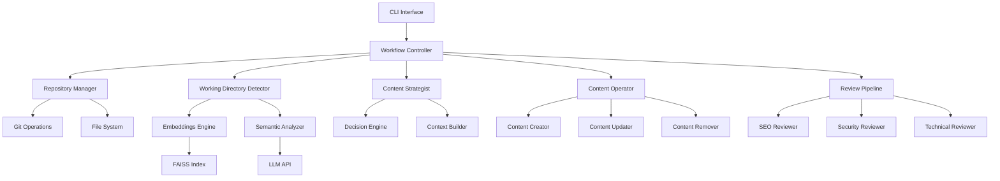

# Content Developer Automation Tool - Comprehensive Planning Document

## Executive Summary

This document outlines the complete plan for building a content developer automation tool that mirrors the exact workflow of professional content developers working with Microsoft Docs repositories. The tool will automate the 12-step process from repository cloning to final security review, ensuring content developers can scale their work while maintaining quality and compliance.

## Table of Contents

1. [Project Overview](#project-overview)
2. [Technical Architecture](#technical-architecture)
3. [File Structure](#file-structure)
4. [Core Components](#core-components)
5. [Workflow Implementation](#workflow-implementation)
6. [Embedding Strategy](#embedding-strategy)
7. [Prompt Engineering Strategy](#prompt-engineering-strategy)
8. [Data Models](#data-models)
9. [Security & Compliance](#security-compliance)
10. [Testing Strategy](#testing-strategy)
11. [Deployment Plan](#deployment-plan)
12. [Success Metrics](#success-metrics)

## Project Overview

### Vision
Create an AI-powered tool that automates the complete content development workflow for Microsoft Docs repositories, enabling content developers to handle 10x more documentation requests while maintaining the highest quality standards.

### Core Requirements
- **Local-first**: All processing happens locally for security and privacy
- **Repository-native**: Deep understanding of Microsoft Docs structure
- **Standards-compliant**: Enforces all Microsoft documentation standards
- **Quality-focused**: Multiple review phases ensure production-ready output
- **Developer-friendly**: CLI interface with rich feedback and progress tracking

### Success Criteria
- Reduce documentation creation time by 80%
- Maintain 95%+ compliance with Microsoft standards
- Zero security vulnerabilities in generated content
- 90%+ technical accuracy on first generation

## Technical Architecture

### Tech Stack

```yaml
Core:
  Language: Python 3.11+
  Framework: Typer (CLI)
  LLM Integration: LangChain + OpenAI/Azure OpenAI
  
Processing:
  Embeddings: OpenAI text-embedding-3-small
  Vector Store: FAISS (local)
  Content Parsing: 
    - python-frontmatter (YAML front matter)
    - markdown-it-py (Markdown parsing)
    - BeautifulSoup4 (HTML extraction)
    - python-docx (.docx and .doc files)
  
Storage:
  Cache: Local file system with pickle
  Config: JSON/YAML files
  Embeddings: FAISS index files
  
Quality:
  Linting: markdownlint-cli2
  Security: bandit, safety
  SEO: custom validators
  
Development:
  Testing: pytest + pytest-asyncio
  Type Checking: mypy
  Code Quality: black, ruff
  Documentation: mkdocs
```

### System Architecture



## File Structure

```
content-developer-tool/
├── src/
│   ├── __init__.py
│   ├── main.py                 # CLI entry point
│   ├── config/
│   │   ├── __init__.py
│   │   ├── settings.py         # Global configuration
│   │   ├── standards.json      # Microsoft docs standards
│   │   └── prompts/            # Prompt templates
│   │       ├── working_directory.yaml
│   │       ├── content_strategy.yaml
│   │       ├── content_creation.yaml
│   │       ├── content_update.yaml
│   │       ├── content_removal.yaml
│   │       ├── seo_review.yaml
│   │       ├── security_review.yaml
│   │       └── technical_review.yaml
│   ├── core/
│   │   ├── __init__.py
│   │   ├── workflow.py         # Main workflow orchestrator
│   │   ├── repository.py       # Repository management
│   │   ├── embeddings.py       # Embeddings engine
│   │   └── llm.py             # LLM interface
│   ├── analyzers/
│   │   ├── __init__.py
│   │   ├── working_directory.py
│   │   ├── content_strategy.py
│   │   └── semantic.py
│   ├── operators/
│   │   ├── __init__.py
│   │   ├── content_creator.py
│   │   ├── content_updater.py
│   │   ├── content_remover.py
│   │   ├── toc_manager.py
│   │   └── redirections_manager.py
│   ├── reviewers/
│   │   ├── __init__.py
│   │   ├── seo.py
│   │   ├── security.py
│   │   └── technical.py
│   ├── models/
│   │   ├── __init__.py
│   │   ├── content.py          # Content data models
│   │   ├── repository.py       # Repository models
│   │   └── workflow.py         # Workflow state models
│   └── utils/
│       ├── __init__.py
│       ├── git.py              # Git operations
│       ├── markdown.py         # Markdown utilities
│       ├── frontmatter.py      # Front matter handling
│       ├── validators.py       # Content validators
│       └── docx_utils.py       # DOCX processing utilities
├── tests/
│   ├── unit/
│   ├── integration/
│   └── fixtures/
├── docs/
│   ├── user-guide.md
│   ├── developer-guide.md
│   └── api-reference.md
├── scripts/
│   ├── setup.py
│   └── validate_standards.py
├── requirements.txt
├── requirements-dev.txt
├── pyproject.toml
├── README.md
└── LICENSE
```

## Core Components

### 1. Workflow Controller (`core/workflow.py`)

```python
class WorkflowController:
    """Orchestrates the 12-step content development workflow."""
    
    def __init__(self, config: Config):
        self.config = config
        self.state = WorkflowState()
        self.repository = RepositoryManager()
        self.embeddings = EmbeddingsEngine()
        self.llm = LLMInterface()
        
    async def execute(self, 
                     repo_url: str,
                     service_area: str,
                     content_goal: str,
                     support_materials: List[str]) -> WorkflowResult:
        """Execute the complete workflow."""
        
        # Step 1-2: Clone and setup
        await self._setup_repository(repo_url)
        
        # Step 3-4: Process inputs
        context = await self._build_context(service_area, content_goal, support_materials)
        
        # Step 5: Determine working directory
        working_dir = await self._find_working_directory(context)
        
        # Step 6: Determine strategy
        strategy = await self._determine_strategy(context, working_dir)
        
        # Step 7-9: Execute strategy
        results = await self._execute_strategy(strategy, context, working_dir)
        
        # Step 10-12: Review pipeline
        reviewed_results = await self._review_pipeline(results)
        
        return reviewed_results
```

### 2. Working Directory Detector (`analyzers/working_directory.py`)

```python
class WorkingDirectoryDetector:
    """Identifies the most appropriate working directory based on semantic analysis."""
    
    def __init__(self, embeddings_engine: EmbeddingsEngine):
        self.embeddings = embeddings_engine
        
    async def detect(self, 
                    repo_path: Path,
                    context: ContentContext) -> Path:
        """Find the most semantically relevant directory."""
        
        # Build directory embeddings
        dir_embeddings = await self._build_directory_embeddings(repo_path)
        
        # Create query embedding from context
        query = self._create_directory_query(context)
        query_embedding = await self.embeddings.embed(query)
        
        # Find best matching directory
        best_dir = self._find_best_directory(dir_embeddings, query_embedding)
        
        return best_dir
        
    def _create_directory_query(self, context: ContentContext) -> str:
        """Create a query that represents the working directory we need."""
        return f"""
        Service Area: {context.service_area}
        Content Goal: {context.content_goal}
        Topics: {', '.join(context.extracted_topics)}
        Content Type: {context.inferred_content_type}
        """
```

### 3. Content Strategist (`analyzers/content_strategy.py`)

```python
class ContentStrategist:
    """Determines the optimal content strategy based on analysis."""
    
    async def analyze(self,
                     context: ContentContext,
                     working_dir: Path) -> ContentStrategy:
        """Determine whether to create, update, or remove content."""
        
        # Analyze existing content
        existing_analysis = await self._analyze_existing_content(
            working_dir, context
        )
        
        # Compare with goals
        gap_analysis = self._perform_gap_analysis(
            existing_analysis, context
        )
        
        # Determine strategy
        if gap_analysis.has_critical_gaps:
            return self._plan_content_creation(gap_analysis, context)
        elif gap_analysis.has_outdated_content:
            return self._plan_content_update(gap_analysis, context)
        elif gap_analysis.has_redundant_content:
            return self._plan_content_removal(gap_analysis, context)
        else:
            return self._plan_hybrid_approach(gap_analysis, context)
```

### 4. Embeddings Engine (`core/embeddings.py`)

```python
class EmbeddingsEngine:
    """Manages all embedding operations with intelligent chunking."""
    
    def __init__(self, model: str = "text-embedding-3-small"):
        self.model = model
        self.chunk_size = 2000
        self.chunk_overlap = 200
        
    async def build_repository_index(self, repo_path: Path) -> RepositoryIndex:
        """Build comprehensive embeddings for the repository."""
        
        index = RepositoryIndex()
        
        # Process all markdown files
        for md_file in repo_path.rglob("*.md"):
            # Create document-level embedding
            doc_embedding = await self._create_document_embedding(md_file)
            index.add_document(md_file, doc_embedding)
            
            # Create section-level embeddings
            sections = self._extract_sections(md_file)
            for section in sections:
                section_embedding = await self._create_section_embedding(section)
                index.add_section(md_file, section, section_embedding)
                
        return index
        
    def _extract_sections(self, file_path: Path) -> List[Section]:
        """Extract meaningful sections with context."""
        content = file_path.read_text()
        
        # Parse markdown structure
        sections = []
        current_section = None
        
        for line in content.split('\n'):
            if line.startswith('## '):
                if current_section:
                    sections.append(current_section)
                current_section = Section(
                    title=line[3:],
                    content=[],
                    level=2
                )
            elif current_section:
                current_section.content.append(line)
                
        return sections
```

### 5. Supporting Materials Processor (`core/materials_processor.py`)

```python
class MaterialsProcessor:
    """Processes various types of supporting materials."""
    
    def __init__(self):
        self.supported_formats = {
            '.docx': self._process_docx,
            '.doc': self._process_doc,
            '.md': self._process_markdown,
            '.txt': self._process_text,
            '.pdf': self._process_pdf,
            '.html': self._process_html,
        }
        
    async def process(self, material_path: str) -> ProcessedMaterial:
        """Process any supported material type."""
        
        if material_path.startswith(('http://', 'https://')):
            return await self._process_url(material_path)
        
        path = Path(material_path)
        if not path.exists():
            raise FileNotFoundError(f"Material not found: {material_path}")
            
        extension = path.suffix.lower()
        if extension in self.supported_formats:
            return await self.supported_formats[extension](path)
        else:
            # Try to process as plain text
            return await self._process_text(path)
    
    async def _process_docx(self, file_path: Path) -> ProcessedMaterial:
        """Extract structured content from .docx files."""
        
        from docx import Document
        from docx.enum.style import WD_STYLE_TYPE
        
        doc = Document(file_path)
        
        # Extract structured content
        content = DocxContent()
        
        # Process paragraphs with style information
        for para in doc.paragraphs:
            if para.style.type == WD_STYLE_TYPE.PARAGRAPH:
                if 'Heading' in para.style.name:
                    level = self._extract_heading_level(para.style.name)
                    content.add_heading(para.text, level)
                elif 'List' in para.style.name:
                    content.add_list_item(para.text, para.style.name)
                else:
                    content.add_paragraph(para.text)
        
        # Process tables
        for table in doc.tables:
            table_data = []
            for row in table.rows:
                row_data = [cell.text.strip() for cell in row.cells]
                table_data.append(row_data)
            content.add_table(table_data)
        
        # Extract code blocks (often in specific styles)
        code_blocks = self._extract_code_blocks(doc)
        for code in code_blocks:
            content.add_code_block(code['content'], code.get('language'))
        
        # Extract hyperlinks
        links = self._extract_hyperlinks(doc)
        
        # Extract comments and tracked changes
        comments = self._extract_comments(doc)
        
        return ProcessedMaterial(
            source=str(file_path),
            content=content.to_markdown(),
            raw_content=content,
            metadata={
                'format': 'docx',
                'properties': self._extract_properties(doc),
                'statistics': {
                    'paragraphs': len(content.paragraphs),
                    'headings': len(content.headings),
                    'tables': len(content.tables),
                    'code_blocks': len(code_blocks),
                    'links': len(links),
                    'comments': len(comments),
                },
                'links': links,
                'comments': comments,
            }
        )
    
    def _extract_code_blocks(self, doc) -> List[Dict]:
        """Extract code blocks from Word document."""
        
        code_blocks = []
        in_code_block = False
        current_code = []
        
        for para in doc.paragraphs:
            # Common code block indicators
            if para.style.name in ['Code', 'Source Code', 'Plain Text']:
                if not in_code_block:
                    in_code_block = True
                current_code.append(para.text)
            elif in_code_block:
                # End of code block
                code_blocks.append({
                    'content': '\n'.join(current_code),
                    'language': self._detect_language('\n'.join(current_code))
                })
                current_code = []
                in_code_block = False
                
        return code_blocks
    
    def _extract_hyperlinks(self, doc) -> List[Dict]:
        """Extract all hyperlinks from the document."""
        
        links = []
        for paragraph in doc.paragraphs:
            for run in paragraph.runs:
                if run.element.tag.endswith('hyperlink'):
                    for child in run.element:
                        if child.tag.endswith('r'):
                            link_text = child.text
                            # Get the actual URL from relationships
                            link_url = self._get_hyperlink_url(run.element)
                            if link_url:
                                links.append({
                                    'text': link_text,
                                    'url': link_url,
                                    'context': paragraph.text
                                })
        return links
```

## Workflow Implementation

### Step 1-2: Repository Setup

```python
async def setup_repository(repo_url: str) -> Repository:
    """Clone and prepare repository for analysis."""
    
    # Clone repository
    repo_path = await git_clone(repo_url)
    
    # Validate structure
    if not is_valid_docs_repo(repo_path):
        raise InvalidRepositoryError()
        
    # Load configuration
    config = load_repo_config(repo_path)
    
    return Repository(path=repo_path, config=config)
```

### Step 3-4: Context Building

```python
async def build_context(service_area: str, 
                       content_goal: str,
                       support_materials: List[str]) -> ContentContext:
    """Process all inputs into a rich context."""
    
    context = ContentContext(
        service_area=service_area,
        content_goal=content_goal
    )
    
    # Process support materials
    for material in support_materials:
        processed = await process_material(material)
        context.add_material(processed)
        
    # Extract topics and entities
    context.topics = extract_topics(context.all_content)
    context.entities = extract_entities(context.all_content)
    
    # Infer content type
    context.content_type = infer_content_type(context)
    
    return context

async def process_material(material_path: str) -> ProcessedMaterial:
    """Process various types of supporting materials."""
    
    if material_path.startswith(('http://', 'https://')):
        return await process_url(material_path)
    elif material_path.endswith(('.docx', '.doc')):
        return await process_docx(material_path)
    elif material_path.endswith('.md'):
        return await process_markdown(material_path)
    elif material_path == '-':  # stdin
        return await process_stdin()
    else:
        return await process_text_file(material_path)

async def process_docx(file_path: str) -> ProcessedMaterial:
    """Extract content from Word documents."""
    
    from docx import Document
    from docx.oxml.ns import qn
    
    doc = Document(file_path)
    content_parts = []
    
    # Extract document properties
    properties = {
        'title': doc.core_properties.title,
        'author': doc.core_properties.author,
        'created': doc.core_properties.created,
        'modified': doc.core_properties.modified,
    }
    
    # Extract all text with structure preservation
    for paragraph in doc.paragraphs:
        # Check if it's a heading
        if paragraph.style.name.startswith('Heading'):
            level = int(paragraph.style.name[-1]) if paragraph.style.name[-1].isdigit() else 1
            content_parts.append(f"{'#' * level} {paragraph.text}")
        else:
            content_parts.append(paragraph.text)
    
    # Extract tables
    for table in doc.tables:
        table_content = extract_table_content(table)
        content_parts.append(table_content)
    
    # Extract images metadata
    images = extract_image_metadata(doc)
    
    return ProcessedMaterial(
        source=file_path,
        content='\n\n'.join(content_parts),
        metadata=properties,
        images=images,
        format='docx'
    )
```

### Step 5: Working Directory Detection

```python
async def find_working_directory(repo: Repository, 
                               context: ContentContext) -> Path:
    """Identify the most appropriate working directory."""
    
    detector = WorkingDirectoryDetector(repo.embeddings)
    
    # Score all directories
    directory_scores = {}
    
    for directory in repo.get_content_directories():
        score = await detector.score_directory(directory, context)
        directory_scores[directory] = score
        
    # Select best directory
    best_dir = max(directory_scores.items(), key=lambda x: x[1])
    
    # Validate selection
    if best_dir[1] < 0.3:  # Low confidence
        best_dir = await detector.create_new_directory(context)
        
    return best_dir[0]
```

### Step 6: Strategy Determination

```python
async def determine_strategy(context: ContentContext,
                           working_dir: Path) -> ContentStrategy:
    """Analyze and determine content strategy."""
    
    strategist = ContentStrategist()
    
    # Analyze existing content
    existing_files = list(working_dir.rglob("*.md"))
    existing_analysis = await analyze_files(existing_files, context)
    
    # Determine primary action
    if existing_analysis.coverage < 0.3:
        action = ContentAction.CREATE
    elif existing_analysis.outdated_ratio > 0.5:
        action = ContentAction.UPDATE
    elif existing_analysis.redundancy > 0.7:
        action = ContentAction.REMOVE
    else:
        action = ContentAction.HYBRID
        
    # Build detailed strategy
    strategy = ContentStrategy(
        action=action,
        target_files=existing_analysis.relevant_files,
        new_files=plan_new_files(context, existing_analysis),
        rationale=generate_rationale(existing_analysis)
    )
    
    return strategy
```

### Step 7-9: Content Operations

```python
async def execute_content_creation(strategy: ContentStrategy,
                                 context: ContentContext,
                                 working_dir: Path) -> List[ContentFile]:
    """Create new content files."""
    
    creator = ContentCreator()
    created_files = []
    
    for file_plan in strategy.new_files:
        # Gather additional context
        related_content = await find_related_content(
            file_plan, working_dir
        )
        
        # Generate content
        content = await creator.create(
            plan=file_plan,
            context=context,
            related=related_content
        )
        
        # Write file
        file_path = working_dir / file_plan.filename
        write_markdown_file(file_path, content)
        
        # Update TOC
        await update_toc(working_dir, file_path, file_plan.toc_position)
        
        created_files.append(content)
        
    return created_files

async def execute_content_update(strategy: ContentStrategy,
                               context: ContentContext,
                               working_dir: Path) -> List[ContentFile]:
    """Update existing content files."""
    
    updater = ContentUpdater()
    updated_files = []
    
    for update_plan in strategy.updates:
        # Read current content
        current_content = read_markdown_file(update_plan.file_path)
        
        # Extract what's new from supporting materials
        new_information = await extract_relevant_updates(
            current_content, context.support_materials
        )
        
        # Identify related files for cross-reference checking
        related_files = await find_related_files(update_plan.file_path)
        
        # Generate updated content
        updated_content = await updater.update(
            current_content=current_content,
            new_information=new_information,
            update_plan=update_plan,
            context=context,
            related_files=related_files
        )
        
        # Validate no breaking changes
        validation = await validate_update(current_content, updated_content)
        if validation.has_breaking_changes:
            updated_content = await handle_breaking_changes(
                updated_content, validation
            )
        
        # Write updated file
        write_markdown_file(update_plan.file_path, updated_content)
        
        # Update cross-references if needed
        if validation.requires_xref_updates:
            await update_cross_references(
                update_plan.file_path, 
                validation.xref_changes
            )
        
        updated_files.append(updated_content)
        
    return updated_files

async def execute_content_removal(strategy: ContentStrategy,
                                context: ContentContext,
                                working_dir: Path) -> List[RemovalResult]:
    """Remove content files with proper cleanup."""
    
    remover = ContentRemover()
    removal_results = []
    
    for removal_plan in strategy.removals:
        # Analyze removal impact
        impact_analysis = await analyze_removal_impact(
            removal_plan.file_path,
            working_dir
        )
        
        # Find best redirection target
        redirect_target = await find_best_redirect(
            removal_plan.file_path,
            impact_analysis.related_files
        )
        
        # Check if content should be preserved elsewhere
        preserve_content = await identify_content_to_preserve(
            removal_plan.file_path,
            removal_plan.reason
        )
        
        if preserve_content:
            await merge_content_elsewhere(
                preserve_content,
                redirect_target
            )
        
        # Update files with references to removed content
        for referencing_file in impact_analysis.referencing_files:
            await update_file_references(
                referencing_file,
                removal_plan.file_path,
                redirect_target
            )
        
        # Remove from TOC
        await remove_from_toc(working_dir, removal_plan.file_path)
        
        # Add redirection
        await add_redirection(
            working_dir,
            removal_plan.file_path,
            redirect_target
        )
        
        # Remove the file
        remove_file(removal_plan.file_path)
        
        removal_results.append(RemovalResult(
            file_path=removal_plan.file_path,
            redirect_target=redirect_target,
            updated_references=impact_analysis.referencing_files,
            preserved_content=preserve_content
        ))
        
    return removal_results

async def execute_hybrid_strategy(strategy: ContentStrategy,
                                context: ContentContext,
                                working_dir: Path) -> OperationResults:
    """Execute a hybrid strategy with multiple operation types."""
    
    results = OperationResults()
    
    # Execute in order: removals first, then updates, then creations
    # This ensures references are correct
    
    if strategy.removals:
        results.removals = await execute_content_removal(
            strategy, context, working_dir
        )
    
    if strategy.updates:
        results.updates = await execute_content_update(
            strategy, context, working_dir
        )
    
    if strategy.new_files:
        results.creations = await execute_content_creation(
            strategy, context, working_dir
        )
    
    # Final validation of all changes
    results.validation = await validate_all_changes(
        results, working_dir
    )
    
    return results
```

### Content Update Implementation

```python
class ContentUpdater:
    """Handles intelligent content updates."""
    
    async def update(self, 
                    current_content: str,
                    new_information: Dict,
                    update_plan: UpdatePlan,
                    context: ContentContext,
                    related_files: List[Path]) -> ContentFile:
        """Update content intelligently."""
        
        # Parse current content structure
        current_structure = parse_markdown_structure(current_content)
        
        # Determine update strategy based on change scope
        if update_plan.update_type == UpdateType.MINOR:
            return await self._minor_update(
                current_structure, new_information
            )
        elif update_plan.update_type == UpdateType.MAJOR:
            return await self._major_update(
                current_structure, new_information, context
            )
        elif update_plan.update_type == UpdateType.VERSION:
            return await self._version_update(
                current_structure, new_information, update_plan.version_info
            )
        elif update_plan.update_type == UpdateType.DEPRECATION:
            return await self._deprecation_update(
                current_structure, update_plan.deprecation_info
            )
    
    async def _intelligent_merge(self, 
                               existing_section: str,
                               new_content: str) -> str:
        """Intelligently merge new content into existing section."""
        
        # Use LLM to merge content while avoiding duplication
        merge_prompt = CONTENT_MERGE_PROMPT.format(
            existing_section=existing_section,
            new_information=new_content,
            merge_strategy="preserve_existing_enhance_with_new"
        )
        
        merged = await self.llm.generate(merge_prompt)
        return merged
```

### Content Removal Implementation

```python
class ContentRemover:
    """Handles safe content removal with proper cleanup."""
    
    async def analyze_removal_impact(self, 
                                   file_path: Path,
                                   working_dir: Path) -> RemovalImpact:
        """Analyze the impact of removing a file."""
        
        impact = RemovalImpact()
        
        # Find all files that reference this file
        impact.referencing_files = await self._find_references(
            file_path, working_dir
        )
        
        # Check TOC entries
        impact.toc_entries = await self._find_toc_entries(
            file_path, working_dir
        )
        
        # Check for unique content
        impact.unique_content = await self._identify_unique_content(
            file_path, working_dir
        )
        
        # Calculate SEO impact
        impact.seo_impact = await self._calculate_seo_impact(file_path)
        
        return impact
    
    async def find_best_redirect(self, 
                               removed_file: Path,
                               related_files: List[Path]) -> Path:
        """Find the best redirection target for removed content."""
        
        # Score each related file for suitability
        scores = {}
        
        for file in related_files:
            score = await self._calculate_redirect_score(
                removed_file, file
            )
            scores[file] = score
        
        # Return highest scoring file
        best_file = max(scores.items(), key=lambda x: x[1])
        return best_file[0]
```

### Redirection Management

```python
class RedirectionManager:
    """Manages redirections.json for removed content."""
    
    async def add_redirection(self, 
                            working_dir: Path,
                            source: Path,
                            target: Path) -> None:
        """Add a redirection rule."""
        
        redirections_file = working_dir / ".openpublishing.redirection.json"
        
        # Load existing redirections
        redirections = load_json(redirections_file)
        
        # Create new redirection entry
        new_redirect = {
            "source_path": str(source.relative_to(working_dir)),
            "redirect_url": str(target.relative_to(working_dir)),
            "redirect_document_id": True
        }
        
        # Add to redirections
        redirections["redirections"].append(new_redirect)
        
        # Save updated redirections
        save_json(redirections_file, redirections)
```

## Embedding Strategy

### Multi-Level Embedding Architecture

```yaml
Embedding Levels:
  1. Repository Level:
     - Purpose: Understand overall structure
     - Content: Directory names, README files, TOC structure
     - Use: Working directory detection
     
  2. Directory Level:
     - Purpose: Identify semantic clusters
     - Content: Aggregate of file summaries in directory
     - Use: Navigation and organization
     
  3. Document Level:
     - Purpose: Quick classification and matching
     - Content: Front matter + structure + introduction
     - Use: Strategy determination
     
  4. Section Level:
     - Purpose: Detailed content matching
     - Content: Individual sections with context
     - Use: Content creation and updates
     
  5. Code Block Level:
     - Purpose: Technical accuracy
     - Content: Code examples with surrounding context
     - Use: Technical review and validation
     
  6. Supporting Material Level:
     - Purpose: Extract knowledge from DOCX/external sources
     - Content: Structured content from Word docs, PDFs, URLs
     - Use: Content enrichment and fact extraction
```

### DOCX-Specific Embedding Strategy

```python
class DocxEmbeddingStrategy:
    """Specialized embedding strategy for Word documents."""
    
    def create_embeddings(self, docx_content: DocxContent) -> List[Embedding]:
        """Create multi-level embeddings for DOCX content."""
        
        embeddings = []
        
        # 1. Document-level embedding (overview + metadata)
        doc_summary = self._create_document_summary(docx_content)
        embeddings.append(Embedding(
            content=doc_summary,
            type="document",
            metadata={"level": "document", "source": "docx"}
        ))
        
        # 2. Section embeddings (by heading hierarchy)
        sections = self._group_by_heading_hierarchy(docx_content)
        for section in sections:
            section_embedding = self._create_section_embedding(section)
            embeddings.append(section_embedding)
        
        # 3. Table embeddings (structured data)
        for i, table in enumerate(docx_content.tables):
            table_embedding = self._create_table_embedding(table, i)
            embeddings.append(table_embedding)
        
        # 4. Code block embeddings (technical content)
        for i, code in enumerate(docx_content.code_blocks):
            code_embedding = self._create_code_embedding(code, i)
            embeddings.append(code_embedding)
        
        # 5. List embeddings (procedural content)
        for i, list_content in enumerate(docx_content.lists):
            list_embedding = self._create_list_embedding(list_content, i)
            embeddings.append(list_embedding)
        
        return embeddings
    
    def _create_document_summary(self, content: DocxContent) -> str:
        """Create a comprehensive summary for document-level embedding."""
        
        summary_parts = []
        
        # Add document structure overview
        summary_parts.append("Document Structure:")
        for level, heading in content.headings[:20]:
            indent = "  " * (level - 1)
            summary_parts.append(f"{indent}- {heading}")
        
        # Add content statistics
        summary_parts.append(f"\nContent Statistics:")
        summary_parts.append(f"- Sections: {len(content.headings)}")
        summary_parts.append(f"- Tables: {len(content.tables)}")
        summary_parts.append(f"- Code blocks: {len(content.code_blocks)}")
        summary_parts.append(f"- Lists: {len(content.lists)}")
        
        # Add first paragraph as preview
        if content.paragraphs:
            summary_parts.append(f"\nPreview:")
            summary_parts.append(content.paragraphs[0][:500])
        
        return "\n".join(summary_parts)
```

### DOCX Processing Utilities (`utils/docx_utils.py`)

```python
"""Utilities for processing Word documents."""

from typing import List, Dict, Tuple, Optional
from pathlib import Path
import re
from docx import Document
from docx.table import Table
from docx.text.paragraph import Paragraph
from docx.enum.text import WD_ALIGN_PARAGRAPH
from docx.enum.style import WD_STYLE_TYPE

class DocxProcessor:
    """Advanced DOCX processing utilities."""
    
    @staticmethod
    def extract_structured_content(doc_path: Path) -> DocxContent:
        """Extract fully structured content from DOCX."""
        
        doc = Document(doc_path)
        content = DocxContent(
            paragraphs=[],
            headings=[],
            tables=[],
            code_blocks=[],
            lists=[]
        )
        
        # Process with context awareness
        current_list = None
        current_code_block = None
        
        for element in DocxProcessor._iterate_document_elements(doc):
            if isinstance(element, Paragraph):
                DocxProcessor._process_paragraph(
                    element, content, current_list, current_code_block
                )
            elif isinstance(element, Table):
                DocxProcessor._process_table(element, content)
        
        return content
    
    @staticmethod
    def _process_paragraph(para: Paragraph, content: DocxContent, 
                          current_list, current_code_block):
        """Process paragraph with style awareness."""
        
        style_name = para.style.name
        
        # Handle headings
        if style_name.startswith('Heading'):
            level = int(style_name[-1]) if style_name[-1].isdigit() else 1
            content.headings.append((level, para.text))
            
        # Handle lists
        elif style_name.startswith('List'):
            if current_list is None:
                current_list = {'type': style_name, 'items': []}
                content.lists.append(current_list)
            current_list['items'].append(para.text)
            
        # Handle code blocks
        elif style_name in ['Code', 'Source Code', 'Plain Text']:
            if current_code_block is None:
                current_code_block = {'content': [], 'style': style_name}
                content.code_blocks.append(current_code_block)
            current_code_block['content'].append(para.text)
            
        # Regular paragraph
        else:
            content.paragraphs.append(para.text)
            # Reset list and code block tracking
            current_list = None
            if current_code_block:
                current_code_block['content'] = '\n'.join(
                    current_code_block['content']
                )
                current_code_block = None
    
    @staticmethod
    def convert_to_markdown(docx_content: DocxContent) -> str:
        """Convert DOCX content to well-formatted markdown."""
        
        md_parts = []
        
        # Reconstruct document with proper markdown formatting
        para_index = 0
        list_index = 0
        table_index = 0
        code_index = 0
        
        for element_type, element in DocxProcessor._get_document_flow(docx_content):
            if element_type == 'heading':
                level, text = element
                md_parts.append(f"{'#' * level} {text}\n")
                
            elif element_type == 'paragraph':
                md_parts.append(f"{element}\n")
                
            elif element_type == 'list':
                md_parts.append(DocxProcessor._format_list_markdown(element))
                
            elif element_type == 'table':
                md_parts.append(DocxProcessor._format_table_markdown(element))
                
            elif element_type == 'code':
                language = DocxProcessor._detect_language(element['content'])
                md_parts.append(f"```{language}\n{element['content']}\n```\n")
        
        return '\n'.join(md_parts)
    
    @staticmethod
    def _format_table_markdown(table_data: List[List[str]]) -> str:
        """Convert table data to markdown table format."""
        
        if not table_data:
            return ""
        
        md_lines = []
        
        # Header row
        md_lines.append("| " + " | ".join(table_data[0]) + " |")
        md_lines.append("|" + "|".join(["---"] * len(table_data[0])) + "|")
        
        # Data rows
        for row in table_data[1:]:
            md_lines.append("| " + " | ".join(row) + " |")
        
        return "\n".join(md_lines) + "\n"
    
    @staticmethod
    def extract_technical_content(doc_path: Path) -> Dict[str, List[str]]:
        """Extract technical elements like code, commands, and configurations."""
        
        doc = Document(doc_path)
        technical_content = {
            'code_snippets': [],
            'commands': [],
            'configurations': [],
            'api_references': [],
            'urls': []
        }
        
        for para in doc.paragraphs:
            text = para.text.strip()
            
            # Detect code snippets (inline code)
            inline_code = re.findall(r'`([^`]+)`', text)
            technical_content['code_snippets'].extend(inline_code)
            
            # Detect commands (common patterns)
            commands = re.findall(r'(?:^|\s)([a-z]+(?:-[a-z]+)*)\s+(?:--?[a-zA-Z])', text)
            technical_content['commands'].extend(commands)
            
            # Detect API references
            apis = re.findall(r'(?:[A-Z][a-z]+)+(?:\.[A-Z][a-z]+)+', text)
            technical_content['api_references'].extend(apis)
            
            # Detect URLs
            urls = re.findall(r'https?://[^\s]+', text)
            technical_content['urls'].extend(urls)
        
        return technical_content
```

## Prompt Engineering Strategy

### Prompt Architecture

```yaml
Prompt Structure:
  System Prompt:
    - Role definition
    - Constraints and standards
    - Output format specification
    
  Context Injection:
    - Repository context
    - Working directory context
    - Related content
    - Standards reference
    
  Task Specification:
    - Clear objective
    - Success criteria
    - Examples when needed
    
  Output Control:
    - Structured format
    - Validation rules
    - Error handling
```

### Key Prompts

#### Working Directory Detection Prompt

```python
WORKING_DIR_PROMPT = """
You are a Microsoft Docs content architect analyzing repository structure.

Repository Overview:
{repo_structure}

Content Goal: {content_goal}
Service Area: {service_area}
Topics: {topics}

Analyze the repository structure and identify the most appropriate working directory for this content. Consider:
1. Semantic alignment with the service area
2. Existing content organization
3. Microsoft Docs conventions
4. Logical content grouping

Return the full path to the recommended working directory with justification.
"""
```

#### Content Strategy Prompt

```python
STRATEGY_PROMPT = """
You are a senior content strategist for Microsoft Docs.

Working Directory Analysis:
{directory_analysis}

Content Goal: {content_goal}
Supporting Materials Summary: {materials_summary}
Gap Analysis: {gap_analysis}

Determine the optimal content strategy:
1. CREATE: If significant gaps exist
2. UPDATE: If content exists but needs refresh
3. REMOVE: If content is redundant or outdated
4. HYBRID: If multiple actions needed

Provide specific file-level recommendations with rationale.
"""
```

#### Content Creation Prompt

```python
CREATION_PROMPT = """
You are a Microsoft Docs content author creating {content_type} documentation.

Content Requirements:
- Goal: {content_goal}
- Service Area: {service_area}
- Target Audience: {audience}

Supporting Materials:
{materials}

Related Content for Context:
{related_content}

Microsoft Standards:
{standards}

Create a complete markdown file with:
1. Proper front matter (title, ms.topic, ms.date, etc.)
2. Clear structure with appropriate headings
3. Technical accuracy from supporting materials
4. Code examples where relevant
5. Cross-references to related content

Follow the {content_type} template exactly.
"""
```

#### Content Update Prompt

```python
UPDATE_PROMPT = """
You are a Microsoft Docs content maintainer updating existing documentation.

Current File Analysis:
- File Path: {file_path}
- Current Title: {current_title}
- Last Updated: {last_updated}
- Content Type: {content_type}

Current Content:
{current_content}

Update Requirements:
- Goal: {content_goal}
- Service Area: {service_area}
- Specific Changes Needed: {change_requirements}

New Information from Supporting Materials:
{new_information}

Related Files That May Need Cross-Reference Updates:
{related_files}

Update the documentation following these guidelines:
1. Preserve the existing document structure and style
2. Maintain all existing accurate information
3. Update outdated information with new content
4. Add new sections only if necessary for completeness
5. Update the ms.date in front matter to today
6. Ensure technical accuracy from supporting materials
7. Update code examples if they've changed
8. Maintain existing cross-references unless they're broken
9. Add new cross-references where appropriate
10. Keep the same tone and voice as the original

Return the complete updated markdown file with tracked changes summary.
"""
```

#### Intelligent Content Merge Prompt

```python
CONTENT_MERGE_PROMPT = """
You are an expert at merging new technical information into existing Microsoft Docs.

Existing Content Section:
{existing_section}

New Information to Integrate:
{new_information}

Merge Strategy: {merge_strategy}

Intelligently merge the new information by:
1. Identifying what information is genuinely new vs. already covered
2. Determining the best location for new information
3. Avoiding redundancy while ensuring completeness
4. Maintaining logical flow and readability
5. Preserving important existing examples while adding new ones
6. Updating version numbers, dates, and deprecated features

Return the merged content with clear indication of what was added/modified.
"""
```

#### Content Removal Prompt

```python
REMOVAL_PROMPT = """
You are a Microsoft Docs content architect managing documentation lifecycle.

File to Remove:
- Path: {file_path}
- Title: {title}
- Content Type: {content_type}
- Incoming Links: {incoming_links}

Removal Reason: {removal_reason}

Related Files in Directory:
{related_files}

Recommended Replacement Target:
{replacement_suggestion}

Analyze the removal impact and provide:
1. Confirmation that this file should be removed
2. Best replacement target for redirections
3. List of files that need their links updated
4. Any content from this file that should be preserved elsewhere
5. TOC.yml entries that need to be removed
6. Suggested redirection rule for redirections.json

Consider:
- User impact of removing this content
- SEO implications
- Whether content should be merged elsewhere instead
- Historical importance of the content
"""
```

#### Bulk Update Strategy Prompt

```python
BULK_UPDATE_PROMPT = """
You are coordinating a bulk update across multiple Microsoft Docs files.

Update Scope:
- Service Area: {service_area}
- Number of Files: {file_count}
- Update Type: {update_type}

Common Changes Needed:
{common_changes}

Files to Update:
{file_list}

Create a bulk update strategy that:
1. Groups files by similar update needs
2. Identifies shared content that needs consistency
3. Determines update order to maintain references
4. Highlights any files that need special attention
5. Suggests which updates can be automated vs. need review

Provide a structured update plan with priorities.
"""
```

#### Content Deprecation Prompt

```python
DEPRECATION_PROMPT = """
You are managing the deprecation of features in Microsoft Docs.

Feature Being Deprecated:
- Name: {feature_name}
- Deprecation Date: {deprecation_date}
- Replacement: {replacement_feature}

Affected Documentation:
{affected_files}

Current Content Sample:
{content_sample}

Update the documentation to:
1. Add clear deprecation notices at the beginning of relevant sections
2. Include the deprecation timeline
3. Provide migration guidance to the replacement
4. Update code examples to show both old and new approaches
5. Add warnings to any procedures using deprecated features
6. Create or update migration guide references
7. Ensure all deprecation notices follow Microsoft standards

Use this deprecation notice template:
> [!WARNING]
> {feature_name} is deprecated as of {deprecation_date}. Use {replacement_feature} instead. For migration guidance, see [migration guide link].

Return updated content with deprecation properly handled.
"""
```

#### Content Archival Prompt

```python
ARCHIVAL_PROMPT = """
You are archiving outdated Microsoft Docs content while preserving historical value.

Content to Archive:
- Files: {file_list}
- Reason: {archival_reason}
- Historical Significance: {significance}

Determine the archival strategy:
1. Should this be moved to an archive folder or removed entirely?
2. What historical information needs to be preserved?
3. Should we create a summary document for historical reference?
4. What redirections are needed?
5. Are there any compliance/legal requirements for retention?

If archiving (not removing), create:
1. An archive notice to prepend to each file
2. A summary document explaining the archived content
3. Appropriate redirections to current content
4. TOC structure for the archive section

Archive Notice Template:
> [!NOTE]
> This documentation is archived and no longer maintained. It applies to {version/date range}. For current information, see {current docs link}.
"""
```

#### Cross-Reference Update Prompt

```python
XREF_UPDATE_PROMPT = """
You are updating cross-references after documentation changes.

Changes Made:
- Moved Files: {moved_files}
- Removed Files: {removed_files}
- New Files: {new_files}

Files to Check for Broken References:
{files_to_check}

For each file, identify and fix:
1. Broken links to moved/removed files
2. Outdated anchor links
3. References to deprecated features
4. Links that should point to new content
5. Relative paths that need updating

Update Strategy:
- For moved files: Update path to new location
- For removed files: Update to use redirection target
- For deprecated features: Add deprecation notice
- For new related content: Add helpful cross-references

Return a list of all reference updates needed with:
- File path
- Line number
- Old reference
- New reference
- Update reason
"""
```

#### Version-Specific Update Prompt

```python
VERSION_UPDATE_PROMPT = """
You are updating documentation for a new version release.

Version Information:
- Previous Version: {previous_version}
- New Version: {new_version}
- Release Date: {release_date}
- Breaking Changes: {breaking_changes}

File to Update:
{file_content}

Update the documentation to:
1. Update all version references to {new_version}
2. Add version availability notices for new features
3. Mark deprecated features with version info
4. Update compatibility matrices
5. Revise system requirements if changed
6. Update all code examples to use new version syntax
7. Add migration notes for breaking changes
8. Update API version references
9. Revise performance benchmarks if provided
10. Ensure version consistency throughout

Version Notice Templates:
- New Feature: "> **Applies to:** Version {new_version} and later"
- Deprecated: "> **Deprecated in:** Version {new_version}"
- Breaking Change: "> [!IMPORTANT]\n> Breaking change in version {new_version}: {description}"

Return the version-updated content with a summary of changes.
"""
```

### Prompt Chaining for Complex Updates

```python
class UpdatePromptChain:
    """Chains multiple prompts for complex update scenarios."""
    
    def __init__(self):
        self.prompts = {
            'analyze': ANALYZE_UPDATE_PROMPT,
            'merge': CONTENT_MERGE_PROMPT,
            'update': UPDATE_PROMPT,
            'validate': VALIDATE_UPDATE_PROMPT,
            'xref': XREF_UPDATE_PROMPT
        }
    
    async def execute_update_chain(self, context: UpdateContext) -> UpdateResult:
        """Execute a chain of prompts for comprehensive updates."""
        
        # Step 1: Analyze what needs updating
        analysis = await self.run_prompt('analyze', context)
        
        # Step 2: Merge new information
        merged_content = await self.run_prompt('merge', {
            **context,
            'analysis': analysis
        })
        
        # Step 3: Perform the update
        updated_content = await self.run_prompt('update', {
            **context,
            'merged_content': merged_content
        })
        
        # Step 4: Validate the update
        validation = await self.run_prompt('validate', {
            **context,
            'updated_content': updated_content
        })
        
        # Step 5: Update cross-references if needed
        if validation.needs_xref_updates:
            xref_updates = await self.run_prompt('xref', {
                **context,
                'updated_content': updated_content
            })
            
        return UpdateResult(
            content=updated_content,
            validation=validation,
            xref_updates=xref_updates
        )
```

## Data Models

### Core Models

```python
from dataclasses import dataclass
from enum import Enum
from typing import List, Dict, Optional, Any
from pathlib import Path
from datetime import datetime

class ContentAction(Enum):
    CREATE = "create"
    UPDATE = "update"
    REMOVE = "remove"
    HYBRID = "hybrid"

class UpdateType(Enum):
    MINOR = "minor"          # Small content updates
    MAJOR = "major"          # Significant restructuring
    VERSION = "version"      # Version-specific updates
    DEPRECATION = "deprecation"  # Feature deprecation

class RemovalReason(Enum):
    DEPRECATED = "deprecated"
    REDUNDANT = "redundant"
    OUTDATED = "outdated"
    CONSOLIDATION = "consolidation"
    ERROR = "error"

@dataclass
class ProcessedMaterial:
    """Represents processed supporting material from any source."""
    source: str
    content: str  # Markdown-formatted content
    raw_content: Optional[Any] = None  # Original structured content
    metadata: Dict[str, Any] = None
    format: str = "unknown"  # md, docx, url, txt, etc.
    
@dataclass
class DocxContent:
    """Structured representation of DOCX content."""
    paragraphs: List[str]
    headings: List[Tuple[int, str]]  # (level, text)
    tables: List[List[List[str]]]  # table -> rows -> cells
    code_blocks: List[Dict[str, str]]  # {content, language}
    lists: List[Dict[str, Any]]  # {items, type, level}
    
    def to_markdown(self) -> str:
        """Convert structured content to markdown."""
        # Implementation to convert DOCX structure to markdown
        pass

@dataclass
class ContentContext:
    service_area: str
    content_goal: str
    support_materials: List[ProcessedMaterial]
    topics: List[str]
    entities: List[str]
    content_type: Optional[str] = None
    
@dataclass
class ContentStrategy:
    action: ContentAction
    target_files: List[Path]
    new_files: List[FilePlan]
    updates: List[UpdatePlan]
    removals: List[RemovalPlan]
    rationale: str
    confidence: float
    
@dataclass
class FilePlan:
    filename: str
    content_type: str
    title: str
    outline: List[str]
    toc_position: str
    related_files: List[Path]

@dataclass
class UpdatePlan:
    file_path: Path
    update_type: UpdateType
    change_summary: str
    sections_to_update: List[str]
    new_sections: List[str]
    deprecated_sections: List[str]
    version_info: Optional[Dict[str, str]] = None
    deprecation_info: Optional[Dict[str, Any]] = None

@dataclass
class RemovalPlan:
    file_path: Path
    reason: RemovalReason
    removal_date: datetime
    suggested_redirect: Optional[Path] = None
    content_to_preserve: Optional[List[str]] = None
    impact_assessment: Optional[Dict[str, Any]] = None

@dataclass
class RemovalImpact:
    referencing_files: List[Path]
    toc_entries: List[Dict[str, str]]
    unique_content: List[str]
    seo_impact: float
    user_impact: str

@dataclass
class RemovalResult:
    file_path: Path
    redirect_target: Path
    updated_references: List[Path]
    preserved_content: Optional[Dict[str, str]]
    removal_timestamp: datetime = None

@dataclass
class UpdateResult:
    file_path: Path
    update_type: UpdateType
    changes_made: List[str]
    validation_passed: bool
    xref_updates: Optional[List[Dict[str, str]]] = None
    
@dataclass
class OperationResults:
    creations: List[ContentFile] = None
    updates: List[UpdateResult] = None
    removals: List[RemovalResult] = None
    validation: ValidationReport = None
    
@dataclass
class WorkflowState:
    current_step: int
    repository: Optional[Repository]
    working_directory: Optional[Path]
    context: Optional[ContentContext]
    strategy: Optional[ContentStrategy]
    results: List[ContentFile]
    errors: List[Error]

@dataclass
class ValidationReport:
    total_files_affected: int
    broken_links: List[Dict[str, str]]
    missing_redirects: List[str]
    orphaned_content: List[str]
    compliance_issues: List[Dict[str, str]]
    recommendations: List[str]

### Review Phase Models

```python
@dataclass
class SEOIssue:
    type: str  # title, description, heading, keyword, readability, etc.
    severity: str  # critical, high, medium, low
    location: Optional[str] = None
    description: str = ""
    recommendation: str = ""
    current_value: Optional[str] = None
    suggested_value: Optional[str] = None

@dataclass
class SecurityIssue:
    type: str  # secret, vulnerability, sensitive_info, insecure_practice
    severity: str  # critical, high, medium, low
    severity_score: int  # 1-10 for sorting
    location: str  # line number or section
    description: str
    impact: str
    fix: str
    cwe_id: Optional[str] = None  # Common Weakness Enumeration ID

@dataclass
class TechnicalIssue:
    type: str  # code_error, command_error, concept_error, version_error
    severity: str  # critical, high, medium, low
    location: str
    current_content: str
    correct_content: str
    explanation: str
    reference: Optional[str] = None
    affects_functionality: bool = False

@dataclass
class ReviewResult:
    file_path: Path
    seo_score: int  # 0-100
    seo_issues: List[SEOIssue]
    security_issues: List[SecurityIssue]
    technical_issues: List[TechnicalIssue]
    review_timestamp: datetime
    ready_to_publish: bool
    blocking_issues: List[str]
    
@dataclass
class ContentFile:
    path: Path
    content: str
    metadata: Dict[str, Any]
    front_matter: Dict[str, str]
    review_status: Optional[ReviewResult] = None
    
@dataclass
class ReadabilityScore:
    flesch_reading_ease: float  # 0-100, higher is easier
    flesch_kincaid_grade: float  # US grade level
    gunning_fog: float  # Years of education needed
    average_sentence_length: float
    complex_word_percentage: float
    recommendations: List[str]
```

### Review Utilities

```python
class ReadabilityAnalyzer:
    """Analyzes content readability for SEO and user experience."""
    
    def analyze(self, content: str) -> ReadabilityScore:
        """Calculate various readability metrics."""
        
        # Remove code blocks for analysis
        text = self._remove_code_blocks(content)
        
        # Calculate metrics
        sentences = self._count_sentences(text)
        words = self._count_words(text)
        syllables = self._count_syllables(text)
        complex_words = self._count_complex_words(text)
        
        # Flesch Reading Ease
        # 206.835 - 1.015 * (words/sentences) - 84.6 * (syllables/words)
        fre = 206.835 - 1.015 * (words/sentences) - 84.6 * (syllables/words)
        
        # Flesch-Kincaid Grade Level
        # 0.39 * (words/sentences) + 11.8 * (syllables/words) - 15.59
        fkg = 0.39 * (words/sentences) + 11.8 * (syllables/words) - 15.59
        
        # Gunning Fog Index
        # 0.4 * ((words/sentences) + 100 * (complex_words/words))
        gfi = 0.4 * ((words/sentences) + 100 * (complex_words/words))
        
        # Generate recommendations
        recommendations = self._generate_recommendations(fre, fkg, gfi)
        
        return ReadabilityScore(
            flesch_reading_ease=fre,
            flesch_kincaid_grade=fkg,
            gunning_fog=gfi,
            average_sentence_length=words/sentences,
            complex_word_percentage=(complex_words/words) * 100,
            recommendations=recommendations
        )


class PatternScanner:
    """Scans for security vulnerabilities using regex patterns."""
    
    def __init__(self):
        self.patterns = {
            'api_key': [
                r'["\']?api[_-]?key["\']?\s*[:=]\s*["\'][a-zA-Z0-9]{20,}["\']',
                r'["\']?apikey["\']?\s*[:=]\s*["\'][a-zA-Z0-9]{20,}["\']',
            ],
            'password': [
                r'["\']?password["\']?\s*[:=]\s*["\'][^"\']+["\']',
                r'["\']?pwd["\']?\s*[:=]\s*["\'][^"\']+["\']',
            ],
            'connection_string': [
                r'(mongodb|postgres|mysql|redis|amqp)://[^"\s]+',
                r'Data Source=.*;.*Password=.*',
            ],
            'private_key': [
                r'-----BEGIN (RSA |EC |DSA )?PRIVATE KEY-----',
                r'["\']?private[_-]?key["\']?\s*[:=]\s*["\'][^"\']+["\']',
            ],
            'jwt_token': [
                r'eyJ[a-zA-Z0-9_-]+\.eyJ[a-zA-Z0-9_-]+\.[a-zA-Z0-9_-]+',
            ],
            'azure_key': [
                r'DefaultEndpointsProtocol=https;AccountName=[^;]+;AccountKey=[^;]+',
            ]
        }
    
    def scan(self, content: str) -> List[SecurityIssue]:
        """Scan content for security patterns."""
        
        issues = []
        lines = content.split('\n')
        
        for pattern_type, patterns in self.patterns.items():
            for pattern in patterns:
                for i, line in enumerate(lines):
                    if re.search(pattern, line, re.IGNORECASE):
                        issues.append(SecurityIssue(
                            type='exposed_secret',
                            severity='critical',
                            severity_score=10,
                            location=f"Line {i+1}",
                            description=f"Potential {pattern_type.replace('_', ' ')} exposed",
                            impact="Sensitive credentials could be compromised",
                            fix=f"Replace with placeholder or environment variable"
                        ))
        
        return issues


class CodeValidator:
    """Validates code blocks for technical accuracy."""
    
    def __init__(self, language_validators: Dict[str, Any]):
        self.validators = language_validators
        
    async def validate_code_block(self, code: str, language: str) -> List[TechnicalIssue]:
        """Validate a code block for syntax and common errors."""
        
        issues = []
        
        if language in self.validators:
            validator = self.validators[language]
            validation_result = await validator.validate(code)
            
            for error in validation_result.errors:
                issues.append(TechnicalIssue(
                    type='code_error',
                    severity='high' if error.blocks_execution else 'medium',
                    location=f"Line {error.line}",
                    current_content=error.line_content,
                    correct_content=error.suggestion,
                    explanation=error.message,
                    affects_functionality=error.blocks_execution
                ))
                
        return issues


class ReviewOrchestrator:
    """Orchestrates the complete review pipeline."""
    
    def __init__(self, reviewers: Dict[str, Any]):
        self.seo_reviewer = reviewers['seo']
        self.security_reviewer = reviewers['security']
        self.technical_reviewer = reviewers['technical']
        
    async def review_content(self, content: ContentFile) -> ReviewResult:
        """Run all reviews and compile results."""
        
        # Run reviews in parallel
        seo_task = self.seo_reviewer.review(content)
        security_task = self.security_reviewer.scan(content)
        technical_task = self.technical_reviewer.validate(content)
        
        seo_issues = await seo_task
        security_issues = await security_task
        technical_issues = await technical_task
        
        # Calculate SEO score
        seo_score = self._calculate_seo_score(seo_issues)
        
        # Determine blocking issues
        blocking_issues = []
        
        # Critical security issues always block
        for issue in security_issues:
            if issue.severity == 'critical':
                blocking_issues.append(f"Security: {issue.description}")
                
        # Technical issues that affect functionality block
        for issue in technical_issues:
            if issue.affects_functionality:
                blocking_issues.append(f"Technical: {issue.explanation}")
                
        # Very low SEO score blocks
        if seo_score < 40:
            blocking_issues.append(f"SEO: Score too low ({seo_score}/100)")
            
        return ReviewResult(
            file_path=content.path,
            seo_score=seo_score,
            seo_issues=seo_issues,
            security_issues=security_issues,
            technical_issues=technical_issues,
            review_timestamp=datetime.now(),
            ready_to_publish=len(blocking_issues) == 0,
            blocking_issues=blocking_issues
        )
```

## Security & Compliance

### Security Measures

```python
class SecurityReviewer:
    """Ensures content security and compliance."""
    
    def __init__(self):
        self.vulnerability_patterns = load_vulnerability_patterns()
        self.sensitive_data_patterns = load_sensitive_patterns()
        
    async def scan(self, content: ContentFile) -> List[SecurityIssue]:
        issues = []
        
        # Check for exposed secrets
        secrets = self._scan_secrets(content)
        issues.extend(secrets)
        
        # Check for vulnerable code examples
        vulnerabilities = self._scan_vulnerabilities(content)
        issues.extend(vulnerabilities)
        
        # Check for PII
        pii = self._scan_pii(content)
        issues.extend(pii)
        
        # Check for unsafe URLs
        unsafe_urls = self._scan_urls(content)
        issues.extend(unsafe_urls)
        
        return issues
```

### Compliance Validation

```python
class ComplianceValidator:
    """Validates Microsoft Docs compliance."""
    
    def validate(self, content: ContentFile) -> ComplianceReport:
        report = ComplianceReport()
        
        # Front matter compliance
        report.front_matter = self._validate_front_matter(content)
        
        # Naming conventions
        report.naming = self._validate_naming(content)
        
        # Content structure
        report.structure = self._validate_structure(content)
        
        # Accessibility
        report.accessibility = self._validate_accessibility(content)
        
        return report
```

## Testing Strategy

### Test Levels

```yaml
Unit Tests:
  - Component isolation
  - Mock LLM responses
  - Edge case handling
  - Error scenarios
  - DOCX parsing edge cases
  
Integration Tests:
  - Workflow execution
  - Repository operations
  - Embedding generation
  - File system operations
  - DOCX to Markdown conversion
  
End-to-End Tests:
  - Complete workflow scenarios
  - Real repository testing
  - Performance benchmarks
  - Quality metrics
  - Mixed input formats (MD + DOCX)
```

### Test Implementation

```python
# tests/test_workflow.py
import pytest
from src.core.workflow import WorkflowController

@pytest.mark.asyncio
async def test_complete_workflow():
    """Test entire workflow execution."""
    
    controller = WorkflowController(test_config)
    
    result = await controller.execute(
        repo_url="https://github.com/MicrosoftDocs/test-repo",
        service_area="compute",
        content_goal="Document the new VM sizing feature",
        support_materials=["specs/vm-sizing.md"]
    )
    
    assert result.success
    assert len(result.created_files) > 0
    assert result.compliance_score > 0.95

# tests/test_docx_processing.py
import pytest
from pathlib import Path
from src.core.materials_processor import MaterialsProcessor
from src.utils.docx_utils import DocxProcessor

@pytest.mark.asyncio
async def test_docx_extraction():
    """Test DOCX content extraction."""
    
    processor = MaterialsProcessor()
    test_docx = Path("tests/fixtures/test_spec.docx")
    
    result = await processor.process(str(test_docx))
    
    assert result.format == "docx"
    assert len(result.content) > 0
    assert result.metadata['format'] == 'docx'
    assert 'headings' in result.metadata['statistics']

def test_docx_to_markdown_conversion():
    """Test DOCX to Markdown conversion."""
    
    test_docx = Path("tests/fixtures/complex_doc.docx")
    docx_content = DocxProcessor.extract_structured_content(test_docx)
    
    markdown = DocxProcessor.convert_to_markdown(docx_content)
    
    # Verify structure preservation
    assert "# " in markdown  # Has headings
    assert "```" in markdown  # Has code blocks
    assert "|" in markdown    # Has tables
    assert "- " in markdown   # Has lists

@pytest.mark.asyncio
async def test_mixed_materials_workflow():
    """Test workflow with mixed MD and DOCX inputs."""
    
    controller = WorkflowController(test_config)
    
    result = await controller.execute(
        repo_url="https://github.com/MicrosoftDocs/test-repo",
        service_area="storage",
        content_goal="Document blob storage encryption",
        support_materials=[
            "specs/encryption.docx",
            "examples/code-samples.md",
            "https://docs.microsoft.com/azure/storage/encryption"
        ]
    )
    
    assert result.success
    # Verify content from all sources was incorporated
    for created_file in result.created_files:
        content = created_file.content
        assert "encryption" in content.lower()
```

### DOCX Test Fixtures

```yaml
tests/fixtures/:
  test_spec.docx:
    - Technical specification document
    - Contains headings, tables, code blocks
    - Includes tracked changes and comments
    
  complex_doc.docx:
    - Multi-level heading hierarchy
    - Mixed content types
    - Embedded images and diagrams
    - Complex tables with merged cells
    
  api_reference.docx:
    - API documentation format
    - Code examples in multiple languages
    - Parameter tables
    - Response examples
```

## Deployment Plan

### Phase 1: MVP (Weeks 1-4)
- Core workflow implementation
- Basic embedding strategy
- Simple prompts
- CLI interface

### Phase 2: Enhancement (Weeks 5-8)
- Advanced embedding strategies
- Refined prompts
- Review pipeline
- Performance optimization

### Phase 3: Production (Weeks 9-12)
- Security hardening
- Compliance validation
- Comprehensive testing
- Documentation

### Phase 4: Scale (Weeks 13-16)
- Batch processing
- Parallel execution
- Advanced caching
- Monitoring

## Success Metrics

### Performance Metrics
- **Processing Time**: < 5 minutes per document
- **Token Usage**: < 10,000 tokens per document
- **Accuracy**: > 90% technical accuracy
- **Compliance**: > 95% standards compliance

### Quality Metrics
- **SEO Score**: > 85/100
- **Readability**: Grade level 8-10
- **Completeness**: All required sections present
- **Security**: Zero vulnerabilities

### Business Metrics
- **Developer Productivity**: 10x increase
- **Error Rate**: < 5% require manual fixes
- **User Satisfaction**: > 4.5/5 rating
- **Cost Savings**: 80% reduction in documentation time

## Risk Mitigation

### Technical Risks
1. **LLM Hallucination**: Multi-stage validation, fact-checking against sources
2. **Performance Issues**: Intelligent caching, parallel processing
3. **Repository Corruption**: Git operations in isolated environments
4. **Security Vulnerabilities**: Comprehensive scanning, sandboxed execution

### Business Risks
1. **Adoption Resistance**: Gradual rollout, user training
2. **Quality Concerns**: Human-in-the-loop options, quality metrics
3. **Compliance Issues**: Automated validation, audit trails
4. **Cost Overruns**: Token optimization, usage monitoring

## Conclusion

This comprehensive plan provides a roadmap for building a production-ready content developer automation tool. By following this plan, we can create a system that not only automates the documentation workflow but also ensures quality, security, and compliance at every step.

The success of this tool directly impacts the livelihood of content developers, so every component has been designed with reliability, accuracy, and user trust in mind. The phased approach allows for iterative improvement while maintaining a clear path to production deployment. 

### Review Phase Prompts

#### SEO Review Prompt

```python
SEO_REVIEW_PROMPT = """
You are an SEO specialist reviewing Microsoft Docs content for search optimization.

Content to Review:
{content}

File Metadata:
- Title: {title}
- Description: {description}
- Keywords: {keywords}
- URL Path: {url_path}

Target Audience: {audience}
Primary Search Terms: {search_terms}

Perform a comprehensive SEO review checking:

1. **Title Optimization**
   - Is the title 50-60 characters?
   - Does it include primary keywords?
   - Is it compelling and click-worthy?
   - Does it accurately describe the content?

2. **Meta Description**
   - Is it 150-160 characters?
   - Does it include target keywords naturally?
   - Does it provide a clear value proposition?
   - Does it encourage clicks?

3. **Heading Structure**
   - Is there exactly one H1?
   - Do H2s and H3s follow logical hierarchy?
   - Do headings include relevant keywords?
   - Are headings descriptive and scannable?

4. **Keyword Usage**
   - Are primary keywords in the first 100 words?
   - Is keyword density appropriate (1-2%)?
   - Are related/LSI keywords included?
   - Is keyword usage natural, not forced?

5. **Content Quality**
   - Is content comprehensive (>300 words)?
   - Does it answer user search intent?
   - Is it unique and valuable?
   - Are there clear calls-to-action?

6. **Internal Linking**
   - Are there links to related content?
   - Is anchor text descriptive?
   - Do links add value for users?

7. **Technical SEO**
   - Are images optimized with alt text?
   - Is the URL slug SEO-friendly?
   - Is content mobile-friendly?
   - Is reading level appropriate?

Return:
1. SEO score (0-100)
2. Critical issues that must be fixed
3. Recommendations for improvement
4. Suggested title/description if changes needed
5. Missing keywords to add naturally
"""
```

#### SEO Fix Prompt

```python
SEO_FIX_PROMPT = """
You are optimizing Microsoft Docs content for search engines.

Original Content:
{original_content}

SEO Issues Found:
{seo_issues}

Target Keywords: {keywords}
Search Intent: {search_intent}

Fix the SEO issues while:
1. Maintaining technical accuracy
2. Preserving the original meaning
3. Keeping Microsoft Docs tone/style
4. Ensuring natural keyword placement
5. Improving readability

Specific fixes to apply:
{specific_fixes}

Guidelines:
- Don't over-optimize or keyword stuff
- Keep technical terms accurate
- Maintain document structure
- Ensure changes flow naturally
- Preserve all code examples exactly

Return the SEO-optimized content with all issues resolved.
"""
```

#### Security Review Prompt

```python
SECURITY_REVIEW_PROMPT = """
You are a security expert reviewing Microsoft Docs for vulnerabilities and security issues.

Content to Review:
{content}

File Type: {content_type}
Service Area: {service_area}

Perform a comprehensive security review checking for:

1. **Exposed Secrets**
   - API keys or tokens
   - Passwords or credentials  
   - Connection strings
   - Private keys or certificates
   - Internal URLs or endpoints

2. **Vulnerable Code Examples**
   - SQL injection vulnerabilities
   - XSS (Cross-site scripting) risks
   - Command injection possibilities
   - Insecure authentication patterns
   - Hardcoded credentials
   - Insecure cryptography usage
   - CORS misconfigurations

3. **Sensitive Information**
   - Internal system names
   - Private IP addresses
   - Internal architecture details
   - Unreleased feature names
   - Customer data examples
   - Employee information

4. **Insecure Practices**
   - Disabled security features in examples
   - Overly permissive access controls
   - Insecure default configurations
   - Missing authentication/authorization
   - Unencrypted data transmission
   - Weak password policies

5. **Compliance Issues**
   - PII in examples
   - GDPR violations
   - Industry regulation conflicts
   - Export control violations

6. **URL Security**
   - Links to malicious sites
   - Unverified external resources
   - HTTP links that should be HTTPS
   - Suspicious URL patterns

For each issue found, provide:
1. Severity level (Critical/High/Medium/Low)
2. Exact location (line number)
3. Description of the vulnerability
4. Potential impact if exploited
5. Recommended fix

Return a structured security report with all findings.
"""
```

#### Security Fix Prompt

```python
SECURITY_FIX_PROMPT = """
You are remediating security vulnerabilities in Microsoft Docs content.

Content with Security Issues:
{content}

Security Vulnerabilities Found:
{vulnerabilities}

Apply security fixes following these principles:

1. **For Exposed Secrets**
   - Replace with placeholders: <YOUR_API_KEY>
   - Use environment variables: $env:API_KEY
   - Reference Azure Key Vault where appropriate

2. **For Vulnerable Code**
   - Fix the vulnerability while maintaining functionality
   - Add security notes/warnings where needed
   - Use secure coding patterns
   - Include input validation

3. **For Sensitive Information**
   - Replace with generic examples
   - Use fictional data
   - Remove internal details

4. **Security Best Practices**
   - Enable all security features
   - Use least privilege principle
   - Include authentication/authorization
   - Encrypt sensitive data

5. **Add Security Notices**
   Template: 
   > [!WARNING]
   > Security Note: {specific security guidance}

Ensure:
- All vulnerabilities are remediated
- Code examples remain functional
- Security fixes are clearly explained
- Best practices are demonstrated

Return the secured content with all vulnerabilities fixed.
"""
```

#### Technical Accuracy Review Prompt

```python
TECHNICAL_ACCURACY_REVIEW_PROMPT = """
You are a technical expert reviewing Microsoft Docs for accuracy and correctness.

Content to Review:
{content}

Technical Context:
- Service: {service_name}
- Version: {version}
- Platform: {platform}
- Related Technologies: {technologies}

Supporting Technical Information:
{technical_reference}

Perform a comprehensive technical review checking:

1. **Code Accuracy**
   - Syntax correctness
   - API usage correctness
   - Parameter accuracy
   - Return value correctness
   - Error handling appropriateness

2. **Command Accuracy**
   - CLI syntax correctness
   - Parameter/flag validity
   - Output accuracy
   - Platform-specific variations

3. **Technical Concepts**
   - Terminology correctness
   - Concept explanations
   - Architecture descriptions
   - Process flows
   - Technical relationships

4. **Version Compatibility**
   - Feature availability
   - Deprecated features
   - Breaking changes
   - Version-specific syntax

5. **Performance Claims**
   - Benchmark accuracy
   - Performance numbers
   - Scalability claims
   - Resource requirements

6. **Integration Points**
   - Service dependencies
   - API compatibility
   - Protocol correctness
   - Configuration accuracy

7. **Best Practices**
   - Current recommendations
   - Anti-patterns avoided
   - Security best practices
   - Performance optimizations

For each issue found:
1. Issue type and severity
2. Exact location
3. Current incorrect information
4. Correct information
5. Source/reference for correction

Return a detailed technical review report.
"""
```

#### Technical Accuracy Fix Prompt

```python
TECHNICAL_FIX_PROMPT = """
You are correcting technical inaccuracies in Microsoft Docs content.

Content with Technical Issues:
{content}

Technical Inaccuracies Found:
{inaccuracies}

Authoritative Technical Reference:
{technical_reference}

Fix all technical issues while:

1. **Correcting Code**
   - Fix syntax errors
   - Update API calls to current version
   - Correct parameter usage
   - Fix return value handling
   - Add proper error handling

2. **Updating Commands**
   - Use correct CLI syntax
   - Update deprecated flags
   - Fix parameter values
   - Include platform variations

3. **Fixing Explanations**
   - Correct technical terminology
   - Fix conceptual errors
   - Update architecture descriptions
   - Clarify process flows

4. **Version Updates**
   - Mark version-specific features
   - Update for latest version
   - Note breaking changes
   - Remove deprecated content

5. **Adding Clarifications**
   - Add notes for edge cases
   - Include prerequisites
   - Clarify assumptions
   - Add troubleshooting tips

Ensure:
- All fixes are technically accurate
- Code examples are tested/testable
- Explanations are clear and correct
- Version information is current
- Best practices are followed

Return the technically corrected content.
"""
```

#### Comprehensive Review Orchestration Prompt

```python
REVIEW_ORCHESTRATION_PROMPT = """
You are coordinating a comprehensive review of Microsoft Docs content.

Content has been reviewed for:
1. SEO: {seo_score}/100
2. Security: {security_issues} issues found
3. Technical Accuracy: {technical_issues} issues found

Review Summary:
- SEO Issues: {seo_summary}
- Security Issues: {security_summary}
- Technical Issues: {technical_summary}

Determine the review priority and approach:

1. **Critical Issues** (must fix before publishing)
   - Security vulnerabilities
   - Major technical errors
   - Broken functionality

2. **Important Issues** (should fix)
   - SEO optimizations
   - Minor technical corrections
   - Best practice updates

3. **Nice to Have** (can fix later)
   - Style improvements
   - Additional examples
   - Enhanced explanations

Create a review action plan that:
1. Orders fixes by priority
2. Identifies any conflicts between fixes
3. Ensures fixes don't introduce new issues
4. Maintains document coherence
5. Preserves technical accuracy while improving SEO

Return a structured review plan with:
- Fix order and rationale
- Potential conflicts to resolve
- Final quality checklist
- Confidence score for publication readiness
"""
```

### Review Implementation Classes

```python
class SEOReviewer:
    """Handles SEO review and optimization."""
    
    def __init__(self):
        self.target_keywords = {}
        self.readability_analyzer = ReadabilityAnalyzer()
        
    async def review(self, content: ContentFile) -> List[SEOIssue]:
        """Perform comprehensive SEO review."""
        
        # Extract content components
        components = self._extract_components(content)
        
        # Run SEO review prompt
        review_result = await self.llm.generate(
            SEO_REVIEW_PROMPT.format(
                content=content.content,
                title=components.title,
                description=components.description,
                keywords=self.target_keywords.get(content.path, []),
                url_path=content.path,
                audience=content.metadata.get('audience', 'developers'),
                search_terms=self._identify_search_terms(content)
            )
        )
        
        # Parse and structure issues
        issues = self._parse_seo_issues(review_result)
        
        # Add readability analysis
        readability = self.readability_analyzer.analyze(content.content)
        if readability.score < 60:  # Flesch Reading Ease
            issues.append(SEOIssue(
                type="readability",
                severity="medium",
                description=f"Content readability score is {readability.score}, should be 60+"
            ))
            
        return issues
    
    async def fix(self, content: ContentFile, issues: List[SEOIssue]) -> ContentFile:
        """Fix identified SEO issues."""
        
        if not issues:
            return content
            
        # Generate fixes
        fixed_content = await self.llm.generate(
            SEO_FIX_PROMPT.format(
                original_content=content.content,
                seo_issues=self._format_issues(issues),
                keywords=self.target_keywords.get(content.path, []),
                search_intent=self._determine_search_intent(content),
                specific_fixes=self._generate_fix_instructions(issues)
            )
        )
        
        # Update content
        content.content = fixed_content
        content.metadata['seo_optimized'] = True
        content.metadata['seo_score'] = await self._calculate_seo_score(content)
        
        return content


class SecurityReviewer:
    """Handles security review and remediation."""
    
    def __init__(self):
        self.vulnerability_patterns = self._load_vulnerability_patterns()
        self.secret_patterns = self._load_secret_patterns()
        
    async def scan(self, content: ContentFile) -> List[SecurityIssue]:
        """Scan content for security vulnerabilities."""
        
        issues = []
        
        # Quick pattern-based scan
        pattern_issues = self._pattern_scan(content.content)
        issues.extend(pattern_issues)
        
        # LLM-based deep scan
        llm_issues = await self._llm_scan(content)
        issues.extend(llm_issues)
        
        # Deduplicate and prioritize
        issues = self._deduplicate_issues(issues)
        issues.sort(key=lambda x: x.severity_score, reverse=True)
        
        return issues
    
    async def remediate(self, content: ContentFile, 
                       vulnerabilities: List[SecurityIssue]) -> ContentFile:
        """Fix security vulnerabilities."""
        
        if not vulnerabilities:
            return content
            
        # Group vulnerabilities by type for efficient fixing
        grouped = self._group_vulnerabilities(vulnerabilities)
        
        # Apply fixes
        fixed_content = await self.llm.generate(
            SECURITY_FIX_PROMPT.format(
                content=content.content,
                vulnerabilities=self._format_vulnerabilities(grouped)
            )
        )
        
        # Verify fixes
        verification = await self._verify_fixes(fixed_content)
        if verification.has_remaining_issues:
            # Log for manual review
            logger.warning(f"Security issues remain in {content.path}")
            
        content.content = fixed_content
        content.metadata['security_reviewed'] = True
        content.metadata['security_issues_fixed'] = len(vulnerabilities)
        
        return content


class TechnicalReviewer:
    """Handles technical accuracy review and corrections."""
    
    def __init__(self, service_context: Dict[str, Any]):
        self.service_context = service_context
        self.version_info = self._load_version_info()
        self.api_reference = self._load_api_reference()
        
    async def validate(self, content: ContentFile) -> List[TechnicalIssue]:
        """Validate technical accuracy."""
        
        # Prepare technical context
        tech_context = self._prepare_technical_context(content)
        
        # Run technical review
        review_result = await self.llm.generate(
            TECHNICAL_ACCURACY_REVIEW_PROMPT.format(
                content=content.content,
                service_name=self.service_context['service'],
                version=self.version_info['current'],
                platform=self.service_context['platform'],
                technologies=self.service_context['technologies'],
                technical_reference=self.api_reference
            )
        )
        
        # Parse issues
        issues = self._parse_technical_issues(review_result)
        
        # Add automated checks
        code_issues = await self._validate_code_blocks(content)
        issues.extend(code_issues)
        
        return issues
    
    async def correct(self, content: ContentFile, 
                     inaccuracies: List[TechnicalIssue]) -> ContentFile:
        """Correct technical inaccuracies."""
        
        if not inaccuracies:
            return content
            
        # Generate corrections
        corrected_content = await self.llm.generate(
            TECHNICAL_FIX_PROMPT.format(
                content=content.content,
                inaccuracies=self._format_inaccuracies(inaccuracies),
                technical_reference=self._get_relevant_reference(inaccuracies)
            )
        )
        
        content.content = corrected_content
        content.metadata['technically_reviewed'] = True
        content.metadata['technical_accuracy_score'] = await self._calculate_accuracy_score(content)
        
        return content
```

# ... existing code ... 