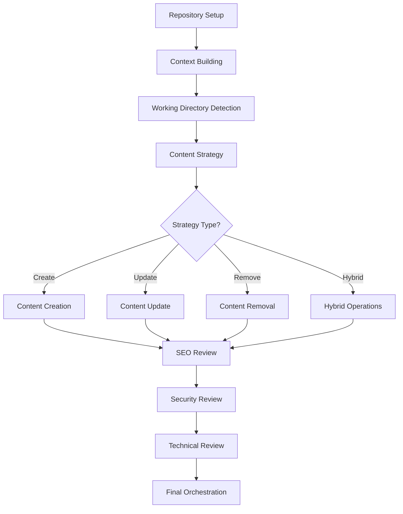

# Content Developer Automation Tool - Prompt Chain Documentation

## Overview

This document outlines the complete prompt chain for the content developer automation workflow, showing how prompts connect and flow through each phase of the 12-step process.

## Workflow Prompt Chain



## Phase 1: Repository Analysis & Setup

### 1.1 Working Directory Detection Prompt

```python
WORKING_DIR_PROMPT = """
You are a Microsoft Docs content architect analyzing repository structure.

Repository Overview:
{repo_structure}

Content Goal: {content_goal}
Service Area: {service_area}
Topics: {topics}

Analyze the repository structure and identify the most appropriate working directory for this content. Consider:
1. Semantic alignment with the service area
2. Existing content organization
3. Microsoft Docs conventions
4. Logical content grouping

Return the full path to the recommended working directory with justification.
"""
```

**Input Variables:**
- `repo_structure`: Tree view of repository directories
- `content_goal`: User's documentation goal
- `service_area`: Target service area (e.g., compute, storage)
- `topics`: Extracted topics from supporting materials

**Output:** Path to working directory with reasoning

**Chains to:** Content Strategy Prompt

---

## Phase 2: Strategy Determination

### 2.1 Content Strategy Prompt

```python
STRATEGY_PROMPT = """
You are a senior content strategist for Microsoft Docs.

Working Directory Analysis:
{directory_analysis}

Content Goal: {content_goal}
Supporting Materials Summary: {materials_summary}
Gap Analysis: {gap_analysis}

Determine the optimal content strategy:
1. CREATE: If significant gaps exist
2. UPDATE: If content exists but needs refresh
3. REMOVE: If content is redundant or outdated
4. HYBRID: If multiple actions needed

Provide specific file-level recommendations with rationale.
"""
```

**Input Variables:**
- `directory_analysis`: Analysis of existing content in working directory
- `content_goal`: User's documentation goal
- `materials_summary`: Processed supporting materials
- `gap_analysis`: Identified content gaps

**Output:** Strategy decision with specific file operations

**Chains to:** One of: Content Creation, Content Update, Content Removal, or Hybrid flow

---

## Phase 3: Content Operations

### 3.1 Content Creation Flow

#### 3.1.1 Content Creation Prompt

```python
CREATION_PROMPT = """
You are a Microsoft Docs content author creating {content_type} documentation.

Content Requirements:
- Goal: {content_goal}
- Service Area: {service_area}
- Target Audience: {audience}

Supporting Materials:
{materials}

Related Content for Context:
{related_content}

Microsoft Standards:
{standards}

Create a complete markdown file with:
1. Proper front matter (title, ms.topic, ms.date, etc.)
2. Clear structure with appropriate headings
3. Technical accuracy from supporting materials
4. Code examples where relevant
5. Cross-references to related content

Follow the {content_type} template exactly.
"""
```

**Input Variables:**
- `content_type`: Type of content (tutorial, how-to, concept, etc.)
- `content_goal`: Documentation goal
- `service_area`: Service area
- `audience`: Target audience
- `materials`: Supporting materials content
- `related_content`: Similar existing content
- `standards`: Microsoft documentation standards

**Output:** Complete markdown file

**Chains to:** SEO Review

### 3.2 Content Update Flow

#### 3.2.1 Content Update Prompt

```python
UPDATE_PROMPT = """
You are a Microsoft Docs content maintainer updating existing documentation.

Current File Analysis:
- File Path: {file_path}
- Current Title: {current_title}
- Last Updated: {last_updated}
- Content Type: {content_type}

Current Content:
{current_content}

Update Requirements:
- Goal: {content_goal}
- Service Area: {service_area}
- Specific Changes Needed: {change_requirements}

New Information from Supporting Materials:
{new_information}

Related Files That May Need Cross-Reference Updates:
{related_files}

Update the documentation following these guidelines:
1. Preserve the existing document structure and style
2. Maintain all existing accurate information
3. Update outdated information with new content
4. Add new sections only if necessary for completeness
5. Update the ms.date in front matter to today
6. Ensure technical accuracy from supporting materials
7. Update code examples if they've changed
8. Maintain existing cross-references unless they're broken
9. Add new cross-references where appropriate
10. Keep the same tone and voice as the original

Return the complete updated markdown file with tracked changes summary.
"""
```

**Chains to:** Content Merge Prompt (if needed) → SEO Review

#### 3.2.2 Content Merge Prompt

```python
CONTENT_MERGE_PROMPT = """
You are an expert at merging new technical information into existing Microsoft Docs.

Existing Content Section:
{existing_section}

New Information to Integrate:
{new_information}

Merge Strategy: {merge_strategy}

Intelligently merge the new information by:
1. Identifying what information is genuinely new vs. already covered
2. Determining the best location for new information
3. Avoiding redundancy while ensuring completeness
4. Maintaining logical flow and readability
5. Preserving important existing examples while adding new ones
6. Updating version numbers, dates, and deprecated features

Return the merged content with clear indication of what was added/modified.
"""
```

### 3.3 Content Removal Flow

#### 3.3.1 Content Removal Prompt

```python
REMOVAL_PROMPT = """
You are a Microsoft Docs content architect managing documentation lifecycle.

File to Remove:
- Path: {file_path}
- Title: {title}
- Content Type: {content_type}
- Incoming Links: {incoming_links}

Removal Reason: {removal_reason}

Related Files in Directory:
{related_files}

Recommended Replacement Target:
{replacement_suggestion}

Analyze the removal impact and provide:
1. Confirmation that this file should be removed
2. Best replacement target for redirections
3. List of files that need their links updated
4. Any content from this file that should be preserved elsewhere
5. TOC.yml entries that need to be removed
6. Suggested redirection rule for redirections.json

Consider:
- User impact of removing this content
- SEO implications
- Whether content should be merged elsewhere instead
- Historical importance of the content
"""
```

**Chains to:** Cross-Reference Update Prompt → SEO Review (for affected files)

#### 3.3.2 Cross-Reference Update Prompt

```python
XREF_UPDATE_PROMPT = """
You are updating cross-references after documentation changes.

Changes Made:
- Moved Files: {moved_files}
- Removed Files: {removed_files}
- New Files: {new_files}

Files to Check for Broken References:
{files_to_check}

For each file, identify and fix:
1. Broken links to moved/removed files
2. Outdated anchor links
3. References to deprecated features
4. Links that should point to new content
5. Relative paths that need updating

Update Strategy:
- For moved files: Update path to new location
- For removed files: Update to use redirection target
- For deprecated features: Add deprecation notice
- For new related content: Add helpful cross-references

Return a list of all reference updates needed with:
- File path
- Line number
- Old reference
- New reference
- Update reason
"""
```

---

## Phase 4: Review Pipeline

### 4.1 SEO Review Flow

#### 4.1.1 SEO Review Prompt

```python
SEO_REVIEW_PROMPT = """
You are an SEO specialist reviewing Microsoft Docs content for search optimization.

Content to Review:
{content}

File Metadata:
- Title: {title}
- Description: {description}
- Keywords: {keywords}
- URL Path: {url_path}

Target Audience: {audience}
Primary Search Terms: {search_terms}

Perform a comprehensive SEO review checking:

1. **Title Optimization**
   - Is the title 50-60 characters?
   - Does it include primary keywords?
   - Is it compelling and click-worthy?
   - Does it accurately describe the content?

2. **Meta Description**
   - Is it 150-160 characters?
   - Does it include target keywords naturally?
   - Does it provide a clear value proposition?
   - Does it encourage clicks?

3. **Heading Structure**
   - Is there exactly one H1?
   - Do H2s and H3s follow logical hierarchy?
   - Do headings include relevant keywords?
   - Are headings descriptive and scannable?

4. **Keyword Usage**
   - Are primary keywords in the first 100 words?
   - Is keyword density appropriate (1-2%)?
   - Are related/LSI keywords included?
   - Is keyword usage natural, not forced?

5. **Content Quality**
   - Is content comprehensive (>300 words)?
   - Does it answer user search intent?
   - Is it unique and valuable?
   - Are there clear calls-to-action?

6. **Internal Linking**
   - Are there links to related content?
   - Is anchor text descriptive?
   - Do links add value for users?

7. **Technical SEO**
   - Are images optimized with alt text?
   - Is the URL slug SEO-friendly?
   - Is content mobile-friendly?
   - Is reading level appropriate?

Return:
1. SEO score (0-100)
2. Critical issues that must be fixed
3. Recommendations for improvement
4. Suggested title/description if changes needed
5. Missing keywords to add naturally
"""
```

**Chains to:** SEO Fix Prompt (if issues found) → Security Review

#### 4.1.2 SEO Fix Prompt

```python
SEO_FIX_PROMPT = """
You are optimizing Microsoft Docs content for search engines.

Original Content:
{original_content}

SEO Issues Found:
{seo_issues}

Target Keywords: {keywords}
Search Intent: {search_intent}

Fix the SEO issues while:
1. Maintaining technical accuracy
2. Preserving the original meaning
3. Keeping Microsoft Docs tone/style
4. Ensuring natural keyword placement
5. Improving readability

Specific fixes to apply:
{specific_fixes}

Guidelines:
- Don't over-optimize or keyword stuff
- Keep technical terms accurate
- Maintain document structure
- Ensure changes flow naturally
- Preserve all code examples exactly

Return the SEO-optimized content with all issues resolved.
"""
```

### 4.2 Security Review Flow

#### 4.2.1 Security Review Prompt

```python
SECURITY_REVIEW_PROMPT = """
You are a security expert reviewing Microsoft Docs for vulnerabilities and security issues.

Content to Review:
{content}

File Type: {content_type}
Service Area: {service_area}

Perform a comprehensive security review checking for:

1. **Exposed Secrets**
   - API keys or tokens
   - Passwords or credentials  
   - Connection strings
   - Private keys or certificates
   - Internal URLs or endpoints

2. **Vulnerable Code Examples**
   - SQL injection vulnerabilities
   - XSS (Cross-site scripting) risks
   - Command injection possibilities
   - Insecure authentication patterns
   - Hardcoded credentials
   - Insecure cryptography usage
   - CORS misconfigurations

3. **Sensitive Information**
   - Internal system names
   - Private IP addresses
   - Internal architecture details
   - Unreleased feature names
   - Customer data examples
   - Employee information

4. **Insecure Practices**
   - Disabled security features in examples
   - Overly permissive access controls
   - Insecure default configurations
   - Missing authentication/authorization
   - Unencrypted data transmission
   - Weak password policies

5. **Compliance Issues**
   - PII in examples
   - GDPR violations
   - Industry regulation conflicts
   - Export control violations

6. **URL Security**
   - Links to malicious sites
   - Unverified external resources
   - HTTP links that should be HTTPS
   - Suspicious URL patterns

For each issue found, provide:
1. Severity level (Critical/High/Medium/Low)
2. Exact location (line number)
3. Description of the vulnerability
4. Potential impact if exploited
5. Recommended fix

Return a structured security report with all findings.
"""
```

**Chains to:** Security Fix Prompt (if issues found) → Technical Review

#### 4.2.2 Security Fix Prompt

```python
SECURITY_FIX_PROMPT = """
You are remediating security vulnerabilities in Microsoft Docs content.

Content with Security Issues:
{content}

Security Vulnerabilities Found:
{vulnerabilities}

Apply security fixes following these principles:

1. **For Exposed Secrets**
   - Replace with placeholders: <YOUR_API_KEY>
   - Use environment variables: $env:API_KEY
   - Reference Azure Key Vault where appropriate

2. **For Vulnerable Code**
   - Fix the vulnerability while maintaining functionality
   - Add security notes/warnings where needed
   - Use secure coding patterns
   - Include input validation

3. **For Sensitive Information**
   - Replace with generic examples
   - Use fictional data
   - Remove internal details

4. **Security Best Practices**
   - Enable all security features
   - Use least privilege principle
   - Include authentication/authorization
   - Encrypt sensitive data

5. **Add Security Notices**
   Template: 
   > [!WARNING]
   > Security Note: {specific security guidance}

Ensure:
- All vulnerabilities are remediated
- Code examples remain functional
- Security fixes are clearly explained
- Best practices are demonstrated

Return the secured content with all vulnerabilities fixed.
"""
```

### 4.3 Technical Accuracy Review Flow

#### 4.3.1 Technical Accuracy Review Prompt

```python
TECHNICAL_ACCURACY_REVIEW_PROMPT = """
You are a technical expert reviewing Microsoft Docs for accuracy and correctness.

Content to Review:
{content}

Technical Context:
- Service: {service_name}
- Version: {version}
- Platform: {platform}
- Related Technologies: {technologies}

Supporting Technical Information:
{technical_reference}

Perform a comprehensive technical review checking:

1. **Code Accuracy**
   - Syntax correctness
   - API usage correctness
   - Parameter accuracy
   - Return value correctness
   - Error handling appropriateness

2. **Command Accuracy**
   - CLI syntax correctness
   - Parameter/flag validity
   - Output accuracy
   - Platform-specific variations

3. **Technical Concepts**
   - Terminology correctness
   - Concept explanations
   - Architecture descriptions
   - Process flows
   - Technical relationships

4. **Version Compatibility**
   - Feature availability
   - Deprecated features
   - Breaking changes
   - Version-specific syntax

5. **Performance Claims**
   - Benchmark accuracy
   - Performance numbers
   - Scalability claims
   - Resource requirements

6. **Integration Points**
   - Service dependencies
   - API compatibility
   - Protocol correctness
   - Configuration accuracy

7. **Best Practices**
   - Current recommendations
   - Anti-patterns avoided
   - Security best practices
   - Performance optimizations

For each issue found:
1. Issue type and severity
2. Exact location
3. Current incorrect information
4. Correct information
5. Source/reference for correction

Return a detailed technical review report.
"""
```

**Chains to:** Technical Fix Prompt (if issues found) → Review Orchestration

#### 4.3.2 Technical Fix Prompt

```python
TECHNICAL_FIX_PROMPT = """
You are correcting technical inaccuracies in Microsoft Docs content.

Content with Technical Issues:
{content}

Technical Inaccuracies Found:
{inaccuracies}

Authoritative Technical Reference:
{technical_reference}

Fix all technical issues while:

1. **Correcting Code**
   - Fix syntax errors
   - Update API calls to current version
   - Correct parameter usage
   - Fix return value handling
   - Add proper error handling

2. **Updating Commands**
   - Use correct CLI syntax
   - Update deprecated flags
   - Fix parameter values
   - Include platform variations

3. **Fixing Explanations**
   - Correct technical terminology
   - Fix conceptual errors
   - Update architecture descriptions
   - Clarify process flows

4. **Version Updates**
   - Mark version-specific features
   - Update for latest version
   - Note breaking changes
   - Remove deprecated content

5. **Adding Clarifications**
   - Add notes for edge cases
   - Include prerequisites
   - Clarify assumptions
   - Add troubleshooting tips

Ensure:
- All fixes are technically accurate
- Code examples are tested/testable
- Explanations are clear and correct
- Version information is current
- Best practices are followed

Return the technically corrected content.
"""
```

---

## Phase 5: Final Orchestration

### 5.1 Review Orchestration Prompt

```python
REVIEW_ORCHESTRATION_PROMPT = """
You are coordinating a comprehensive review of Microsoft Docs content.

Content has been reviewed for:
1. SEO: {seo_score}/100
2. Security: {security_issues} issues found
3. Technical Accuracy: {technical_issues} issues found

Review Summary:
- SEO Issues: {seo_summary}
- Security Issues: {security_summary}
- Technical Issues: {technical_summary}

Determine the review priority and approach:

1. **Critical Issues** (must fix before publishing)
   - Security vulnerabilities
   - Major technical errors
   - Broken functionality

2. **Important Issues** (should fix)
   - SEO optimizations
   - Minor technical corrections
   - Best practice updates

3. **Nice to Have** (can fix later)
   - Style improvements
   - Additional examples
   - Enhanced explanations

Create a review action plan that:
1. Orders fixes by priority
2. Identifies any conflicts between fixes
3. Ensures fixes don't introduce new issues
4. Maintains document coherence
5. Preserves technical accuracy while improving SEO

Return a structured review plan with:
- Fix order and rationale
- Potential conflicts to resolve
- Final quality checklist
- Confidence score for publication readiness
"""
```

**Output:** Final review plan and publication readiness assessment

---

## Special Flow: Version Updates

### Version Update Prompt

```python
VERSION_UPDATE_PROMPT = """
You are updating documentation for a new version release.

Version Information:
- Previous Version: {previous_version}
- New Version: {new_version}
- Release Date: {release_date}
- Breaking Changes: {breaking_changes}

File to Update:
{file_content}

Update the documentation to:
1. Update all version references to {new_version}
2. Add version availability notices for new features
3. Mark deprecated features with version info
4. Update compatibility matrices
5. Revise system requirements if changed
6. Update all code examples to use new version syntax
7. Add migration notes for breaking changes
8. Update API version references
9. Revise performance benchmarks if provided
10. Ensure version consistency throughout

Version Notice Templates:
- New Feature: "> **Applies to:** Version {new_version} and later"
- Deprecated: "> **Deprecated in:** Version {new_version}"
- Breaking Change: "> [!IMPORTANT]\n> Breaking change in version {new_version}: {description}"

Return the version-updated content with a summary of changes.
"""
```

---

## Special Flow: Deprecation Updates

### Deprecation Prompt

```python
DEPRECATION_PROMPT = """
You are managing the deprecation of features in Microsoft Docs.

Feature Being Deprecated:
- Name: {feature_name}
- Deprecation Date: {deprecation_date}
- Replacement: {replacement_feature}

Affected Documentation:
{affected_files}

Current Content Sample:
{content_sample}

Update the documentation to:
1. Add clear deprecation notices at the beginning of relevant sections
2. Include the deprecation timeline
3. Provide migration guidance to the replacement
4. Update code examples to show both old and new approaches
5. Add warnings to any procedures using deprecated features
6. Create or update migration guide references
7. Ensure all deprecation notices follow Microsoft standards

Use this deprecation notice template:
> [!WARNING]
> {feature_name} is deprecated as of {deprecation_date}. Use {replacement_feature} instead. For migration guidance, see [migration guide link].

Return updated content with deprecation properly handled.
"""
```

---

## Prompt Chain Summary

### Linear Flow (Create New Content)
1. Working Directory Detection → 2. Content Strategy → 3. Content Creation → 4. SEO Review → 5. SEO Fix → 6. Security Review → 7. Security Fix → 8. Technical Review → 9. Technical Fix → 10. Review Orchestration

### Update Flow
1. Working Directory Detection → 2. Content Strategy → 3. Content Update → 4. Content Merge (if needed) → 5-10. Review Pipeline

### Removal Flow
1. Working Directory Detection → 2. Content Strategy → 3. Content Removal → 4. Cross-Reference Updates → 5-10. Review Pipeline (for affected files)

### Hybrid Flow
Executes removal flow first, then update flow, then creation flow, followed by unified review pipeline.

## Key Prompt Patterns

### 1. Context Preservation
All prompts include relevant context from previous steps to maintain coherence.

### 2. Structured Output
Each prompt specifies exact output format for reliable parsing.

### 3. Guidelines and Constraints
Every prompt includes specific guidelines to ensure quality and compliance.

### 4. Template Usage
Prompts include templates for consistent formatting (e.g., deprecation notices, security warnings).

### 5. Validation Points
Each prompt includes validation criteria for its output.

## Prompt Variables Reference

### Common Variables
- `{content_goal}`: User's documentation objective
- `{service_area}`: Target service (compute, storage, etc.)
- `{content_type}`: Document type (tutorial, how-to, concept)
- `{file_path}`: Path to file being processed
- `{content}`: Current content being reviewed/modified

### Phase-Specific Variables
- Repository Analysis: `{repo_structure}`, `{topics}`
- Strategy: `{gap_analysis}`, `{directory_analysis}`
- Creation: `{materials}`, `{related_content}`, `{standards}`
- Update: `{current_content}`, `{new_information}`, `{change_requirements}`
- Review: `{seo_issues}`, `{vulnerabilities}`, `{inaccuracies}`

## Error Handling Prompts

### Conflict Resolution Prompt
Used when review fixes conflict with each other.

### Clarification Prompt
Used when strategy is ambiguous or additional user input needed.

### Validation Failure Prompt
Used when generated content fails validation checks.

## Conclusion

This prompt chain ensures consistent, high-quality documentation generation through:
- Clear phase transitions
- Context preservation across prompts
- Structured outputs for reliable processing
- Comprehensive review coverage
- Flexible handling of different content operations

The chain is designed to be modular, allowing individual prompts to be updated without breaking the overall flow. 