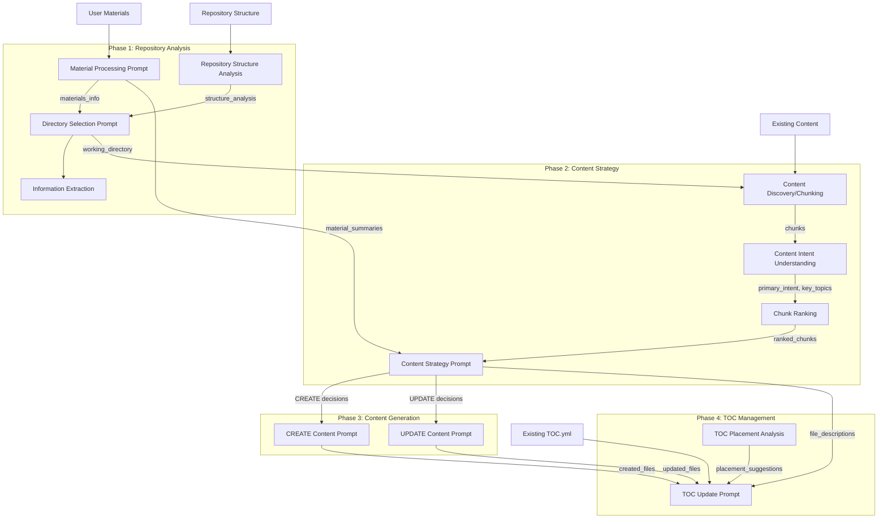

# Prompt Chaining in AI Content Developer

This document illustrates how prompts chain together in the AI Content Developer system, showing the flow of inputs and outputs between different prompts across all phases.

## Overview

The AI Content Developer uses a sophisticated chain of prompts across 4 phases, where outputs from earlier prompts become inputs to later prompts. Each prompt is designed to produce structured JSON outputs that feed into subsequent processing steps.

## Prompt Chain Flow



## Detailed Prompt Chains

### Phase 1: Repository Analysis

#### 1. Material Processing Chain
```
Input Sources:
├── User Materials (documents, URLs)
└── Material Content

↓ Material Processing Prompt ↓

Output:
{
  "thinking": "1. Document analysis... 2. Technology extraction...",
  "main_topic": "Azure CNI Cilium Integration",
  "technologies": ["Azure CNI", "Cilium", "Kubernetes"],
  "key_concepts": ["network policies", "endpoint slices"],
  "microsoft_products": ["AKS", "Azure Virtual Network"],
  "document_type": "Technical Implementation Guide",
  "summary": "Comprehensive guide covering...",
  "source": "./inputs/material.docx"
}

↓ Feeds into ↓

Directory Selection Prompt (as materials_info)
Content Strategy Prompt (as materials_summary)
```

#### 2. Repository Structure Analysis
```
Input Sources:
└── Repository Structure String

↓ Document Structure Analysis (LLM Native) ↓

Purpose: Analyze repository structure to understand organization pattern

Output:
{
  "thinking": "1. I analyzed the repository structure...",
  "sections": ["aks", "azure-arc", "container-registry"],
  "terminal_sections": ["README.md", "media", "includes"],
  "content_flow": "Service-based organization with subdirectories",
  "key_topics": ["Azure Kubernetes Service", "Azure Arc", "Container Registry"]
}

↓ Feeds into ↓

Directory Selection Prompt (as structure_analysis)
```

#### 3. Directory Selection Chain
```
Input Sources:
├── Repository Structure
├── Materials Info (from Material Processing)
├── Structure Analysis (from Repository Structure Analysis)
├── Content Goal
└── Service Area

↓ Directory Selection Prompt ↓

Output:
{
  "thinking": "1. Pattern analysis... 2. Structure understanding...",
  "working_directory": "articles/azure-arc/kubernetes",
  "justification": "Selected based on service-based pattern...",
  "confidence": 0.85
}

↓ Feeds into ↓

Information Extraction (for validation)
Content Discovery (determines where to analyze content)
```

#### 4. Information Extraction (Validation)
```
Input Sources:
├── Directory Selection Output
├── Repository Structure Insights
└── Service Area

↓ Information Extraction (LLM Native) ↓

Purpose: Validate directory selection

Output:
{
  "thinking": "1. Repository structure analysis... 2. Directory pattern evaluation...",
  "is_valid": true,
  "is_documentation_directory": true,
  "pattern_match": "Matches service-based organization",
  "reason": "Valid documentation directory following pattern",
  "concerns": [],
  "suggested_alternative": null
}

↓ Used for ↓

Validation of working directory selection
```

### Phase 2: Content Strategy

#### 5. Content Discovery & Chunking
```
Input Sources:
├── Working Directory Path (from Directory Selection)
└── Existing Markdown Files

↓ SmartChunker Processing (Non-LLM) ↓

Output:
List of DocumentChunk objects with:
- content: Chunk text content
- file_path: Source file path
- heading_path: ["Section", "Subsection"]
- chunk_id: Unique identifier
- frontmatter: Document metadata
- embedding: null (generated later if needed)

↓ Feeds into ↓

Content Intent Understanding
Chunk Ranking
```

#### 6. Content Intent Analysis
```
Input Sources:
├── Material Summaries
└── Content Goal

↓ Content Intent Understanding (LLM Native) ↓

Output:
{
  "thinking": "1. Materials review... 2. Goal analysis...",
  "primary_intent": "Document Cilium configuration",
  "content_type": "How-To Guide",
  "target_audience": "Platform Engineers",
  "key_objectives": ["Configure Cilium", "Enable monitoring"],
  "success_criteria": ["Working Cilium deployment"]
}

↓ Feeds into ↓

Chunk Ranking (for relevance assessment)
```

#### 7. Chunk Ranking Chain
```
Input Sources:
├── Document Chunks (from Content Discovery)
├── Intent Analysis
└── Content Goal

↓ Chunk Ranking (LLM Native) ↓

Output:
{
  "thinking": "1. Goal understanding... 2. Chunk evaluation...",
  "rankings": [
    {
      "chunk_id": "0",
      "relevance_score": 8,
      "relevance_reason": "Covers network configuration"
    }
  ],
  "top_chunks": ["0", "1", "2"],
  "key_themes": ["networking", "configuration"]
}

↓ Feeds into ↓

Content Strategy Prompt (as ranked relevant chunks)
```

#### 8. Content Strategy Generation Chain
```
Input Sources:
├── Material Summaries (from Phase 1)
├── Ranked Chunks
├── Content Standards
├── Intent Analysis
└── Content Goal

↓ Content Strategy Prompt ↓

Output:
{
  "thinking": "1. Gap analysis... 2. Content type evaluation...",
  "decisions": [
    {
      "action": "CREATE",
      "filename": "how-to-configure-cilium-aks.md",
      "content_type": "How-To Guide",
      "content_brief": {
        "objective": "Enable readers to configure Cilium",
        "key_points_to_cover": ["Installation", "Configuration"],
        "prerequisites_to_state": ["AKS cluster", "Azure CLI"],
        "next_steps_to_suggest": ["Monitor performance"]
      }
    }
  ],
  "confidence": 0.85,
  "summary": "Create comprehensive Cilium guide"
}

↓ Feeds into ↓

Content Generation (CREATE/UPDATE prompts)
TOC Management (file_descriptions)
```

### Phase 3: Content Generation

#### 9. Content Creation Chain
```
Input Sources:
├── CREATE Decision (from Strategy)
├── Material Content (full text)
├── Reference Chunks
├── Content Type Template
└── Content Standards

↓ CREATE Content Prompt ↓

Output:
{
  "thinking": "1. Content planning... 2. Section development...",
  "content": "---\ntitle: Configure Cilium\n---\n\n# Configure...",
  "metadata": {
    "word_count": 1500,
    "sections_created": ["Introduction", "Prerequisites"],
    "materials_used": ["aks-prd-02.docx"],
    "key_topics_covered": ["Cilium", "Azure CNI"]
  }
}

↓ Feeds into ↓

TOC Management (created_files list)
```

#### 10. Content Update Chain
```
Input Sources:
├── UPDATE Decision (from Strategy)
├── Existing Document Content
├── Material Context
├── Content Type Info
└── Update Instructions

↓ UPDATE Content Prompt ↓

Output:
{
  "thinking": "1. Document analysis... 2. Change identification...",
  "updated_document": "---\ntitle: Updated Guide\n---\n\n...",
  "changes_summary": "Added Cilium configuration section",
  "metadata": {
    "sections_modified": ["Configuration"],
    "sections_added": ["Cilium Setup"],
    "word_count_before": 1000,
    "word_count_after": 1500
  }
}

↓ Feeds into ↓

TOC Management (updated_files list)
```

### Phase 4: TOC Management

#### 11. TOC Update Chain
```
Input Sources:
├── Existing TOC.yml
├── Created Files (from Phase 3)
├── Updated Files (from Phase 3)
└── File Descriptions (from Strategy)

↓ TOC Placement Analysis (LLM Native) ↓

Output:
{
  "thinking": "1. TOC structure understanding... 2. Entry categorization...",
  "placements": [
    {
      "filename": "how-to-configure-cilium-aks.md",
      "suggested_location": "After 'Network configuration'",
      "parent_section": "How-to guides",
      "reasoning": "Networking-related how-to content"
    }
  ],
  "toc_suggestions": ["Consider networking subsection"]
}

↓ Feeds into ↓

↓ TOC Update Prompt ↓

Output:
{
  "thinking": "1. Structure analysis... 2. Content categorization...",
  "content": "- name: Overview\n  href: overview.md\n...",
  "entries_added": ["how-to-configure-cilium-aks.md"],
  "placement_decisions": {
    "how-to-configure-cilium-aks.md": "Added to How-to guides section"
  }
}
```

## Key Data Transformations

### 1. Material Summary Aggregation
- Multiple material processing outputs → Combined materials_summary
- Each material's `main_topic`, `technologies`, `key_concepts` → Unified understanding

### 2. Chunk Discovery & Ranking
- Directory path → Markdown files → Document chunks (non-LLM chunking)
- Chunks + Intent → Ranked chunks by relevance (LLM-based ranking)
- Top chunks → Reference context for generation

### 3. Strategy to Generation
- Strategy decisions → Individual CREATE/UPDATE actions
- Content briefs → Detailed generation instructions
- File metadata → TOC entry information

### 4. Multi-Source Integration
- Materials + Chunks + Templates → Generated content
- Existing content + Materials + Instructions → Updated content
- Created/Updated files + Descriptions → TOC entries

## Prompt Dependencies

### Direct Dependencies
- **Material Processing** → Directory Selection, Content Strategy
- **Repository Structure Analysis** → Directory Selection
- **Directory Selection** → Content Discovery, Information Extraction (validation)
- **Content Discovery** → Content Intent, Chunk Ranking
- **Content Intent** → Chunk Ranking
- **Chunk Ranking** → Content Strategy
- **Content Strategy** → CREATE Generation, UPDATE Generation, TOC Management
- **Content Generation** → TOC Management

### Indirect Dependencies
- **TOC Placement Analysis** → TOC Generation

## Data Persistence Points

1. **Material Summaries**: Saved and passed through phases
2. **Working Directory**: Determined in Phase 1, used throughout
3. **Strategy Decisions**: Central output feeding Phase 3 & 4
4. **Generated Content**: Saved to preview/output directories
5. **Embeddings Cache**: Chunk embeddings for similarity search

## Error Handling Chains

If any prompt fails:
1. Error is captured with context
2. Fallback prompts may be triggered
3. User confirmation can override
4. Partial results are preserved

## Optimization Opportunities

1. **Parallel Processing**: 
   - Multiple materials can be processed in parallel
   - CREATE and UPDATE actions can run concurrently

2. **Caching**:
   - Document chunks and embeddings are cached
   - Embeddings generated on-demand for similarity search

3. **Conditional Chains**:
   - Skip UPDATE chains if no updates needed
   - Skip TOC if --skip-toc flag set
   - Early exit if confidence too low 

## Available but Unused Prompt Functions

The following LLM-native prompt functions are defined but not used in the current flow:

1. **Content Quality Analysis** (`analyze_content_quality`)
   - Could evaluate generated content before saving
   - Provides quality scores and improvement suggestions

2. **Content Placement Analysis** (`suggest_content_placement`)
   - Could help determine where to add new sections in updates
   - Suggests optimal placement for new content

3. **Terminal Section Detection** (`is_terminal_section`)
   - Could validate document structure during updates
   - Ensures content isn't added after terminal sections

These represent potential enhancements to the system that could be activated for more sophisticated content management. 