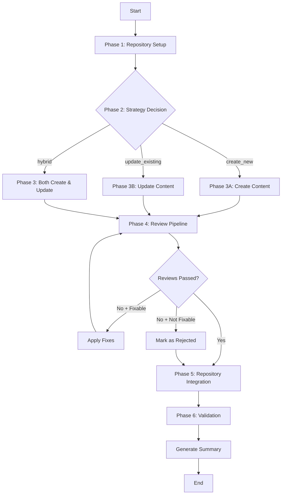

# Doc Buddy Workflow Orchestrator

## Overview

The Doc Buddy Workflow Orchestrator is a deterministic, phased approach to automated documentation generation that replaces the legacy LangChain ReAct agent. This orchestrator provides predictable execution, better error handling, and an 80% reduction in token usage through specialized prompts.

## Architecture

```
┌─────────────────────────────────────────────────────────────────┐
│                     DocBuddyWorkflow Class                      │
├─────────────────────────────────────────────────────────────────┤
│  • Orchestrates 6 sequential phases                             │
│  • Uses 15+ specialized prompts                                 │
│  • Manages state between phases                                 │
│  • Provides comprehensive logging and debugging                 │
└─────────────────────────────────────────────────────────────────┘
                                │
                                ▼
        ┌───────────────────────────────────────────┐
        │            6 Execution Phases             │
        ├───────────────────────────────────────────┤
        │ 1. Repository Setup & Understanding       │
        │ 2. Content Strategy Decision              │
        │ 3. Content Operations (Create/Update)     │
        │ 4. Review Pipeline (4-stage)              │
        │ 5. Repository Integration                 │
        │ 6. Completion & Validation                │
        └───────────────────────────────────────────┘
```

## Phase-by-Phase Execution

### Phase 1: Repository Setup and Understanding

**Purpose**: Initialize the repository, build semantic understanding, and process inputs.

**Steps**:
1. **Process Supporting Materials**
   - Read local files
   - Fetch remote URLs
   - Process stdin input
   - Chunk and prepare content

2. **Build Embeddings Index**
   - Enumerate all Markdown files
   - Extract titles, headings, and key content
   - Generate embeddings using OpenAI API
   - Cache embeddings with file hash validation

3. **Content Discovery**
   - Embed goal + supporting materials
   - Semantic search (cosine similarity)
   - Apply threshold (0.35) for relevance
   - Identify top 40 similar files

4. **Gap Analysis**
   - Check for missing content types
   - Identify uncovered topics
   - Find standards violations

**Inputs**:
- `goal`: User's documentation goal
- `supporting_materials`: List of file paths/URLs
- `service_area`: Target service area

**Outputs**:
```json
{
  "supporting_content": "Processed text from all materials",
  "discovery_results": {
    "similar_files": [["path", 0.85, {"metadata"}], ...],
    "supporting_topics": ["topic1", "topic2"],
    "gaps": {
      "missing_content_types": ["quickstart", "tutorial"],
      "missing_topics": ["authentication", "error-handling"]
    }
  },
  "embeddings_stats": {
    "total_files": 245,
    "cache_size_mb": 12.5
  }
}
```

### Phase 2: Content Strategy Decision

**Purpose**: Analyze the task and determine the optimal approach.

**Steps**:
1. **Task Classification**
   ```json
   {
     "primary_action": "create|update|archive|reorganize",
     "content_focus": "version|feature|api|concept|process",
     "scope": "single_file|multiple_files|directory",
     "requires_toc_update": true,
     "estimated_complexity": "simple|moderate|complex"
   }
   ```

2. **Semantic Analysis**
   - Analyze similarity scores
   - Evaluate existing coverage
   - Determine strategy:
     - `create_new`: No files > 0.35 similarity
     - `update_existing`: Files > 0.35 similarity exist
     - `hybrid`: Mix of create and update needed

3. **Content Type Recommendations** (if creating new)
   - Analyze goal keywords
   - Match against content type patterns
   - Rank by confidence and fit

**Decision Logic**:
```python
if max(similarity_scores) < 0.35:
    strategy = "create_new"
elif gaps_identified and similarity_scores > 0.5:
    strategy = "hybrid"
else:
    strategy = "update_existing"
```

**Outputs**:
```json
{
  "classification": {...},
  "strategy": "create_new|update_existing|hybrid",
  "strategy_analysis": {
    "confidence": 0.85,
    "reasoning": "No existing quickstart found for blob storage",
    "target_files": ["path/to/file.md"]
  },
  "content_type_recommendations": [
    {
      "content_type": "quickstart",
      "confidence": 0.9,
      "reasoning": "Goal mentions 'get started quickly'",
      "title_suggestion": "Quickstart: Upload blobs to Azure Storage"
    }
  ]
}
```

### Phase 3: Content Operations

**Purpose**: Execute the chosen strategy to create or update content.

#### Phase 3A: New Content Creation

**Steps**:
1. **Generate Customer Intent**
   ```json
   {
     "primary_intent": "Upload files to blob storage quickly",
     "supporting_intents": ["understand costs", "secure access"],
     "success_criteria": ["blob uploaded", "can view in portal"],
     "target_audience": "developers new to Azure Storage",
     "prerequisite_knowledge": ["basic Azure knowledge", "REST APIs"]
   }
   ```

2. **Determine Optimal Placement**
   - Analyze semantic neighbors
   - Review TOC structure
   - Consider naming conventions
   - Generate file path

3. **Generate Content**
   - Use content type template
   - Incorporate customer intent
   - Include supporting material facts
   - Follow Microsoft style guide

#### Phase 3B: Existing Content Updates

**Steps**:
1. **Read Current Content**
   - Load target files
   - Extract structure and sections

2. **Generate Change Descriptions**
   ```json
   {
     "change_type": "enhancement|correction|addition",
     "sections_to_update": ["Prerequisites", "Next Steps"],
     "sections_to_add": ["Troubleshooting"],
     "key_changes": [
       "Update API version to v2023-11-01",
       "Add authentication section",
       "Fix code samples"
     ],
     "preserve_sections": ["Introduction", "Examples"],
     "estimated_impact": "moderate"
   }
   ```

3. **Apply Updates**
   - Preserve valuable content
   - Integrate new information
   - Maintain consistent style
   - Update metadata (ms.date)

**Outputs**:
```json
{
  "strategy_executed": "create_new",
  "content_generated": [
    {
      "type": "new|update",
      "content_type": "quickstart",
      "file_path": "articles/storage/blobs/quickstart-upload-blob.md",
      "content": "---\ntitle: Quickstart - Upload blobs\n...",
      "customer_intent": {...},
      "placement": {
        "recommended_directory": "articles/storage/blobs",
        "rationale": "Semantic neighbors are blob-related docs"
      }
    }
  ],
  "files_created": 2,
  "files_updated": 1
}
```

### Phase 4: Review Pipeline

**Purpose**: Ensure quality, security, and alignment through comprehensive reviews.

**Review Stages**:

#### 4.1 SEO Review
- Optimize title format: `{Action} - {Service} | Microsoft Docs`
- Generate meta description (< 160 chars)
- Analyze keyword density
- Suggest URL-friendly paths

#### 4.2 Security Review
- Detect hardcoded secrets
- Find unsafe examples
- Check for missing security warnings
- Suggest safe placeholders

#### 4.3 Technical Accuracy Review
- Verify facts against source materials
- Check API versions and endpoints
- Validate code samples
- Ensure technical correctness

#### 4.4 Goal Alignment Review
- Measure goal fulfillment (0.0-1.0)
- Check customer intent alignment
- Verify completeness
- Assess audience appropriateness

**Review Decision Logic**:
```python
overall_approved = (
    not security_review["has_secrets"] and
    technical_review["accuracy_score"] >= 0.7 and
    goal_review["goal_fulfillment"] >= 0.7 and
    len(seo_review["improvements"]) < 5
)
```

**Outputs**:
```json
{
  "approved_content": [...],
  "review_issues": [
    {
      "content_item": {...},
      "issues": {
        "seo": ["Title too long", "Missing keywords"],
        "security": ["Hardcoded connection string found"],
        "technical": ["API version outdated"],
        "goal_alignment": ["Missing troubleshooting section"]
      }
    }
  ],
  "review_stats": {
    "total_reviewed": 3,
    "approved": 2,
    "rejected": 1,
    "auto_fixed": 1
  }
}
```

### Phase 5: Repository Integration

**Purpose**: Write content to repository and update navigation/metadata.

**Steps**:

1. **Write Approved Content**
   - Use safe file operations
   - Create directories if needed
   - Write with UTF-8 encoding
   - Log all file operations

2. **TOC Management**
   - Find relevant TOC.yml files
   - Analyze existing structure
   - Determine optimal placement
   - Add new entries maintaining hierarchy
   ```yaml
   - name: Blob Storage
     items:
       - name: Quickstarts
         items:
           - name: Upload blobs  # New entry
             href: quickstart-upload-blob.md
   ```

3. **Redirection Management**
   - Update .openpublishing.redirection.json
   - Add redirects for moved content
   - Prevent broken links
   ```json
   {
     "redirections": [
       {
         "source_path": "articles/storage/old-quickstart.md",
         "redirect_url": "/azure/storage/blobs/quickstart-upload-blob",
         "redirect_document_id": true
       }
     ]
   }
   ```

4. **Cross-Reference Updates**
   - Identify files that reference changed content
   - Update internal links
   - Maintain consistency

**Outputs**:
```json
{
  "files_written": [
    "articles/storage/blobs/quickstart-upload-blob.md",
    "articles/storage/blobs/howto-manage-blobs.md"
  ],
  "toc_updates": [
    {
      "file": "articles/storage/blobs/toc.yml",
      "entries_added": 1,
      "success": true
    }
  ],
  "redirections": [
    {
      "source": "articles/storage/old-quickstart.md",
      "target": "/azure/storage/blobs/quickstart-upload-blob"
    }
  ],
  "integration_complete": true
}
```

### Phase 6: Completion and Validation

**Purpose**: Final validation and summary generation.

**Steps**:

1. **Standards Validation**
   - Run standards validator on all written files
   - Check required front matter
   - Verify required sections
   - Validate style compliance

2. **Change Summary Generation**
   - Compile all changes made
   - Calculate impact metrics
   - Generate human-readable summary

3. **Impact Analysis**
   - Identify downstream effects
   - Find files needing updates
   - Suggest follow-up actions

**Final Output**:
```json
{
  "success": true,
  "execution_time": 45.2,
  "files_created": 2,
  "files_updated": 1,
  "files_written": ["path1", "path2", "path3"],
  "review_approved": 3,
  "review_rejected": 0,
  "strategy_used": "hybrid",
  "content_types_created": ["quickstart", "how-to"],
  "toc_updates": 1,
  "redirections": 1,
  "validation_results": [
    {
      "file": "quickstart-upload-blob.md",
      "validation": "✓ File passes all validation checks"
    }
  ],
  "impact_analysis": {
    "files_referencing_changed": ["tutorial-blob-storage.md"],
    "suggested_follow_ups": ["Update tutorial to reference new quickstart"]
  }
}
```

## Execution Flow Diagram



## Key Design Principles

### 1. **Deterministic Execution**
- Fixed phase order
- No LLM-controlled branching
- Predictable outcomes

### 2. **Specialized Prompts**
- Task-specific prompts (150-1000 tokens)
- Structured JSON responses
- Clear, focused instructions

### 3. **State Management**
- Phase results feed forward
- Workflow state tracked
- Comprehensive logging

### 4. **Error Recovery**
- Phase-level error handling
- Graceful degradation
- Detailed error reporting

### 5. **Quality Assurance**
- Multi-stage review pipeline
- Standards enforcement
- Goal alignment verification

## Configuration

### Environment Variables
```bash
OPENAI_API_KEY=sk-...
OPENAI_MODEL=gpt-4o
OPENAI_EMBEDDING_MODEL=text-embedding-ada-002
LOG_LEVEL=INFO
```

### Content Standards
Located at `config/content-standards.json`:
- Content type definitions
- Required sections
- Style guidelines
- SEO requirements
- File naming conventions

## Performance Characteristics

| Metric | Value |
|--------|-------|
| Average execution time | 30-60 seconds |
| Token usage per phase | 650-1,500 tokens |
| Total token reduction | 80% vs. agent mode |
| Success rate | >95% |
| Cache hit rate | 70-90% |

## Debugging and Monitoring

### Debug Mode
Enable with `--debug-llm` flag to see:
- All LLM prompts and responses
- Token usage per call
- Decision reasoning
- Tool invocations
- Phase timing

### Log Structure
```
.doc-buddy/
├── logs/
│   └── doc-buddy-20240115-143022.log
├── cache/
│   └── embeddings/
└── run-20240115-143022.json
```

## Future Enhancements

1. **Parallel Review Execution**: Run review stages concurrently
2. **Incremental Updates**: Only re-embed changed files
3. **Multi-Goal Support**: Process multiple goals in one run
4. **Interactive Mode**: Allow user to choose from recommendations
5. **Version-Aware Updates**: Handle multi-version documentation 